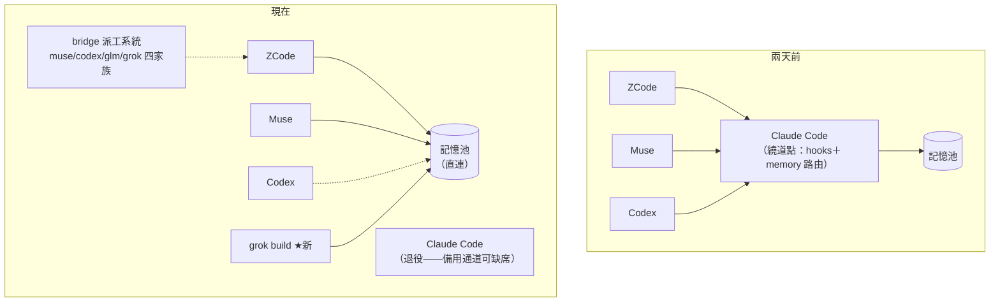
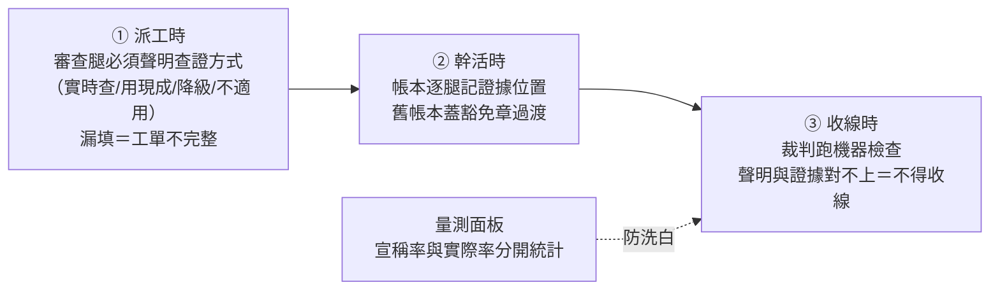

# 0930-1001 建制雙日——圖解說明

> /illustrate mode D（人類 viewport）。Ground truth：git log 09-30 00:00 以降 61 commits；AIR-215～226 十二張卡全 Done。
> 寫作日期 2026-10-01。受眾＝repo owner 判讀：方向對嗎、結構撐得起嗎、哪裡該多看一眼。

## 一句話總結

這兩天把 AI 工作隊完成三件大事：**迎新**（grok build 成為第五個受治理的 AI 工具）、**送舊**（Claude Code 第一方治理退役）、**立規矩**（審查的結構查證從「榮譽制」改成「簽收制」）。

## 全景：五工具工作隊的形狀變化

## 第一章 迎新：grok build 從零到上工（AIR-217/218/219/220/226）

**為什麼**：SuperGrok 訂閱解鎖量產使用。

**怎麼做的**——三步入職流程：
1. **背景調查**（L0 八軸驗證）：廠商宣稱逐條實測——hooks 註冊面實測是 no-op（直接跳過不執行）、沙箱界線用 kernel 級實驗釘死（界外寫入被作業系統擋下並留審計事件，不是靠工具自報）
2. **辦手續**（L1a 工程接線）：部署規則包、hooks 生成、routing 目錄登記，全量 2662 tests 綠
3. **納入派工系統**（AIR-226 bridge admission）：grok 成為 bridge 四家族之一；明文凍結「bridge 派工資格不繼承 CLI 直接使用的驗證」——不同入口分開考核

**教訓一條**：`/tmp` 目錄一度被誤判為沙箱破口，兩段翻轉後確認是「契約內的暫存區」而非漏洞——探針把契約內當界外是探針設計錯誤。此判讀已寫入權威文檔防再犯。

## 第二章 送舊：Claude Code 體面退場（AIR-215/222/223）

**為什麼**：user 裁決——CC 太熱門，coding plan 不划算。

**三步退場**：
1. **控制面換原生**：hooks 註冊從 CC 格式改為 grok 原生格式（`~/.grok/hooks/ai-guide.json` 13 條目）；四條 `~/.claude` symlink 拆除；runtime deny 事件流直證退役生效
2. **安裝不再被卡死**：新機器 bootstrap 檢查裡，CC 配置缺席從「擋安裝」降級為「警告有則照驗」（AIR-222）
3. **記憶池直連**（AIR-223）：以前 ZCode 的長期記憶要**繞道 CC 的目錄**（兩跳 symlink）才能到池本體，CC 目錄不存在就裝不起來；現在改直鏈——CC 目錄降為可缺席的備用通道。mosaic 端回信確認他們本來就是直的，雙邊對帳關閉

**人話**：舊員工離職，門禁卡收回；但檔案櫃本來就是公家的——把「繞道他工位拿鑰匙」改成「直接開櫃」。

## 第三章 立規矩：審查從榮譽制變簽收制（AIR-216 → AIR-224）

**起點是一個難堪的審計發現**：審查契約條文完備（要用 code-reality 做結構查證），但實測 17 條審查腿只有 2 條真的用了（12%）；九份審查帳本，零筆查證簽收。**條文都在，執行是空的**——而且派工前預跑一次就能讓整體數字「看起來有用」，掩蓋了執行者零使用。

**根因**：三個環節都沒有強制點——派工單不強制聲明查證方式、帳本沒有承載查證證據的欄位、裁判收線不核對。

**解法＝三段式簽收單**：

**品質過程**：實作後三道獨立審查（fresh 同模型新 context＋muse 跨家族＋audit-test 測試專項）抓出 18 個問題全數修復。最有代表性的一條：**規範文件裡的示範格式自己過不了機器檢查**——等於法律條文的範例本身違法，照範例寫的帳本全部被拒。

**成本與收益**（viewport 判讀軸）：每條審查腿多三行書寫成本；換到的是「審查宣稱」從口說升為可機械對帳——solo 開發者對 AI 產出的信任基建。

## 第四章 門牌統一：一個 repo 一個信箱（AIR-225）

**事故起點**：一個 repo 同時存在兩個收信位址，值星只掃了其中一個——三封跨團隊信積壓漏讀。

**新規範**：①一個 repo 預設一個門牌（`<repo>-marshal`）②寄信二分——找「這個團隊」寄門牌（跨 session 存活）、找「特定那個人」寄本人 session ③**管信箱的人（holder）與看信箱的人（monitor）分離**——值星不必搶信箱鑰匙，只要會看「哪裡有未讀信」，session 換人不換門牌 ④退役門牌再進信＝異常警報。mosaic 已回覆採用同慣例。

## 給你的直覺檢查清單（認知誤差點）

1. **豁免章是榮譽制殘留**：機器驗不了「這個章該不該蓋」，靠蓋章弧紀律＋用量統計兜底——若 exempt 率飆高代表有人在繞（觀察窗指標）
2. **bridge 證據半開狀態**：bridge 側的「永久證據保存」未落地前，bridge 審查腿只能「看」不能「簽收取線」——刻意設計，等 bridge 側開卡
3. **文檔殘留**：還有幾處寫「四家/三端」未跟上五家現實（已記帳待清，低風險）

## 數字看板

| 項 | 值 |
|---|---|
| commits（09-30 00:00 起） | 61 |
| 結案卡 | AIR-215～226 十二張全 Done（＋follow-up AIR-224.1 觀察窗 To Do） |
| tests | 全量 2676 passed（AIR-224 弧另計 66＋151） |
| 審查腿 | 每弧 fresh＋muse（＋AIR-224 加 audit-test）三腿，findings 全採 |
