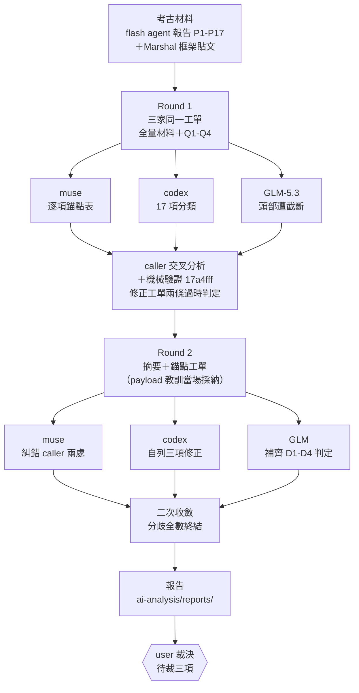
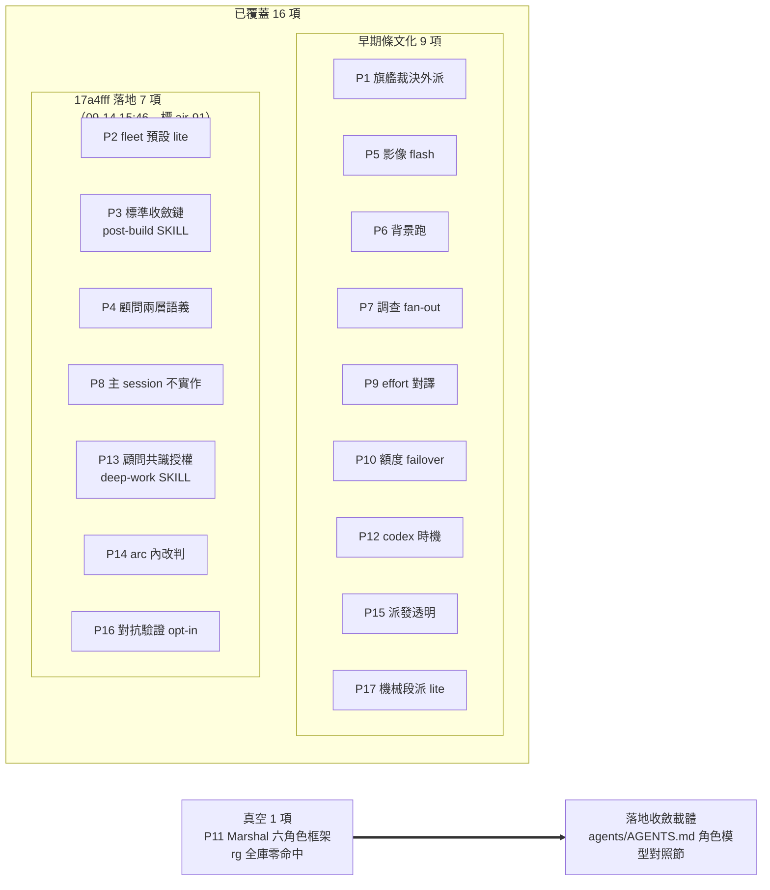
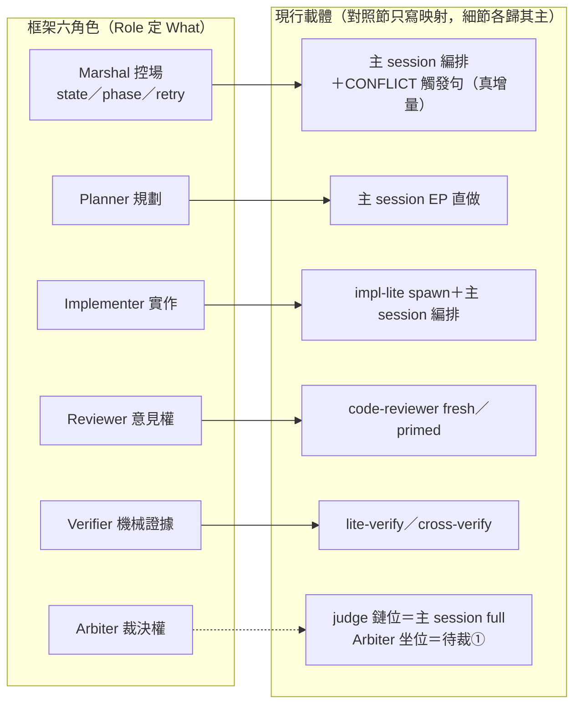
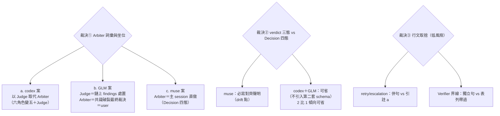

# sub+model 派工考古 × Marshal 框架交叉諮詢——圖解說明

> 本文是 [2026-09-14-sub-model-marshal-cross-consult.md](2026-09-14-sub-model-marshal-cross-consult.md) 的人類 viewport（mode D 圖解沉澱）。人判讀聚焦三問：**結構撐得起嗎**（對照節三必寫）、**在重造嗎**（單一源指針形態）、**方向對嗎**（待裁三項）。顧問材料非結論，Arbiter＝user。

## 1. 雙輪三家諮詢流程總覽

## 2. 17 模式覆蓋判定地圖

> 計數註：報告 TL;DR 沿 muse prose 記「15 已覆蓋」；按 muse 逐項表實為 **16 已覆蓋＋1 真空**（prose 係算術 slip，表為準）。P3／P13 由 caller＋GLM＋muse 三方獨立錨定，codex round-2 修正認可。

## 3. Marshal 六角色 → 現行載體（對照節提案核心）

**對照節「必寫」共識三條**（三家 round-2 收斂）：

| # | 必寫聲明 | 防什麼 |
|---|---|---|
| ① | 三層同名 disambiguation：功能角色 ≠ registry 載體（impl-lite）≠ 家族 profile（implement） | 第二個「旗艦雙義」 |
| ② | 主 session 兼任兩職：Marshal 職＋Policy 執行者（角色≠坐位） | 把 Marshal 等同主 session 的誤讀 |
| ③ | CONFLICT→Arbiter 觸發句（例外路徑非預設鏈）＋retry/escalation 歸屬 | 現行 contract 表無狀態機的真空白 |

## 4. 分歧終局與待裁事項

**Round-1 分歧 D1–D4 在 round-2 全數終結**：

| 分歧 | 終局 |
|---|---|
| D1 P4 顧問語義 | 已覆蓋（skill:155-159 兩層語義在場）；codex 立場係「標準之爭」非漏讀（muse 糾錯 caller 歸因）；profile/phase 細化＝未來增補候選 |
| D2/D3 P2/P8 | 已覆蓋；「再抽象一層」訴求＝對照節本身（命名不動條文） |
| D4 P16 預設化 | 三家皆反對——對抗驗證價值在稀缺性；維持 opt-in，對照節只陳述「例外路徑」 |

**待 user 裁決三項**（進 AIR-91 討論）：

## 5. 流程自身實證教訓（回流素材）

| # | 教訓 | 證據 |
|---|---|---|
| 1 | 外部 runtime 輸出完整性無預檢 | GLM round-1 頭部截斷：stream／ledger／jsonl 三處一致缺失；muse 盲點預言被實況命中 |
| 2 | 多輪工單「摘要＋錨點」形態有效 | round-2 只帶摘要，三家全數完成表態（GLM 自證受益） |
| 3 | effort 軸不對稱→橫向比較歸因不可靠 | glm bridge 不收 `--effort`；「哪家更深」不可靠，本報告比較面同受此限 |
| 4 | transport 三態表缺 holder-session 死亡行 | muse 建議一行增補（零行為變化） |
| 5 | 三家交叉的價值 | caller 工單兩條過時判定被 GLM／muse 獨立糾錯——單一家族審查會漏的時序差，交叉即現形 |
