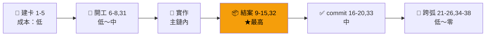
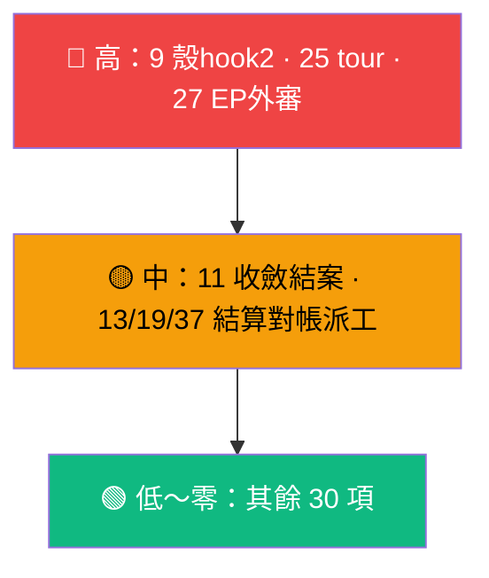
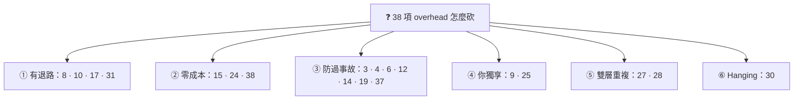

# 開發流程雜事總整理——砍/留決策材料

> 日期：2026-09-15。來源：`skills/CLAUDE.md` 工作流拓撲全檔、`skills/kanban-board/SKILL.md`、`skills/commit/SKILL.md`、`AGENTS.md` 受眾模型、09-15 dev-flow 盤點報告。
用途：user 思考「哪些要砍、哪些不用砍」的決策材料。每項：內容 / 觸發 / 成本 / 為什麼有 / 砍了會怎樣。
> 本報告列出觀察事實與待驗證假設；保留、降頻、替代或刪除 verdict 由後續決策下。
> 共 38 項（v1 26 項＋v2 補 12 項）＋ 3 張結構圖。

## 0A. 項目狀態分類（避免把盤點誤讀為保留決策）

本文件只描述現有流程與成本，不代表所有項目都應永久保留。項目分三類：

| 類別 | 定義 | 判讀方式 |
| --- | --- | --- |
| A. Observed overhead | 已存在的流程成本 | 先量測實際使用頻率與事故避免價值 |
| B. Protection mechanism | 為避免已發生或高成本事故而存在 | 砍前需確認替代防線 |
| C. Optimization candidate | 已知成本較高、價值尚需驗證 | 優先做 A/B 實驗或降頻，而非直接刪除 |

目前建議優先重新評估：**9 Report Shell hook、27 EP Review legs、28 Agent Review 3-perspective、30 doc-health/instruction-testing**。這些不是判定應刪除，而是成本／收益最需要重新校準的候選。

## 0B. Review / Compact 相關邊界（補充 UC：Review System Skill Design）

新增 UC 顯示：review 流程本身也有一個容易膨脹的邊界問題。

目前 review 相關成本不應理解為「review 越多越安全」，而應拆成：

```text
review command
    |
    v
review protocol（共通規則）
    |
    +-- completion evidence
    |
    +-- architecture review
    |
    +-- code reality evidence
```

### 應保留為 protocol / skill 的內容

- reviewer role 與責任邊界
- approve / request_changes 等 structured output schema
- severity 定義
- requirement completeness / regression / architecture consistency / validation quality

這些屬於所有 repo 共通能力，不應重複塞入每個 review prompt。

### 應避免成為固定 overhead 的內容

- 每次 review 都載入完整架構方法論
- 每次 review 都執行所有 code-reality inspection
- 每次小修改固定啟用多 reviewer legs

建議原則：

```text
small diff
 -> normal review

architecture change
 -> deep review

security / high risk
 -> specialized review
```

因此原本 27/28 的 review overhead 應視為 routing 問題，而不是單純砍 reviewer 數量問題。

## 0. 結構圖

### 0.1 overhead 在生命週期上的分佈



### 0.2 成本熱區



### 0.3 決策切分（六刀法）



---

## 一、建卡（承諾進池）

**1. 建卡前去重**：`backlog search`＋查 `drafts/`＋`open-items.md`，命中則復用不重複承諾
- 觸發：每次建卡前。成本：低。為什麼：一行指針≠承諾，卡＝承諾；防承諾池重複佔位
- 砍了：To Do 池出現重複卡，開工才發現撞車

**2. 建卡本體＋spec gate**：`task create`（人話 title＋desc）→ `task edit --plan` 補工單 spec（三必有：baseline／已決策勿重辯／範圍；軟自查 `rg -c` 應 ≥3）
- 觸發：每次建卡。成本：中（寫 spec 是主要成本）。為什麼：跨 session 接手不重辯；卡拼裝即 handoff
- 砍了：接手重問重辯；simple 卡本來就豁免

**3. 建卡即 commit**（批次併一顆；共享 WT 活躍 branch 時走暫時 worktree 直進 main）
- 觸發：每次建卡。成本：低（分流形態較繞）。為什麼：跨 WT id 防撞靠卡及時進 branch ref；AIR-46 狗糧
- 砍了：平行 session 建卡撞 id；看不見別人的新卡

**4. 建卡 id 防撞檢查**（多 WT 預掃／單 WT 三面查驗）
- 觸發：每次建卡。成本：低～中。為什麼：撞號反覆發生後強化；卡 id 不可重用
- 砍了：撞號後 `git mv`＋改 id，比事前檢查貴

**5. 欄位分工**（title/desc 全人話，AI 工單住 Plan；09-15 改制）
- 觸發：建卡＋開工/結算/結案更新 desc。成本：低。為什麼：board 是你的主視圖
- 砍了：卡面變 AI 黑話，巡板要逐張點進去

## 二、開工（動卡第一動）

**6. 起手式五步**：①先設 In Progress ②讀卡全層 ③看有無 EP 判形態 ④新鮮度核對 ⑤掛雙 ref（EP＋殼，相對路徑）
- 觸發：凡動某卡的 session。成本：中（④機械驗證）。為什麼：relay 宣稱常過時；ref 是卡→EP/殼唯一導航
- 砍了：照舊描述做錯方向；卡與 EP 失聯

**7. 開工 metadata 即 commit**（僅 `backlog/`）
- 觸發：每次開工。成本：低。為什麼：In Progress 未 commit＝平行 session 看不見
- 砍了：兩個 session 同開一卡

**8. 卡 branch 生命週期**（`air-N` 開→收尾 ff-merge＋刪 branch；被拒先 rebase）
- 觸發：階段 1 起手式⑤後開，收尾吸回。成本：低。為什麼：弧邊界乾淨，main 線性
- 砍了：已有軟條款（直落 main 不回頭搬）——代價最小的一條

**31. 卡編輯前查驗**（id 歸屬對時＋SECTION marker 雙包裹檢查）
- 觸發：每次 `task edit`。成本：低。為什麼：AIR-26/28 誤打他卡毀 refs；marker 嵌套 CLI 不報錯肉眼易漏
- 砍了：偶發毀卡（尤其毀到別人的卡時很痛）；修復靠 `git checkout`，有退路

## 三、結案（收斂後，最重的一坨）

**9. Report Shell hook 1＋hook 2**（EP 定稿建殼→post-build refresh：實作章節＋產圖一次＋badge ✅＋持久 delta tour；`index.html` 進版控）
- 觸發：每弧兩次。成本：高（整條鏈最貴的人工段之一）。為什麼：你的日常判斷主載體；commit 前穩定點
- 砍了：失去「這弧改了什麼行為」單一入口，退回逐檔看 diff

**10. 階段 5a metadata-sync Built 結算**（Capabilities＋消費場景＋SYSTEM-MAP 預覽＋badge 🟡）
- 觸發：implement 內。成本：中。為什麼：能力索引即時更新，不靠結案回想
- 砍了：Capabilities 漂移；可退回 standalone 補漏（有退路）

**11. 收斂後結案**（結案兩步＋SYSTEM-MAP 升級＋EP 歸檔＋flow-feedback 歸檔＋badge ✅）
- 觸發：每弧收尾。成本：中～高。為什麼：EP 不歸檔＝任務家變墓地；SYSTEM-MAP 過期＝變謊言
- 砍了：分不清誰活誰死；跨域現狀無人維護

**12. 結案兩步＋metadata commit 特赦**（`Done`＋final-summary＋ref 整組替換；precheck 綠才免確認，限互動 session）
- 觸發：每卡結案。成本：低。為什麼：ref 替換語義；特赦省一次確認往返
- 砍了：卡面與實際脫钩；refs 指向搬走前的舊路徑（MOS-28）

**13. 弧結案蒸餾第三動**（本弧 memory 條目重寫為終態 facts）
- 觸發：每弧結案。成本：中。為什麼：不蒸餾＝流水帳餵給未來 session 當事實
- 砍了：池膨脹＋髒知識；夜間波是第二道不是源頭

**14. precheck 跨線掃描**（`task complete`／歸檔／清板前強制）
- 觸發：清場動作前。成本：低（一條 script）。為什麼：攔平行線訊號
- 砍了：清掉別線還在用的卡

**15. backlog 清理批次**（Done＞30d→`task complete`，每日排程）
- 觸發：每日 23:50 自動。成本：零。為什麼：Done 欄無限堆積＝board 變墓地
- 砍了：手動清，或 Done 欄越來越長

**32. To Do 池 triage＋draft/archive 治理**（backbone 定優先；遠期 demote→draft；廢棄 archive；不加 Icebox 欄）
- 觸發：定期。成本：低。為什麼：To Do 只留可開工承諾，否則承諾池變許願池
- 砍了：池越來越長，開工前多一道「這卡還做嗎」

## 四、commit 閘門群（/commit 內）

**33. PENDING 拍板池結算**（commit 前搬已結案段，不含 hash；禁 post-commit 回寫）
- 觸發：有 PENDING 條目的 commit。成本：低。為什麼：雞生蛋懸掛（記錄 commit 的文字進不了那個 commit）
- 砍了：拍板池殘留已決條目，下次誤以為還沒決

**16. Lint 閘門**（ruff check＋format＋mypy，全過才 commit）
- 成本：低（失敗才有手修成本）。為什麼：最後一道機械門
- 砍了：壞碼進版控；注意 mypy 連 pre-existing 都擋，有時為舊債付費

**17. 引用同步掃描 2.5**（改 rules/skills .md 才觸發）
- 成本：低。為什麼：single-source drift。提醒非強制，本來就輕
- 砍了：改 rule 不改 skill，兩邊打架

**18. POC/Demo 處置閘門 2.7**（改寫成 test／delete 須附三選一證據／活躍豁免；刪後 dangling-ref 全域掃）
- 成本：中。為什麼：POC 不得無痕消失，倒逼測試覆蓋
- 砍了：poc/ 堆積無人認領；「驗證過」的行為沒 test 留存

**19. Finalization 對帳閘門 2.8**（結算物全納入／並行排除／孤兒收編；半套歸檔偵測；memory 池對帳腿）
- 成本：中。為什麼：AIR-17 孤兒懸掛半日＋假結算；MOS-28 半套歸檔
- 砍了：結案做完沒進 commit；refs 指向 git 不存在的路徑

**20. 確認門＋message＋收尾**（摘要＋message→你 OK；docs 單檔閘門；TEMP log 掃描；`.review/` per-branch 清除；Co-Authored-By）
- 成本：低～中（你的注意力是主要成本）。為什麼：commit 是最嚴格 outward action
- 砍了：特赦 ①–④ 已是最小集；再砍＝AI 自主 commit（09-13 已裁定禁）

## 五、記憶與接續（跨 session）

**21. STATE.md**（Last session 觀察層，覆寫非累積）
- 成本：低。為什麼：/at resume 入口；記「為什麼轉向」
- 砍了：resume 後從零考古

**22. compact-prep**（preserve-list 脈絡檔＋memory 檢查＋提醒手動 /compact）
- 成本：中。為什麼：/compact 壓掉 verbatim；ZCode 無 hook 可補，只能靠這個
- 砍了：壓縮後接不回來，重做已驗證的事

**23. memory 寫入端紀律**（六問＋desc 三不＋hooks＋載體判定）
- 成本：中。為什麼：池曾膨脹失控（149K 條目實證）
- 砍了：回到膨脹，只是這次你知道會發生

**24. 夜間收斂波＋稽核＋排程三條**（23:40 收斂／週日看照／週六週報＋launchd 清理）
- 成本：零（自動）。為什麼：存量收斂＋流入節流的第二道
- 砍了：省機器時間；停波＝存量漂移無人收

## 六、慢知識產線

**25. tour corpus／blueprint**（delta tour 持久＋tour-bootstrap＋blueprint-bootstrap）
- 成本：高。為什麼：re-onboard 與結構導覽
- 砍了：re-onboard 回到逐檔讀；砍了要同步拆 post-build chain 的修復閉環

**26. flow-feedback＋flow-review**（摩擦收集→聚合→新 EP／卡）
- 成本：低。為什麼：本輪「想砍什麼」本身就是 flow-review 輸入
- 砍了：流程問題停留抱怨，不沉澱成改動

## 七、審查支線（主鏈之外的 review 開銷）

**27. EP Review legs**（雙家族外部 review：GLM code-reviewer×2＋muse bridge 工單；--background＋wait/show 晚收＋judge 裁決）
- 觸發：EP 定稿前。成本：高（多腿＋等待＋額度）。為什麼：EP 錯了整弧重做；外部第二意見
- 砍了：EP 只剩 self-review；省額度＋等待，賭 EP 品質

**28. Agent Review 3-perspective**（implement 段落收斂：fresh＋primed＋lite-verify）
- 觸發：每段收斂。成本：中。為什麼：Writer/Reviewer 分離在段落級落地
- 砍了：段落只剩 self-check；post-build code 鏈仍兜底——段落級＋全弧級雙層是否重複，可判

**29. /followup-review＋/cross-verify＋/state-review**（修正複驗／多源查證／全 repo state-rot 掃描）
- 觸發：按需。成本：中～高（state-review 是 external family 單發深審）。為什麼：各補一個盲區
- 砍了：對應盲區回肉眼；按需觸發＝不用零成本，放著不礙事

## 八、文檔健康與部署

**30. /doc-health＋instruction-init/clean/sync**（能力地圖健檢＋instruction 體系生成／清理／同步；instruction-testing 仍是 draft、pilot 沒跑）
- 觸發：按需／定期。成本：低～中。為什麼：Capabilities 漂移偵測；instruction 有人養
- 砍了：漂移無人報；testing draft 可先判死刑或先跑起來，二選一比 hanging 好

**34. code-reality 工具鏈維運**（build＋階段 1 baseline snapshot＋delta_tour＋profile；index 是 build-time，編輯後重 harvest）
- 觸發：每弧 snapshot＋查詢前驗新鮮度。成本：中（大 repo build 分鐘級；staleness 是認知成本）。為什麼：符號真相／blast radius／debrief 底稿都靠它
- 砍了：退回 rg＋LSP 人肉查引用；debrief/drift 失機械底稿

**35. deploy＋bundle size gate**（deploy_agents.py：90KiB／per-target／muse 36KiB；deploy 前 diff 授權；fresh session 驗證）
- 觸發：每次改 rules/skills 部署。成本：中。為什麼：跨 harness 漂移；超截斷線 rule 靜默失效
- 砍了：改了沒部署到某端，行為分岔無人知

## 九、git 與派工開銷

**36. /rebase＋收尾紀律**（trunk 永不被 rebase；`all` 前先收卡；ff-only 吸收）
- 觸發：收尾／同步。成本：低。為什麼：多 worktree＋單 trunk 線性
- 砍了：`all` 護欄防一鍵 rebase 災難；單卡收尾已有軟條款

**37. 派工固定開銷**（派工前載 model-routing＋查 spine 額度＋eligibility gate＋bridge 合法路徑＋工單禁再委派＋wait/show 晚收）
- 觸發：每次外部派工。成本：中（認知＋等待；設錯 binding 燒旗艦額度）。為什麼：AIR-50 旗艦燒機械段；bridge cache 事故；1308 failover
- 砍了：裸派＝憑感覺選 model，省流程花額度

**38. 日常維運三件**（/standup 晨間 digest＋/daily-maintain 自動修＋corrections-weekly 糾正週報）
- 觸發：排程自動。成本：零（你只讀報告）。為什麼：跨 WT 可見性；低風險自動修；糾正暴增＝規則衰減儀表板
- 砍了：同 24；週報是你判斷「規則爛了沒」的唯一儀表板

**低頻附帶**（成本趨近零，不佔決策位）：`/spec`、`/ep-validate`（本來就可選）；multi-machine 移植腳本（換機才用）；`voice-notification`；commit message 繁中＋Co-Authored-By 格式。

---

## 附：判讀問題（給人的三問）

1. **9（殼 hook2）**：過去一個月，有幾次是靠殼而不是靠 diff／對話搞懂一條弧的？零次→可砍，留 hook1 當計劃 viewport 就好。
2. **28（段落 review）**：post-build code 鏈抓到的 finding，有多少是段落 review 漏掉的？很少→段落級可降級為 lite-verify 錨點就好。
3. **27（EP 外審）**：回想最近三條 EP，外審 legs 提過幾次「不審會整弧重做」的 finding？零次→降為高風險 EP 才開，平時關掉。

*附：靜態盤點，數字以報告內註明的機械來源為準；repo 演進後以各單一源 skill／卡面為準。*
