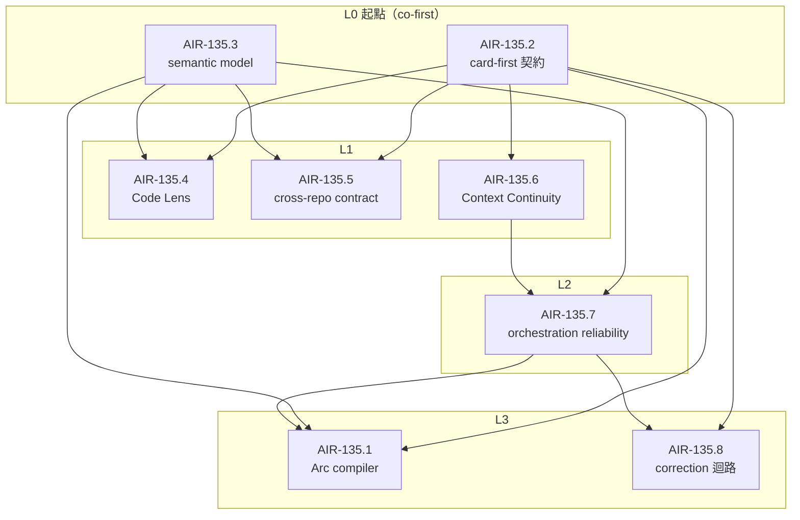
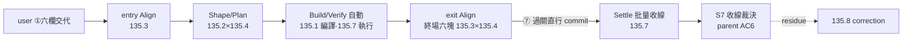

## Description

<!-- SECTION:DESCRIPTION:BEGIN -->
把「開發流程固定化」提升成 **AI Development Arc program**。

**核心思維**

- 定義必要的 semantic obligations，讓人與 LLM 在關鍵時點保持同一張圖——不是固定一串 command
- 可委派的流程／model／WT／session 細節交給 Marshal 自動化；Marshal 包覆全弧，不是 lifecycle node
- 工作狀態採 card-first：Backlog parent/sub-card tree 是唯一 durable planning/control plane；standalone EP 是否退役由 AIR-135.2 實證收尾
- human viewport 是 projection 而非第二真相源；跨 repo 採 owner/consumer contract——ai-guide 擁 lifecycle semantics，SouthChariot 擁人機 control surface、不另建 lifecycle truth
- 開卡一律 **Description 先行**（人話＋一張 mermaid 圖），user 在 SC ext 點卡確認後才建卡、再補 AC/Plan

**主鏈**：entry Align（user 六欄交代）→ Shape/Plan → Build/Verify（自動）→ exit Align（終場六塊）→ Settle（批量收線）；同 repo handoff 只是 orchestration 細節。

**Program 拓撲（deps 分層）**

**Two-Touch 旅程**

<!-- SECTION:DESCRIPTION:END -->

## Acceptance Criteria
<!-- AC:BEGIN -->
- [ ] #1 Development Arc 的 semantic nodes／transition obligations 收斂：human alignment moments 明確，Marshal-owned WT/session/model/retry 等 mechanics 不被誤當 lifecycle nodes；node 拓撲須標 Two-Touch 八階段覆蓋與 human-present／Marshal-automated 旗標（135.3 AC#1），transition obligations 含⑦ commit 條件委任（bi/tri＋post-build 過關即授權——0919 裁決，135.3 AC#6）
- [ ] #2 card-first contract 經 AIR-135 family 真實 dogfood：parent/sub-card 可讓 fresh session 還原 135.2 AC#2 清單所列全部欄位（該清單為 family 單一源，parent 不另列防 drift），含 Two-Touch 開頭六欄、exit 終場 receipt pointer 與 priced-autonomy 契約欄位；EP 是否退役有實證裁決
- [ ] #3 user 不需重複指定 model／review／WT/session／handoff procedure：AIR-135.1 可從 canonical card state＋runtime facts 產生可追溯 dispatch/transition obligations；obligations 含 priced-autonomy 記帳（revert 預算餘額／預授權類；超支即停為 JIT 重算與停機觸發——135.1 AC#1-#3）
- [ ] #4 Code Lens contract 收斂並以 code tour + pr-lens dogfood 證明 narrative/topology/impact 可由同一 canonical facts（card tree＋repo/code facts）投影；視圖時刻收斂（0920 user 裁決）：規劃時刻（②卡面討論、③SPEC 呈現）＝卡本身即投影（SC ext 點卡）、Code Lens 覆蓋⑥終場呈現單時刻（135.4 AC#2 view mapping）；EP 退場 verdict 以 Code Lens POC 承載（135.2 AC#5×135.4 AC#4 聯合 dogfood）；Report Shell／illustrate／Code Lens 都不成第二 truth source
- [ ] #5 ai-guide↔SouthChariot cross-repo ownership／identity／projection/action contract 收斂；SC implementation card 的開卡條件與回寫 canonical state 規則明確，SC 不另建 lifecycle truth。**跨 repo 發送＝outward 逐次授權（確認 gate 憲法級——135.5 AC#6 草案八欄＋三路 transport 分流）；⑦直接 commit 委任僅及本 repo 審查通過弧，跨 repo 寫恆停（135.5 AC#4）——此邊界為 program 級 invariant，四張子卡引用本條不重刻**
- [ ] #6 AIR-135 family 完整跑一輪後，產出現行流程→新 Arc 的 rename/deprecation/migration 清單，且 user 可用 human viewport 對照「系統理解 vs 真實意圖」完成最後方向裁決。「完整跑一輪」的驗收度量＝S7 三欄＋Two-Touch 不變式計數（無正當理由打斷＝0、自治決策預算記帳完整——與 135.1 AC#4 dogfood 謂詞同軸）
- [ ] #7 AIR-135.7 dogfood 證明互動中 main agent 可持續留在 human discussion／steering seat，適合的工作自動 delegate/background；大／可恢復 worker 產出自動 artifact-first 落盤並回 bounded receipt，user 不需再提醒「開 sub／主 agent 待命／寫 .agent-tmp」。背景 job 的 liveness/collection 由 Marshal 主動維護，user 不需輪詢「做完了沒」（135.7 AC#3/#6）
- [ ] #8 Context Continuity 經 AIR-135.6 dogfood：長弧在 context 壓力／compact／session restart 前後，可由 card-first canonical state＋artifact/runtime facts＋薄 continuation packet 恢復 current plan、已驗/未驗、active jobs 與下一動；不要求 user 重述，也不以 harness 自動 /compact 當主要狀態保存機制
- [ ] #9 開卡簡則（0919 v4 終版）：所有新開卡（含拆卡）Description 先行——人話（這卡解什麼／定什麼／不做什麼）＋恰好一張 mermaid 圖；user 在 SC ext 點卡看過確認後才建卡，AC/Plan 於確認後補齊；既有 9 卡的確認＝user 對本輪改寫的點頭（reconciliation）。S7 保留終場驗收
<!-- AC:END -->

## Implementation Plan

<!-- SECTION:PLAN:BEGIN -->
〔定位〕AIR-135 是 program parent，不直接承載所有 implementation detail；parent 保留目標、跨子卡 invariant、整體 topology 與最終裁決，bounded work 下放 135.x。

〔已確認 evidence〕
- 實際 session audit 顯示，WT/session/handoff/bridge 等 execution mechanics 不應膨脹成 human-visible lifecycle nodes；Marshal 應吸收同 repo orchestration。
- mosaic_alpha MOS-22 precedent：原平級 MOS-16~21 為了真正成為 program children，重發為 22.1~22.6；Backlog.md source 又確認 parent 只在 create input、沒有 reparent edit path。
- Backlog.md source review：Task 原生承載 Description/AC/Plan/Notes/Comments/Final Summary + parent/subtask；Plan 有 replace/append semantics，官方 execution guideline 把 task 當 plan of record。真正風險是 plan 無痕覆寫，不是 plan 會變。

〔program workstreams〕
S1 / AIR-135.3：Development Arc semantic model＋命名。只定必要 obligations / transition gates / human alignment moments；Marshal-owned mechanics 不升格成 nodes。
S2 / AIR-135.2：card-first planning contract＋EP 退場 dogfood。定 section ownership/mutability、plan revision rationale、fresh-session reconstruction、既有 ep.md consumer 遷移與 reversal condition。
S3 / AIR-135.1＋AIR-135.7：Arc compiler／Marshal automation（2026-09-18 拆卡：135.1＝compiler 本體——card tree 投影 ArcSpec/ArcPlan/DispatchSlice，role/model/window/review/retry/WT/session 義務程式化；135.7＝orchestration 可靠性——main-seat、artifact-first delivery、collection contract、bounded slices/checkpoint、context 對接），user 不再重複 procedural prompt。
S4 / AIR-135.4：Code Lens。統一 code tour + pr-lens，定 canonical facts vs derived views、on-demand rendering、entry/exit Align 用法；原 S1 pr-lens graph 成為本 workstream 的 dogfood evidence，不再等同整張 AIR-135。原 AIR-130（pr-lens deterministic producer slice-1）已併入本卡為首個 implementation slice（2026-09-19 user 裁決吸收）。
S5 / AIR-135.5：cross-repo contract。定 ai-guide↔SouthChariot ownership、shared arc identity、projection/action contract、何時在 SC 開對應 implementation card；禁止 SC 成第二 workflow DB。
S6 / AIR-135.6：Context Continuity。把 card-first state、artifact/runtime facts、event-driven checkpoint、thin continuation packet、adaptive rehydration 與 compact boundary 組成跨弧可靠性機制；不自製 summarizer、不把 /compact 時機從 user 手上拿走。
S7（owner＝parent 本卡收尾段）：整體 dogfood／對照：用 AIR-135 family 本身跑一輪，驗證 user 只給方向也能正確走流程；包含 context pressure/compact/restart recovery；dogfood 驗收度量＝user correction 計數、dispatch receipt 追溯率、residue 留存三欄（防結論淪為自評）；之後固化條文、rename/deprecate 舊 lifecycle/EP/viewport/compact-prep 名稱與入口，最終方向裁決以 human viewport 呈現交 user。

〔決策原則〕
- human/LLM shared understanding 優先於 command completeness。
- canonical state 少且明確；視圖按需產生。
- Plan 可變；變更必有 reason/evidence/supersedes trace。
- 同 repo orchestration 隱藏在 Marshal；cross-repo 才用 explicit contract/boundary。
- 子卡可以平行研究，但跨 repo implementation 不在 contract 未定前搶跑。
- 各卡實質裁決統一以〔已決策勿重辯〕節標記（格式同 135.6），禁散落 Notes 無標籤。

〔術語釘住（家族統一；各卡細節擴充歸各卡）〕
- Marshal＝runtime 責任主體：包覆全弧的 orchestration，執行 dispatch/collection/recovery，擁有 WT/session/model/retry mechanics。
- Arc compiler（135.1）＝card tree→ArcSpec→ArcPlan→DispatchSlice 的純函式投影器，無 runtime 權；Marshal 消費其產物。
- Planning Contract＝standard 卡開工時的計畫契約（現行 guide 規模分級）；PlanSource/TaskRef（135.2）＝consumer 端對 card tree 的邏輯引用抽象，ArcSpec 是其 compiler 投影。
- continuation packet（135.6）＝context 恢復用 thin 投影，其 schema 由 135.6 擁有；與 DispatchSlice 的 context-delivery budget 對接（135.7 AC#5）。
- Align＝human shared-understanding obligation（定義在 135.3）；entry/exit alignment moment 指其排程時點，viewport 呈現（135.4）是其服務面。
- pending-decision 台帳＝未決人類裁決的唯一住處：仲裁語義 135.3（AC#6/#7）、surfacing 欄位 135.7（AC#2）、跨 repo 投影 135.5（AC#7）；晨間批量裁決清單視圖歸 135.4。
- liveness 台帳（135.7，dispatch 期望登記六欄）≠ 跨 repo 通知草案八欄（135.5 AC#6，發送 payload）——目的正交禁混用（135.7 Notes 辨義升格為 family 術語）。

〔執行序與計畫時點〕
- 子卡 ordinal＝建卡序非執行序；執行序依 dependencies DAG（0919 v3 定著）：L0 135.2‖135.3 無 deps 可即開（co-first）→L1 135.4／135.6／135.5→L2 135.7→L3 135.1；135.8（correction 迴路）依 135.2＋135.7 屬 L2 後段；「平行研究」僅限唯讀對方卡，未定介面前禁寫對方擁有的面。
- 子卡 Plan 節於各卡開工時依 card Planning Contract 補齊；現階段 Description＋AC 即其 current plan，135.2 AC#2 的 fresh-session 還原宣稱以已開工卡為驗收對象。
<!-- SECTION:PLAN:END -->

## Implementation Notes

<!-- SECTION:NOTES:BEGIN -->
【0918 開工】原卡以「完整標準流程六 lane + pr-lens 第一產物」為中心，已完成 v1 graph/validate/render 作方向對照；後續實際 session audit 與 user 校正顯示這個 framing 過度貼近 implementation mechanics。

【0918 方向校正】user 定調：模型會更強、可給更多自主權；最重要是 human 與 LLM 同一張圖。Report Shell、code tours、pr-lens、/illustrate 是 human alignment surfaces；反覆提醒方法／model flow 應由系統消除。同 repo WT/session/handoff 由 Marshal 自己處理，handoff 主要留跨 repo。

【0918 card-first 證據】Muse 直接讀本機 Backlog.md source 後，推翻前輪「full-tier 保留 EP」結論：Backlog Task 已有完整 structured sections + nested parent/subtask；Plan 原生可 replace/append，並非穩定 artifact；官方 guideline 明示 task 是 plan of record。缺口是 bare plan replacement 可能無痕丟 rationale，因此 AIR-135.2 要把「改 plan 必留 supersedes + reason/evidence」做成 contract/finalization gate。另確認既有 top-level task 無 reparent edit，需像 mosaic MOS-16~21→MOS-22.1~22.6 重發；AIR-134/DRAFT-12 的承接因此改走 135.1/135.2。

【0918 program 擴張】user 提議 Code Lens 整合 code tours + pr-lens，並考慮 AI lifecycle 改名／調整新流程；SouthChariot 未來也需開 implementation card，但跨 repo 關係要先設計。本卡因此改為 program parent，新增 semantic model、Code Lens、cross-repo contract workstreams；SC 卡等 AIR-135.5 contract 收斂後再開。

【0918 prompt-burden 補充】反覆 user correction 顯示兩個 orchestration 細節尚未被 program 明文化：互動 main-seat/delegation-first、以及大輸出 artifact-first delivery。ownership 下放 AIR-135.1；parent 只保留 dogfood 成功條件，不把它們升成 lifecycle node。

【0918 context continuity 補充】研究 09-15 compact architecture／controlled strategy／direction handoff、memory §6 與 09-08 compact feedback 後，新增 AIR-135.6。定位不是新增 lifecycle node，也不是自製 compact：把 context preservation 升成 Marshal cross-cutting reliability mechanic——card/artifact 平時持續 checkpoint，壓力來時只產 thin continuation delta，compact/new session 後 adaptive rehydrate 並驗實物。user 仍保留 /compact／換 session 時機裁決。

【0918 跨家族審查＋judge】muse fresh-eyes 審查（job-mu6yvfsr-qb10ze，只憑卡檔還原實測）：16 findings＝✅14（採納項隨 b5cf2b10 落地：術語釘住、S7 owner=parent＋度量三欄、135.3 authority 邊界、135.6 介面 ownership、full_trigger 回接等）／❌1（F12 SC-15/16 存在性——user 逐字為能力源＋AC#4 gate 已管）／⚠️1（F5 135.1 十一條 AC 是否拆卡——留 user 裁決，建議卡內標 MVP/stretch 線）。還原測試 (b)(e) fail 已由 plan 補齊時點＋執行序兩節修復；帳本 .review/air-135.md（lint discovery 綠）。

【0918 user 裁決＋收線】F5＝拆卡（orchestration 可靠性重發 AIR-135.7，135.1 保留 compiler 本體 6 AC；90e51931）；收線授權＝rebase onto main＋ff-only merge（branch/WT 保留——arc 續行中，7 子卡 To Do）；DB 修復由 user 另 session（sess_2f4d6ea5）進行中。帳本 F5 已閉（✅16 條全收斂：✅15/❌1）。

【0918 POC 前期實驗（deep-work）】9 線：8 綠＋1 deferred（P5 等 DB）。P1 還原 v2 五格 4 pass＋1 partial（v1 兩 fail→歸零）；P3/P4/P12 ArcSpec→DispatchSlice→work-order 全鏈機械可行（fail-loud 反證觸發、窗口 JIT 斷言綠、政策值自 spine 09-16 行）；P6 packet fresh-agent 四問全對——schema 修正：packet 須拆 per-WT git state；P2 EP retrospective＝7 EP/122 section/71% consumed（嚴格 52%），0/7 儀式塊五個＋Scenario Matrix 57%——135.2 verdict 實證證據；P9 v1 手抄視圖 FAIL→機械生成 v2 機械驗證綠（手工視圖必漂移實證）；P10 search token 正向全命中；P11 decision entity roundtrip＋首筆真裁決 decision-1；P8 六 node 全必要、Align＝可重入 obligation（非同步 receipt 實證）。產物與判定標準：.agent-tmp/air-135-poc/（journal.md）。

【0919 北極星定案（tri：muse＋GLM-fresh＋5.3；codex 三連死憑證過期記環境事故）】**Two-Touch Execution（priced autonomy 版）**＝本 program 終態：任務＝開頭交代（六欄：intent verbatim／non-goals／revert 預算／預授權類／假設台帳四欄／成功謂詞）→ 不打擾的可觀察性執行 → 終場呈現六塊（comprehension receipt／intent-diff 防拉伸／決策紀錄含被拒選項／可逆點＋成本標注／no-impact 機械證據／否決介面——否決必須比批准便宜）。核心不變式：①**無正當理由的打斷＝0**（打斷合法性＝強 outward／真分岔／自我擴權／預算超支；「次數＝2」非 invariant）②**priced autonomy**：「能 revert 就不問」錯——「revert 便宜才不問」；revert 成本連續，開頭定預算、自治決策扣款、超支即停 ③門裝對位置：行動面（commit/outward/破壞性）憲法停；判斷面自治記錄理由（0919 自我檢舉：十幾次打斷多數違規——W1-W8 清單見 tri 檔）④方向漂移複利對策：早期方向探針（artifact 不提問）＋bounded slices checkpoint＋假設台帳 slice 邊界審計 ⑤信任畢業制：首批小額預算＋可不看的 checkpoint，否決率低→升級。viewport 層（135.4）＝終場呈現＋可觀察性的工具：圖替你看（沉默是成功）、新鮮度錨（stale 自稱 stale）、注意力送到 AI 最可能誤解處、無問題可問的視圖不存在。設計全文：.agent-tmp/air-135/twotouch-{muse,glm}.md＋northstar-{muse,glm}.md（codex 腿三連死：環境事故記錄）。

【0919 Two-Touch 落地旅程（user 親述，取代抽象北極星）】①開頭交代任務→②卡內容討論：Code Lens 即時產生幫 user 理解的視圖，顯示於 SC（VSCode 整合瀏覽器）→③討論確定 SPEC 好了：SC Code Lens 呈現→LLM 研究→EP 寫在卡上→SC Code Lens 再呈現→④guide 依時間窗口＋coding plan 訂閱資訊＋memory spine 產生 LLM 使用規劃與開發流程（＝135.1 DispatchSlice）→⑤自動化執行（135.7）→⑥完成：Code Lens 終場呈現（產出＋最終架構＋待裁定事項；有 UI／可呈現物一併開好不用 user 說）→⑦經 bi/tri＋post-build 過關→**直接 commit（user 0919 授權：審查通過的弧 commit consent 委任）**→⑧收尾（user 裁定修好整理好）→關卡可批量（半夜／不在場跑，依次處理多卡）。

【0919 commit 委任細化＋plugin 授權（user 親述→canonical 落 decision entity）】①自動化弧 gate 順序＝bi/tri 審查過關→post-build 過關→自動 commit；post-build 沒跑＝禁 commit、補救＝補跑（非跳過）②commit skill 最後確認加嚴（staged 逐檔核對／verdict＋receipt 機驗／message 對帳）③plugin：cc/codex 直裝免問、zcode 僅 user 手動。canonical＝decision-2／decision-3（accepted）；本條為指針。rule/skill 面收編（outward-action-consent＋commit skill）走落地前審查閘，歸 135 條文收編批。

【0919 v2 全案驗收（user OK）】旅程①納前期 alignment viewport 觸發規範（機械錨：pending decision ≥2 選項含 tradeoff／理解 delta；user opt-out 恆在）；S7 close gate 節點 owner＝本卡。deps 拓撲定著：L0 135.2‖135.3→L1 135.4‖135.6‖135.5→L2 135.7→L3 1351。提案溯源＝.agent-tmp/air-135/dogfood/proposal-v2.md＋codelens-poc-proposal.html（tri：muse job-mu7xaeki／codex job-mu7xbsv5／GLM-fresh）。

【0919 user 裁決：main-seat delegate-default＝預設開發模式（非僅 135.7 未來契約，即日生效）】做事＝預設開 sub（背景、artifact-first 落盤、回 bounded receipt）；main agent 留 discussion/steering 座席——討論、判斷、審查整合、liveness 盯場。實作腿、查證腿、機械腿全走 sub；user 在場時 main seat 不親手做可委派的工作。135.7 實作時以此為 baseline 契約，skill/條文面落地走審查閘。

【0919 v3 總修（gap-mining 四腿：muse job-mu7z2ayf/mu7z2b0e＋flash×2；user deep-work 授權）】C8 建真卡 AIR-135.8（618f6a36，deps 135.2/135.7）——correction 迴路；G1 升格＝135.1 新增 AC#7 使用規劃 artifact（含 spine 保鮮承接）；G3 mode taxonomy pending（decisions-pending 台帳）；小 gap 各歸屬（135.4 裁決清單視圖、135.7 信任畢業＋方向探針、135.2 影子禁升格）。拓撲更新：L2 後段加 135.8。

【0919 外部討論收割（ChatGPT 四層缺口框架×討論腿 muse job-mu88oodq／GLM-5.3 job-mu88osjx，雙腿收斂）】對表 Two-Touch 後收四條——①Epistemic Merge 最小閉環（假設台帳穩定 id＋狀態機 unverified/verified/invalidated＋decision entity 選填 invalidates/affected/confidence；schema 歸 135.2 AC#3、觸發歸 135.7、時序歸 135.3）②Intent Review 獨立腿＝exit intent 雙證（自報 intent-diff＋fresh 腿排除中間鏈；語義 135.3 AC#7、編排 135.7、read-set 排除 135.1）③reviewer／tester read-set 刻意差異化（role-dependent、禁逐字繼承 implementer reasoning——135.1 AC#2）④pending 台帳兩新批量浮出類 evidence-contradicts-intent／assumption-invalidated（135.3 AC#6）。已覆蓋勿加：entry 補第七欄（UNCERTAINTIES＝假設台帳未驗證列、TRADE-OFF＝priced autonomy——補欄即第二住處）、Attention Gate 機制本體（dw 承諾制即「resolved 不上浮」）、HumanInterruptions/ValuableOutcome KPI 公式（ValuableOutcome 無機械判準拒收；可測核心已在不變式①計數＋S7 三欄）、L0/L1/L2 制度化（viewport 已事實分層——135.4 選型指南補理解層一問）。禁新開卡；禁擴 135.8 scope（KPI 語義 user correction 專屬，model finding 未經裁決非信念）。findings：.agent-tmp/air-135/align-gate-{muse,glm}.md＋align-gate-brief.md（外部原文）。

【0919 v4 終版（user 裁決「簡單不要有太多規則」）】開卡＝Description 先行（人話＋一張 mermaid 圖），user 在 SC ext 點卡確認後建卡、再補 AC/Plan；marker 體系（INTENT／SA:*）與 digest/receipt 機制、HTML 生成器全數移除——卡本身就是投影，SC card 預覽即確認介面；卡尾 PROJECTION 段一併退役（user OK）。歷程：0918 批量開卡影子核可事故→v4 marker schema→同日依 user 簡化裁決收斂為本形態（SC 開法實證＝flash sc-previewer-flash.md：card detail 純 md 渲染，mermaid fence 為 repo 讀者/GitHub 服務）。
【0921 EP 定位討論輸入登記（sess_0983d2b2 spine 審查弧寫入 .agent-tmp/air-135/ep-positioning-discussion.md；sess_2c1d13c6 逐卡確認 session 消化）——四項登記 S7 verdict slot，終審權＝user viewport】EP 定位三分已覆蓋大半：artifact 退場＝decision-4（proposed）、工作單位＝Development Arc＋弧（card tree slice）、詞彙殘餘＝時序問題非概念問題（135.2 AC#4 的 16 STRUCTURAL/26 REFERENTIAL 遷移）。S7 待裁四項＋逐卡確認 session 推薦：①「弧／Arc」正式化為工作單位詞彙接手「一 EP＝一 session」——推薦：是（日常語彙已自然漂移，條文化＝追認非新制）②命令名 A（先遷 target 不改名——AIR namespace 前例正典化字面/語義脫鉤；避免 consumer 遷移＋公開介面改名雙重疊加）／B（一次改名）——推薦 A，rename 等 card-tree consumer 穩定後一次付清③guide 三行概念級條文（:38 UC 規模分級／:44 一 EP 一 session／:12 寫回 EP）遷移時點——推薦綁條件非序數：PlanSource/TaskRef consumers 穩定後隨 135.2 AC#4 批次④glossary／spine EP 條目補註記——decision-4 翻 accepted 的機械跟隨項，無獨立裁決必要（可回填 sess_0983d2b2 slug-glossary）。共識：歷史 EP 檔案（ai-analysis/_tasks archive）不動。

【0924 路線定著（user 三 OK——marshal session 收斂）】①AIR-135.9 結案 Done（7a814151）：註冊收線——旗艦裁決＋Mockup 契約已落地（516e0a56），dogfood 歸 135.3 AC#7/#8＋135.7 AC#7 消費端；殘留＝過渡期旗艦諮詢成本手動記卡 Notes（等 135.1 budget context）、mockup 合規盲區（無場景 vs 靜默跳過）交 135.8 mining ②AIR-135.5 翻 In Progress（0141becc；SC-162 handoff＋scbus amendment 進行中——precheck 反向檢查訊號解）③family 實作路線五波定著：W0＝135.2 decision-4 viewport pass（user 看 Code Lens POC 三問→翻 accepted）→W1＝135.2 收尾＋135.3 收斂＋135.5 形式化（互動弧——凍結契約基座，135.1 的前置）→W2＝批量夜 #1（135.6＋135.8；standard、零跨 repo、decision-5 過關直行；產 135.7 AC#7 批量 Settle dogfood 證據＋S7 度量首批）→W3＝135.1 compiler build（family 唯一未動工大件、full tier bounded design EP、multi-slice）→W4＝批量夜 #2＝family dogfood 一輪跑真弧（Two-Touch 不變式計數）→收 135.7→S7 rename/migration 清單→user viewport 終審→parent 收線；135.4 park 等 SC-162（不佔本地關鍵路徑）④AIR-135.8 Plan 節已落（四步迴路＋D-a~D-e 開放決策；batch 夜前 entry Align 補六欄）。待 user：decision-4 viewport pass（三問隨 illustrate 視圖交付）；兩筆卡面編輯 commit 已獲 user 確認。

【0924 user 資源約束】GLM 並發上限 3 線（含主 seat；codex/muse bridge 腿不計）——marshal 派工前機械盤點：seat＋在跑 GLM subagent（impl-lite=flash、Explore/general-purpose 繼承 5.3）＋bridge glm job，合計 ≤3 才派，超過排隊等回收。本批量剩餘弧一體適用。

【0924 receipt 錨更新（135.7 判讀腿附帶發現）】批量夜 #1 兩張匯總 receipt 引用的 commit 61f9b205／700bbb1f 已成孤兒（收線 merge 換 hash、無 ref 包含、僅 reflog 可達＝GC 風險）。內容新錨：135.6 內容＝22663e62（card-first recovery ownership 遷移）、135.8 內容＝b0fb2945（correction 迴路四步）。本節即錨修正記錄。

【0924 cookbook r2 雙腿收納（flash job-mufl0vu5＋muse job-mufl0vw9；findings＝oss-survey/cookbook-r2-{flash,muse}.md）】治理六面地毯掃描（registry 319 條全枚舉＋8 漏掃項補讀）。雙腿交叉 Top 共識五項（改進輸入，待 135.8/各 skill 修正週期消化，非立即動作）：①sandboxed-code-migration 全包→implement/agent-workflow/135.1（隔離＋receipt 機驗三層獨立同構＋work-order 範本）②記憶三連（context_personalization 領銜）→memory-audit（Memory Evals 三類＋Guardrails 三層〔instruction-shaped payload 拒收〕＋「只存 lessons 不存 facts」獨立佐證）③skills_in_api 三分框架→instruction-writing 載體選擇外部對照＋skill 版本 pinning vs symlink live 的 freshness 取捨待評④eval 方法論群（Optimize_Prompts golden pairs／分類式 judge 勝於打分／eval 三起點：冷啟動→自動迴圈→離線巨觀）→135.8 資產化⑤sev_bot 治理模式群（approval≠execution 句式／skills≠credentials／fail-closed）→outward-consent 佐證與句式借入。次選：what_makes_documentation_good→instruction-writing 體例（AI 讀者轉換點已標）；gpt-5-2 guide 四構件→post-build runbook；per_run_spending_controller→autonomous 預算記帳算法。
<!-- SECTION:NOTES:END -->

## Final Summary

<!-- SECTION:FINAL_SUMMARY:BEGIN -->
## 批量夜 #1 多卡匯總 receipt（0924 深夜，dw 承諾制）

| 卡 | 結果 | commit |
|---|---|---|
| AIR-135.6 card-first 遷移 | **Done**（AC#1-#4 全勾——AC#4 dogfood PASS 零重工） | 61f9b205 @ ephemeral/air-135.6-impl |
| AIR-135.8 correction 迴路 | **Done**（四步迴路＋review 鏈收斂） | 700bbb1f @ ephemeral/air-135.8-impl |
| AIR-182 catalog 沉澱 | **新建**（tri OK-with-changes；To Do 待領） | 建卡 commit |
| decision-4 EP 退場 | **accepted**（兩驗證腿＋user Q2） | — |

度量（S7 首批）：無正當理由打斷＝0（user 僅問進度＋新增 AIR-168 交接任務）；自治決策記帳＝review 裁定／豁免適用／editorial apply 全數落卡 notes 與 receipts；紅線跳過＝0（trunk merge 恆停待授權）。審查鏈＝codex＋muse review／5.3 judge（user 指定）；全部 findings 分級處置（採納／記後續項）。

待 user 晨間：①trunk merge 兩 ephemeral branch 授權 ②bridge 2.0.31 打包回歸（binary 自報 2.0.2，waiter 版本閘失效）③sess_64d6fbf9 關閉 TODO 2 筆裁決 ④close-out 機械化命令是否開卡 ⑤glm closeout 腿 interim 續收。

## W1 續行批量 receipt（0924 白天，AIR-183 授權後續線）

| 卡／弧 | 結果 | commit |
|---|---|---|
| AIR-135.2 AC#4 consumer 遷移 | **五模式 slices 1-5 全落地＋REFERENTIAL 25 檔收編完**（8fbb6834/94da3094/1a439ff9/8b4b2fda/02df7709/d73d772f/fc7147e2）；結案評估＝六 AC 勾，#2 歸 135.3、#9 待 user | 各 slice commit |
| AIR-183 commit gate 放寬 | **Done＋生效**：tri panel→五補丁→3/3 部署→drift 零殘留→memory 蒸餾（6dee1ef0/補丁/6e45f824） | 6e45f824 |
| AIR-184 webgpt 雙軸預算 | **Done**：三檔＋部署閘 hotfix（30,699B；0627d903/657f3d08） | 0110a6c4 |
| SC-199.1 跨 repo 摩擦③ | **閉環**：SC 停手改 finding 形態＋d9372a91 處置留用（6b41748b＋回執 dd7b7c46） | 6b41748b |
| DB-41 muse 越權擋關調查 | 擋關清單成冊（SOP 驗收閘/admission guard 憑證/#1 sandbox 候補）——worker 面不隨 AIR-183 放寬 | 記 183 卡 |

度量（S7）：無正當理由打斷＝0（user 三次 mid-turn 指令全即時消化）；checkpoint proven 三發（每次邊界重寫後重驗）；GLM 並發≤3 約束自落實後零違反。**pending 台帳**：135.2#9 user 逐卡點頭／AIR-182 branch 合併授權／sess_64d6fbf9 TODO 2 筆／closeout 機械化開卡／glm closeout 續收／SC-162 摩擦兩筆／muse bundle 餘裕 21B 瘦身。下一批：135.3 收斂弧（含六欄還原演練）→135.5 形式化。
<!-- SECTION:FINAL_SUMMARY:END -->
