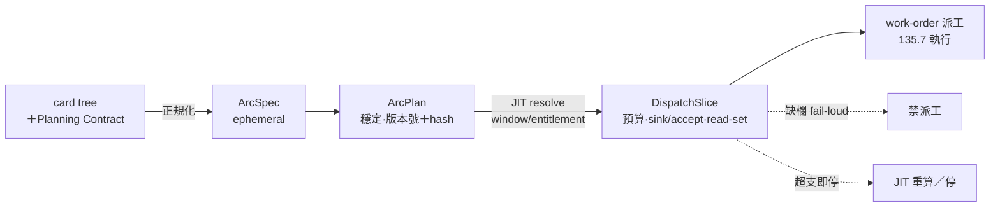
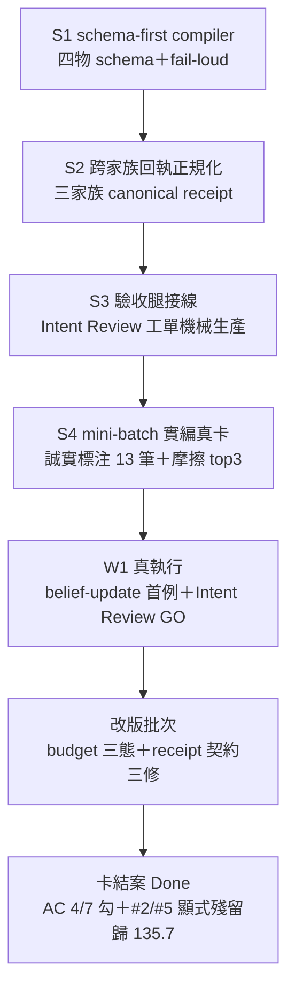

## Description

<!-- SECTION:DESCRIPTION:BEGIN -->
把使用者反覆提醒的 procedure 與 model 流程，編譯成 Marshal 可執行的 node-transition contract——**user 只給方向也能走對方法**，核心成功條件不是產生手冊。

**做什麼**

- card tree → ArcSpec → ArcPlan（穩定，版本號＋內容 hash）→ DispatchSlice（dispatch 前按 runtime entitlement/window JIT resolve）
- DispatchSlice 必攜：revert 預算餘額、sink/accept、budget context（敞口帽／用量帽分欄）、role-dependent read-set——review/verify 禁逐字繼承 implementer reasoning；Intent Review slice 只給 entry 六欄＋final artifact＋機械驗證證據包（0920 修訂）
- fail-loud：歧義、雙 authoritative 值、priced-autonomy 欄位缺場＝不得派工
- 恢復 invariant：work unit 錨 card node id；runtime tail 缺場或 ledger/artifact 矛盾 fail-loud；不重做、不腦補
- LLM 使用規劃 artifact（旅程④）：依時間窗口＋entitlement 事前規劃各 model/binding 分配

**不做**

- orchestration 可靠性契約（main-seat／artifact-first／collection／checkpoint）歸 135.7，本卡只編譯成 slice 欄位
- phase transition predicate 引用 135.3 不重定；同 repo handoff 不是流程 node

<!-- SECTION:DESCRIPTION:END -->

## Acceptance Criteria
<!-- AC:BEGIN -->
- [x] #1 ArcSpec 輸入以 AIR-135 card tree／Planning Contract 為 canonical——entry 六欄等結構化契約欄位依 AIR-135.2 AC#3 存儲分配為投影源；**弧啟動時釘住 card tree baseline（owning WT identity contract 的 baseline SHA），baseline 後卡面變更走 recompile→新 ArcPlan 版本（supersedes trail），禁原地改寫**。不存在 mandatory EP pointer 假設，歧義、雙 authoritative 值、**priced-autonomy 必要欄位（revert 預算／預授權類／成功謂詞）缺場**一律 fail-loud——缺欄 arc 不得編譯出可派工 DispatchSlice（135.2 AC#2 缺欄不得開工的 compiler 端對偶）
- [x] #2 ArcPlan（穩定 phase/work-unit contract，phase transition predicate 自 AIR-135.3 引用不重定）＋DispatchSlice（dispatch 前按 runtime entitlement/window JIT resolve；輸入源列名：時間窗口、coding plan 訂閱 entitlement、memory spine）有測試，窗口跨越可重算且不改穩定 plan。**runtime 證據消費走三態（AIR-140 先例）：fresh→照解；stale/drift→保守預設＋receipt 標注；absent→fallback 源或 PENDING，禁 silent default。ArcPlan 帶單調版本號＋決定性內容 hash（sha256 of canonical JSON；禁 process-salted hash），DispatchSlice 與 receipt 回指 plan 版本**。**DispatchSlice 必攜：revert 預算餘額、sink:（artifact 預期路徑；無 artifact 填 receipt-only）＋accept:（預設 exists＋readable＋nonempty）——欄位語義與判定（terminal≠complete）owner＝135.7，本卡只攜帶；JIT 重算第三觸發軸＝預算耗盡（超支即停），與 quota／window 變同級**。**read-set 組成為 role-dependent（0919 外部收割；same page ≠ same projection——truth source 不變、投影因 role 而異）：review／verify 類 slice 以 problem／behavior contract（entry 六欄＋AC 謂詞）為首讀、禁逐字繼承 implementer reasoning（防 framing 繼承）；tester 類 slice 只給 problem／behavior contract；Intent Review slice＝chain-exclusion——只給 entry 六欄凍結基線＋final artifact＋hash＋機械驗證證據包（test 輸出／invariant 結果；0920 dry-run 雙腿收斂 user 核准擴充——排除的是 implementer reasoning 非驗收事實；語義歸 135.3 AC#7、編排歸 135.7），禁含中間 plan／review／court 討論**——殘留已收口（0925：AIR-135.7 結案，台帳消費面 W2-W5 落地完成，本格補勾）
- [x] #3 Marshal 自動處理 WT/session、role/model、review depth、retry/escalation；同 repo 不需 user 發 handoff／指定 model／提醒 review procedure。**Marshal 自治以開頭交代的預算與預授權類為界：界內自治並記帳（理由進 receipt），超支即停＋逐次授權；review depth／retry 升級同受此界**
- [x] #4 至少一條 AIR-135 dogfood arc 在 user 未重複 procedural/model 指令下完成，dispatch receipts 可追溯實際選擇與理由。**dogfood 成功謂詞＝Two-Touch 不變式：無正當理由打斷為 0、自治決策皆有預算記帳、dispatch receipt 追溯率完整；「未重複 procedural 指令」為必要條件**
- [x] #5 session/retry/entitlement recovery 是 Marshal invariant：從 actual runtime tail＋canonical card state＋owning WT／artifacts 恢復，已完成 work unit 不重做、不靠口述腦補——**work unit identity 錨定 card node id、跨 plan recompile 穩定；runtime tail 證據缺場或 ledger 與 artifact 矛盾時 fail-loud／標 important（AIR-141 honest-skip 先例：ledger 缺失≠未發生，禁當未開工而重做）**；quota/window/runtime entitlement 改變時 JIT 重算 DispatchSlice 並留下**帶 plan 版本號的** re-resolution receipt。**恢復源單一源裁決：期望以 dispatch 登記（liveness 六欄表／registry）為準，實際以 metadata.json／jobs.json 為準，漂移即訊號；re-resolution receipt 須含假設／決策台帳 delta**——殘留已收口（0925：AIR-135.7 結案，liveness 台帳 W2＋sweep 日頻 W5 落地完成，本格補勾）
- [x] #6 DispatchSlice 明示 execution authority 與 identity：owning WT、writer/read-only、role/model/binding、job/session/artifact identity（跨 worktree 正規化沿 AIR-141 basename 收斂語義）、failure/terminal attribution、**budget context（revert 預算餘額、本 slice 預算、扣款事件指針——超支即停的機械判準；revert 敞口帽與 goal 用量帽分欄——135.7 題六⑦設計輸入）**；平行 work unit 不得出現 ambiguous writer。**liveness/collection 欄位（dispatch id／carrier／sink／collection mode）由 DispatchSlice 產出、AIR-135.7 台帳消費，禁兩處各自定義**。worker self-report 不能取代 Marshal 對實際 WT／runtime／artifact 的回收核對。**本 AC 身份欄為 135.5 通知草案 source identity／artifact pointers 的上游事實源（單向消費）；凡攜跨 repo 通知內容的 dispatch，組裝與發送須重走 135.5 AC#6（Marshal 組裝＋逐次 user 授權），不得以本 slice authority 視為已授權；execution authority 另載 commit 委任範圍（僅本 repo 審查通過弧，跨 repo 寫恆停）**
- [x] #7 LLM 使用規劃 artifact（旅程④第一級交付——gap-mining 四腿一致裁定升格）：依時間窗口＋coding plan 訂閱 entitlement（memory spine model-runtime-entitlements 現況）事前產出使用規劃——窗口內各 model/binding 分配、額度預算、哪腿用誰；計費鐵律內建（idle 不燒窗口、不預開對端 session）；spine 保鮮收尾承接（AIR-134 AC#4 launchd 歸屬裁決，135.1 reconcile 條漏項補上）。規劃 artifact 為 DispatchSlice 上游輸入，非 runtime 欄位
<!-- AC:END -->

## Implementation Plan

<!-- SECTION:PLAN:BEGIN -->
【0924 Plan 草案（bounded design，multi-slice——依 OSS 對標報告 §10 審查收斂版；user 過目裁決中）】

## 規模與載體

full tier、card-first Plan（EP 已退役）、multi-slice、每 slice 獨立成功謂詞。族群依賴：消費 135.2 契約（六欄/AC 存儲）＋135.3 六站語義＋135.7 collection 契約條文；產出供 135.7 台帳消費。

## 開工前決策群 D1-D8（建議答案——user 拍板處標 ⚖）

- D1 compiler/runtime 邊界：135.1 只做「卡面契約→派工單靜態物」的編譯與校驗；journal replay／admission 限流／計量歸 135.7 runtime（§10.5 修正——地基已在，增量後置）
- D2 四物 ownership：ArcSpec（ephemeral，編譯器寫）／ArcPlan（穩定版控，編譯器寫、recompile 產新版本禁原地改）／DispatchSlice（ArcPlan 衍生，派工時 JIT 填 runtime 欄）／receipt（worker 寫、marshal 驗）
- D3 欄位二分：machine invariant（缺欄禁派工：sink/accept/budget/revert 餘額/read-set/authority）vs LLM guidance（敘述性 prompt 材料）——schema 顯式標注
- D4 ArcPlan 修訂權威：Deviations-only（implementer 禁改原計畫，只能加偏差記錄）＋PLAN_CHANGES diff 交驗收腿複核（grok 式）；重編譯＝新版本 supersedes
- D5 binding 位置：model/family 選擇留 resolver 呼叫面（跨家族必須呼叫點選——muse 審查 Q2-2 修正），preset 鎖設定層；禁進模型呼叫面
- D6 終態語義：BudgetLimited＋raise-cap 人類動作＋settle 尾（commit/push outward 不在自動終態內）
- D7 receipt minimum：slice 完成＝receipt（sink 存在＋anchor 命中＋terminal 語義）——沿用 CollectionReceipt 欄位集，新增 plan 版本號回指
- D8 跨家族欄位：family/model/帳本歸屬欄進 Slice 1 schema（留形狀，正規化 v0 後補） ⚖

## Slices

- **S1 schema-first compiler（第一份可跑程式碼）**：四物欄位 schema 檔＋fail-loud 校驗腳本（缺欄即錯並列可用值）＋PLAN_CHANGES 修訂流定義＋選一張真實 standard 卡端到端試編→產出人類可手派派工單。成功謂詞：marshal 無需問 compiler 任何問題即可照單派工。明示非目標：replay 引擎、admission、eval、compact 改動、六站重議
- **S2 跨家族樣本**：選一張需 bridge 派工的卡（muse/codex/glm 擇一）——異質回執正規化 v0（三家族 receipt 欄位對照表→單一 schema 首版）＋D8 欄位實填。成功謂詞：三家族回執可合成單一 receipt 視圖
- **S3 驗收腿接線**：PLAN_CHANGES 複核進 135.3 AC#7 的 Intent Review 介面＋receipt minimum contract 落地＋（視批量夜 #2 排期）liveness/collection 欄位交接 135.7
- **S4+（彈性）**：批量夜 #2 回饋迭代

## 驗證基線

每 slice TDD（schema 校驗腳本可全機驗）；端到端試編的真卡樣本與 result 存 .agent-tmp/air-135.1/；pre-commit 全量測試閘照跑。

## 參考源碼地圖（實作時逐 slice 對照；file:line 錨點全在 oss-survey/ 材料檔）

**主參考：ZCode（同構度最高＋技術棧最近——TS 腳本＋schema 合成，非 Rust daemon）**
- S1 主對照：`ZCode/apps/zcode-cli/packages/core/src/tool/handlers/create-workflow.ts`（script→analyzeScript typecheck＋schema 合成→確認窗——我們的「編譯＋fail-loud」直接對照；特別看「解不出來的呼叫根本走不到這裡」的 catalog 解析模式）＋`dynamic-workflow/src/facade/dts.ts`（ask<T> 介面編譯期合成輸出 JSON Schema——DispatchSlice 輸出契約的參照形）
- S2 主對照：saved-workflows args 宣告（`dynamic-workflow/src/args.ts:24-65`——string|number|boolean|json＋required/default 校驗）＋`savedWorkflowLaunchPrompt.ts`（對話建立→SaveWorkflow 工具→確認窗含 overwrite/shadowing 事實回填）
- 權限梯（D3 欄位二分參照）：`core/src/permission/service.ts:130-231`（四模式判定梯＋工具自報 riskLevel/destructive/sideEffectScope）

**副參考：codex（fail-loud 錯誤文案的教科書）**
- D 組 #15 對照：`codex-rs/core/src/tools/handlers/multi_agents_common.rs:395-442`（未知 model 報錯並列可用清單／effort 不支援列舉——fail-loud 的輸出長相）
- 深度/併發上限：`spawn.rs:69-74`＋`registry.rs:96-115`（admission clamp 語義，S2+ 參照）

**副參考：grok-build（契約文字三行＋verifier 介面）**
- F 組 #22/#23/#25 對照：`session/templates/goal_verifier_prompt.md` 全文（adversarial verifier＋blocking 分類＋anti-ratchet——S3 驗收腿接線的 prompt 參照）
- PLAN_CHANGES：`goal_plan_block.md:7`＋`goal_verifier_prompt.md:7`（修訂流兩句核心條文）

**官方欄位基準：cookbook phase file**（§3.1 欄位集——decisions requiring human input／evidence required before complete 逐 slice 欄）

**注意**：ZCode 借鑑邊界——其 saved-workflow「重跑繞過權限確認窗」契約（中樞點擊＝同意）不適用我們（bridge 跨家族無中樞點擊面）；其 inputHash/journal 屬 runtime 面（D1 畫線歸 135.7 後置）。同源污染警示：ZCode↔Claude Code 移植關係——借鑑時標注單一來源效力。
<!-- SECTION:PLAN:END -->

## Implementation Notes

<!-- SECTION:NOTES:BEGIN -->
【0918 AIR-134 reconcile】原卡 0918 bi 雙腿（muse job-mu6ku5gf＋codex job-mu6kuaxw，九題零分歧）收斂內容已由本卡吸收：ArcPlan＋DispatchSlice 兩層（AC#2）、雙 authoritative 值 fail-loud（AC#1，並依 AIR-135.2 card-first 裁決反轉「full-tier 無 EP 指針 fail loud」為「不存在 mandatory EP pointer 假設」）、窗口跨越 recompile（AC#2）、真弧 dogfood（AC#4）、零新增常駐文件（artifact-first sink 語義）。bi ②「條文引用不 inline、inline 僅 instance data；external carrier 讀不到 workspace 時於 transport boundary materialize＋附 source path/hash」亦由本卡承接（compiler/work-order 接線原則）。唯一單獨承接項：bi 決策 S3「model-routing fallback playbook 一行（unknown→PENDING＋保守預設）＋work-order 模板接線」歸本卡 compiler 接線範圍。原卡已標 superseded 並 archive（backlog/archive/tasks/，bi 九題原文可查）。

【0918 context interface】context 壓力本身不新增 Arc node；AIR-135.6 擁有 checkpoint/rehydration contract，本卡 compiler 只負責把需要的 checkpoint obligation、bounded context delivery、artifact/read-set pointers 編進 ArcPlan/DispatchSlice——obligation 契約由 AIR-135.7 定義（其 AC#5），本卡消費實作。這與既有 artifact-first／collection／recovery 契約相接，不讓 compiler 變成 summarizer。

【0918 拆卡】main-seat／artifact-first delivery／collection contract／bounded slices＋checkpoint／context 對接五條 AC 與其 research／dogfood failure／bridge root-cause notes 已移 AIR-135.7（2026-09-18 user 裁決拆卡，免單卡 11 條 AC 全有全無驗收）。

【0919 v2 全案裁決（tri 三腿＋user OK）】本卡＝唯一 full tier（bounded design 決策群：ArcSpec→Slice＋routing＋JIT＋預算＋版本/hash）；載體不預綁——card＋bounded slices 驅動，bounded design EP 依 135.2 契約可用、非開工 gate。deps 定著＝135.2/135.3/135.7（三份上游契約——編譯器後開的機械答案）。
【0920 dry-run 連動修訂（user 裁決「都改」；135.3 reconciliation 進行中）】Intent Review slice read-set 擴充：＋機械驗證證據包（test 輸出／invariant 結果）——雙腿（codex job-mu94u0xh-l41mf5＋GLM-5.3 job-mu94u4z9-e7agk1）收斂「隔離 implementer reasoning、不隔離驗收事實」，抓「表面符合、語義已偏」的隱性偏航（look-ahead／復權／fee model 類）；Description 與 AC#2 同步修訂。語義源＝135.3 AC#7。

【0924 深夜批量 checkpoint（/at 0332 排程前置結算）】夜鏈：S1→marshal 親驗零追問→post-build codex+muse→judge GLM-5.3→ff-only merge main（user 已授權 merge；push 恆停）→S2 跨家族樣本→S3 驗收腿→135.5 #3→批量夜 #2 迷你版。In-flight：S1 flash job-muflra3f-dd7ea4 於 card WT /Users/ctai/Github/ai-guide-air-135.1（write-mode edit；帳本＝WT .delegate-bridge/jobs.json）；waiter（fan-in）＋watchdog（watchdog_night.sh，5 分週期）已掛。恢復順序：查 WT job 狀態→receipt（WT .agent-tmp/air-135.1/s1-receipt.md）→照 s1-brief DONE-WHEN 親驗→老規矩鏈續跑；post-build 工單模板已備（主 repo .agent-tmp/air-135.1/postbuild-brief-template.md）；compact checkpoint 已 proven（sess_81adb354）。

【0924 深夜 S1 收線】S1 job-muflra3f 完成——receipt delivered（L1+L2 錨 S1-DONE-WHEN）。marshal 收線腿：①worker 無 Bash/git 面（誠實申報 NOT VERIFIED）——seal_and_validate.sh 首跑 RED（1 failed：validator 把 nullable 欄 null/[] 當缺欄，違反自身 schema 文檔語義）→修 FieldSpec nullable 旗標＋回歸測試釘 key-缺席-fail→ALL GREEN 52 tests ②親驗零追問 PASS（八問全答；nit：accept anchors 首尾縮寫靠散文補——post-build 評估）③commit 99a6b224（pre-commit 全量閘 2203 passed）。現況：post-build codex（job-mufn1cui）＋muse（job-mufn1cw6）跑中，fan-in waiter＋watchdog 已掛；下步＝findings 回貼→judge GLM-5.3→修正→ff-only merge main。

【0924 深夜 post-build 收線】雙腿回報：codex PASS-WITH-FIXES 零 blocking（NB-1 anchors nit）＋muse PASS-WITH-FIXES 零 blocking（獨立重跑 52 tests＋6 組負向 probe 抓 N1-N6）。marshal 修正輪落地：N1 巢狀型別 guard（_require_list/_require_object，probe silent-pass 閉）／N2 sink.mode 枚舉／N3 pointers-選填顯式化（決策 b＋測試釘）／N4 樣本 anchors 展開 8 錨／N5 golden vector 測試／N6 receipt_sink 延 S2。56 tests ALL GREEN＋四樣本 VALID；commit 846e0f42（pre-commit 2207 passed）。Judge 已派：job-mufna554（GLM-5.3——首派誤綁 Flash 已 stop 重派，model routing 老規矩）anchor JUDGE-VERDICT；GO→ff-only merge main。

【0924 深夜 S1 弧收官】Judge（GLM-5.3 job-mufna554）verdict＝GO——判決書落盤遭 harness 阻（bridge glm worker 預設 plan-mode 唯讀閘，Write 擋＋ExitPlanMode 無人可核，resume 兩回合同因未解）；證據改以 session jsonl 轉錄歸檔（.agent-tmp/air-135.1/judge-s1-transcript.md，606 行含逐軸 reasoning——judge 原話機械抽取非代筆；品質閘 GO＋誠實申報驗證面替代）。已知缺口記錄：glm 背景工單的判決書交付應改「最終訊息即交付」或派 --write-mode（S2 工單規則吸收）。Merge 完成：main diverge（卡 notes commit）→rebase 卡 branch onto main→ff-only 吸收（新 hash 8b6d0180 feat＋509d5c33 fix；AUTH＝user 原話「你們可以merge回 main, 我這樣比較好測試」；push 恆停）。S1 五項 DONE-WHEN 全 PASS（#4 親驗＋judge 複核、#5 56 tests）。WT 保留供 S2/S3。

【0924 深夜 S2 收線】S2 job-mufnpust 完成——receipt delivered（worker 無 Bash 面誠實申報同 S1）。marshal 收線：①seal 腳本 cd 樓層錯（/../../.. 跳出 repo）修正 ②真 bug：blockers caller pass-through 只接 interrupted 分支、completed 者被丟——補無條件合併→2247 tests GREEN ③四張今晚真實回執 normalize→CLI validate 全 VALID＋merged-receipt-view.md（成功謂詞『三家族回執合成單一視圖』機驗達成）④N6 receipt_sink 落地。Commit 2501070a。Post-build：codex PASS 零 finding（自跑 95 tests）＋muse PASS-WITH-FIXES 零 blocking（NB-1 pass-through 型別閘／NB-2 glm usage 未映射鍵原樣保留＋unverified／NB-3 回歸測試）→marshal 全數落地 commit 723703c3→2251 tests GREEN。Judge 已派 job-mufp9938（GLM-5.3＋--write-mode edit——S1 plan-mode 閘教訓修正，判決書應能真落盤）。

【0925 凌晨 S3 收官——S1-S3 全閉】S3 job-mufps568 首跑即 ALL GREEN（2280 tests——worker 品質逐 slice 上升，marshal 零修正）。post-build：muse PASS＋codex PASS-WITH-FIXES（NB-1 純環境 uv cache，seal 實跑已重現）。judge job-mufqqvmt GLM-5.3 GO 零前置條件（判決書 judge-s3.md 真落盤；JN-1 receipt_normalize envelope 未納 intent_review——135.7 writeback 接線項；JN-2 render 表格換行微瑕——135.7）。rebase＋ff merge→main c5720da1。S1-S3 累計：arc_spec.py＋receipt_normalize.py＋intent_review.py 三模組、2280 tests、intent 雙證工單機械生產能力在場。下一線：135.5 #3＋批量夜 #2 迷你版（compiler 實編多張真卡——air-94 回溯樣本外的真實考試）。

【0925 凌晨 S4 mini-batch＋批量夜 #2 真執行】mini-batch job-mufqzfzd 完成：實編兩真卡（AIR-135.7 前瞻＋AIR-135.10 回溯）八檔＋誠實標注 13 筆 UNRESOLVABLE＋摩擦 top3（①0-佔位承載衝突語義——usage/revert 預算同值異義 ②dispatch-stage JIT 欄靜態編譯困境——建議加 sealed stage ③回溯/前瞻無自辨——arc-spec 缺 card_status 欄）。marshal 收線：regen ROOT 樓層 off-by-one 修正→MINI-BATCH SEAL ALL GREEN（六 artifact VALID＋手推工單與 generate() 逐位元全等）。零追問親驗 PASS。批量夜 #2 真執行啟動（W1 marshal 編排）：①BELIEF-UPDATE-DECISION 首例已落 exit receipt（invalidated row＝S1『0-佔位可用到 135.7 定案』假設——被摩擦 #1 實證推翻；decision＝null=未設 分流提案入 135.1 pending 台帳）②Intent Review 獨立腿已派 job-mufs9iug（GLM-5.3 唯讀 chain-exclusion）——verdict 回寫後 W1 兩錨全命中即首例閉環。compiler 對卡面品質的回饋資料（摩擦三條）＝135.1 改版輸入。

【0925 S4 mini-batch 收官——S1-S4 全閉】mini-batch：兩真卡（135.7 前瞻＋135.10 回溯）八檔全 VALID＋誠實標注 13 筆＋摩擦 top3（0-佔位衝突語義／sealed stage 缺／card_status 無自辨）——compiler 改版輸入三條入 pending 台帳。W1 真執行（marshal 編排）：compiler 產工單首次實戰——belief-update 首例＋Intent Review 腿 GO 首例（135.7 AC#7 已勾）。S1-S4 四 slice 全閉：arc_spec／receipt_normalize／intent_review 三模組在 main；2280 tests；intent 雙證工作單機械生產＋執行閉環全鏉實證。結案前殘餘（晨間）：卡 AC audit＋四大改版候補裁決（budget null 分流最急）——本卡候選結案，待 user 晨間裁決後行結案兩步。

【0925 結案 AC 審計判決落帳（fresh 腿 job-mug2l52t）＋marshal 處置】審計：#1/#3/#6 PASS、#4 PASS（caveat：補 Two-Touch 顯式計數）、#2/#5 PARTIAL、#7 FAIL（零產出＋未進未做申報——誠實帳破口；審計原話『現在不可以結案』）。marshal 處置：①#1/#3/#4/#6 勾選（#4 補 Two-Touch 注記、#6 補台帳消費面注記）②#7 補做——第一份 window×entitlement 使用規劃 artifact 本波產出（誠實框架＝回溯首例：當下窗口事實＋W2-W8 起為 DispatchSlice 上游慣例，不宣稱餵過昨晚）③#2/#5 顯式殘留（非默認完成）：#2 三態消費＋JIT 輸入源列名歸 runtime 面＝135.7（D1 先例同構，本卡留欄）；#5 re-resolution receipt 首例待下次真實 quota/window 事件＋期望登記歸 W2 liveness 接線——兩項 owner 指針落 135.7。結案待 rebuild batch merge 後行結案兩步。

【0925 #7 補做完成——使用規劃 artifact 首例】usage-plan-20260925.md（card WT .agent-tmp/air-135.1/）：回溯段＝批量夜 #2 用量對帳（19 job 三家族零偏差——老規矩 routing 隱性執行今顯式化）＋前瞻段＝當下 GLM 5h 窗分配表（implement=flash／review=muse+codex／judge=5.3 full＋peak 疊加）＋計費鐵律三條＋spine 保鮮條款。誠實框架＝回溯首例＋W2-W8 起為 DispatchSlice 上游慣例（dispatch 編譯前必查現行版），不宣稱餵過昨晚。AIR-134 AC#4 launchd 指針 open——收尾 owner 記 135.7 W2-W8 批次（AC#7 該子句歸屬）。W2 起真實 slice receipt 承載 intent_review JSON 欄（W1 fix-forward (b)）同批。

## Final Summary

<!-- SECTION:FINAL_SUMMARY:BEGIN -->

**as-built 終態**（2026-09-25 結案）：三模組在 main（arc_spec.py／receipt_normalize.py／intent_review.py，改版後 2311 tests）；S1-S4＋W1 全鏉實證；AC 審計獨立腿判決落地（#1/#3/#4/#6/#7 勾；#2 JIT 輸入源列名＋三態消費、#5 re-resolution receipt 首例——兩項顯式殘留 owner＝AIR-135.7 W2-W8 批次，卡 notes 0925 審計處置節）。殘留非默認完成，指針已掛。<!-- SECTION:FINAL_SUMMARY:END -->
<!-- SECTION:NOTES:END -->
