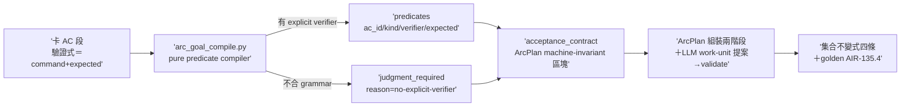

## Description

<!-- SECTION:DESCRIPTION:BEGIN -->
雙腿收斂（muse＋codex 討論腿；5.3 裁三分歧：compiler 獨立檔、judgment_required 清單承載、已勾 AC 編已滿足 predicate——設計權威＝.agent-tmp/c5b-wiring/verdict-muse.md＋verdict-codex.md）。deep-work amendment：把過渡條款（「goal compiler 落地前手動編譯」）退役——新增 pure predicate compiler，只認 explicit verifier grammar（Planning Contract 凍結的「驗證式＝command＋expected」可 parse 形），禁 regex 猜自然語言；不合 grammar 的 AC fail-closed 為 judgment_required（reason=no-explicit-verifier），永不靜默丟失。

做什麼：①新檔 scripts/arc_goal_compile.py（pure compiler——無 process side effects、無 engine；arc_spec.py 續任 schema＋validator owner 不改職責）：讀卡檔 AC 段 → 產 acceptance_contract（predicates：ac_id／kind=command_expected｜artifact｜schema｜state_transition／verifier／expected；judgment_required：ac_id／reason）→ 輸出雙承載 md＋json。②acceptance_contract 進 ArcPlan schema machine-invariant 區塊（arc_spec.py schema 擴）——ArcPlan 組裝兩階段：card AC →(deterministic) acceptance_contract →(ArcSpec＋Planning Contract＋LLM work-unit 分解提案) → validate＋canonical hash → ArcPlan vN（禁原地改，card 改動＝recompile vN+1 supersedes）。③已勾 [x] AC 編成已滿足 predicate（帶 baseline 身份——重編譯不丟已完成證據）。④集合不變式為核心 oracle：verifier-bearing AC＝exactly-once predicates、no-verifier AC＝exactly-once judgment_required、聯集＝全部 AC、交集＝空。⑤測試：golden fixture（AIR-135.4 當第一張真實卡——mixed predicate 分類驗證）＋malformed verifier fail-loud＋duplicate ac_id＋決定性 hash（同卡兩跑同 hash）＋artifact roundtrip（serialize→parse→canonical byte-equal；不做 card roundtrip——投影本意 lossy-on-prose）。

不做：完整 ArcPlan 自動生成（work_units 分解＝LLM 提案＋validator 把關——machine-invariant 不等於 machine-inferable）；regex 猜 prose；lifecycle 接線（歸依賴子卡）；card roundtrip。

<!-- SECTION:DESCRIPTION:END -->

## Implementation Notes

<!-- SECTION:NOTES:BEGIN -->
雙腿審查收齊：muse GO-WITH-FIXES（F-top AC 掃描器不終止於泛用 heading——plan 正文可靜默編成 predicate 且四不變式全過，merge 前置）＋fresh GO-WITH-FIXES（F1 validator 缺反向包含——唯一 runtime 機驗面 3.5/4 條；F2 checkbox-like 續行靜默吞 AC＋fenced phantom；F3 跨塊 card_id/baseline 回指未驗；F4-F8 Suggestions；全套件 2758 passed 獨立重現＋四支 probe）。judge 裁決：merge 前置必修 R1-R4＋順手 R5/R6/R7（docstring）——flash 修復腿跑中；F6 journal 數字更正歸結案；F8（真實卡 predicate 正例 golden）歸 135.1.2。兩腿各自從不同面抓到 parser 靜默態——「compiler 靜默做錯」最危險失效形在 merge 前全數攔下。verdict 存檔 .agent-tmp/air-135-1-1/。
<!-- SECTION:NOTES:END -->
