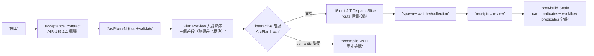
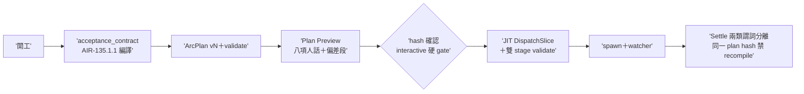

## Description

<!-- SECTION:DESCRIPTION:BEGIN -->
雙腿收斂續卡（依賴 AIR-135.1.1 acceptance_contract 編譯器落地）。把編譯器嵌進開發流程：卡開工→acceptance_contract→ArcPlan vN 組裝 validate→**Plan Preview 人話顯示（做什麼/work units/每 AC 對應 verifier/judgment-required 清單/驗收與 review 路徑/CR obligation/watcher obligation/風險與 plan_changes 偏差段——無偏差也標注）→interactive 確認（ArcPlan hash 一次確認，非逐 slice 重問）**→逐 work-unit JIT DispatchSlice→spawn＋watcher/collection owner→receipts→post-build 以同一 plan hash Settle。

做什麼：①deep-work 過渡注記退役（:233/:256 手動編譯條款→指向 compiler）②implement 開工步嵌編譯（baseline 釘住後 ArcPlan v1）③agent-workflow 步 5/6：JIT DispatchSlice 填欄＋preview 行追加 plan=<ver/hash> plan_unit=<unit_id>（plan_unit 與行首 unit= work-unit 標籤分責——fresh F2）；既有 [Dispatch] 機器行保留並存（機器對帳鍵與人類確認面分責）④work-order 檔頭 provenance 行（compiled-from: card/baseline/plan/unit——溯源不複製 acceptance source）⑤確認閘：interactive＝ArcPlan-version 硬 gate；autonomous/deep-work＝記 confirmation_mode=autonomous 沿既有紅黃線（紅線恆停；非紅線 human gate 入 pending 台帳 safe default）＋Plan Preview receipt 留痕；semantic recompile（acceptance contract／work-unit 集合／authority／風險邊界變更）才重確認——JIT runtime facts 不重問⑥post-build Settle 兩類謂詞分離：card predicates（acceptance_contract）＋workflow predicates（review ledger converged＋plan_changes closure＋precheck＋completion report）——review ledger 不得偽裝成 card AC goal；judge 加 plan_changes 複核項（what＋diff 齊、弱化/刪除/自利即駁回）⑦CR：compile 只產 trigger 事實 ref；crsurface→route 由 dispatcher JIT 探測投影（AIR-224 語法 executable wiring——不再手填自由文本）；ledger grammar 凍結沿用⑧四支週邊保持獨立（欄位接線非函數調用——arc_spec 邊界決策：編譯器不建引擎）。

不做：重新 compile（post-build 只消費已確認 ArcPlan）；新 watcher 形態（既有 collection-owner invariant 執行）；route 值域擴張；父卡 AIR-135.1（Done）回改。

dogfood 兩段：AIR-135.4 先驗 mixed-predicate 分類（compiler 卡 golden 已含）＋本卡落地後**下一張真實 code-changing 卡全程 lifecycle dogfood**（plan confirm→spawn→watcher→live CR→receipt→Settle；收線證據＝ledger lint 綠＋judgment-required 對帳零丟失）——bootstrap self-hosting 不得為唯一 acceptance。

<!-- SECTION:DESCRIPTION:END -->

## Implementation Plan

<!-- SECTION:PLAN:BEGIN -->
〔Planning Contract——AIR-135.1.2（standard tier——五檔控制面條文接線，boundary classification；設計由雙腿討論＋codex §2/§3 主軸收斂）〕
**Baseline**：main @ 20406a8a（含 AIR-135.1.1 compiler）。**已決策勿重辯**：①compile 在 arc 進場、DispatchSlice 只 JIT runtime materialization②post-build 消費同一 plan 不重編譯③provenance 溯源不複製 acceptance source④plan_changes semantic 變更升格 recompile 禁藏⑤四支週邊欄位接線非函數調用⑥judge 複核落 judge-review 非 post-build（methodology owner）。
**Scope**：動＝skills/{deep-work,implement,agent-workflow,judge-review}/SKILL.md＋skills/_common/work-order.md。不動＝post-build（不重抄約束）、route grammar、四支週邊、父卡。
**驗收式**：六處接線 rg 錨點＋226 tests＋「手動編譯」零殘留＋diff 限 5 檔。
<!-- SECTION:PLAN:END -->

## Acceptance Criteria

- [x] deep-work 過渡注記退役→指向 arc_goal_compile.py（「手動編譯」全域零殘留）；judgment_required fail-closed 留痕語義保留（fresh F3 收斂 pointer 形）
- [x] implement 開工步嵌編譯（baseline 釘住後 ArcPlan v1＋validate --stage compile）
- [x] agent-workflow 步 5 JIT 填欄＋validate --stage dispatch 缺欄禁派工；步 6 preview 行追加 plan=<ver/hash> plan_unit=<unit_id>（F2 改名消 unit= 重複鍵）
- [x] work-order compiled-from 溯源行（plan_unit 同步——範圍外 single-source 同步經披露）
- [x] Plan Preview 確認閘（八項人話計畫＋偏差段無偏差也標注＋interactive hash 硬 gate＋autonomous confirmation_mode 沿紅黃線）
- [x] judge-review plan_changes 複核節（what＋diff、弱化/刪除/自利駁回、semantic 禁藏→recompile）＋**Settle 謂詞分離 doctrine 落地**（deep-work Settle 條件＋judge authority closure——fresh F1 補齊）
- [x] 226 passed（muse/fresh 各自獨立重現；muse 加跑全套 2801）

## Implementation Notes

<!-- SECTION:NOTES:BEGIN -->
實作備忘：①plan_changes 複核落 judge-review 非 post-build（methodology owner——post-build 不重抄約束，muse F1 確認為正確判斷）②plan_unit 改名同步範圍：agent-workflow 步 6＋work-order:7＋本卡③（single-source 同步經披露）③work-unit 依賴／non-goal 兩觸發項補入（fresh F4——codex §3 canonical 清單為準）。live acceptance 後續：AIR-135.1.2 條文生效後的首次真實弧即 lifecycle dogfood（下一張 code-changing 卡）。
<!-- SECTION:NOTES:END -->

## Final Summary

<!-- SECTION:FINAL_SUMMARY:BEGIN -->
**as-built 終態**：ArcPlan lifecycle 接線完成——卡開工→acceptance_contract 編譯（AIR-135.1.1）→ArcPlan 組裝 validate→**Plan Preview 人話確認閘**（interactive hash 硬 gate／autonomous沿紅黃線）→逐 unit JIT DispatchSlice（雙 stage validate）→spawn＋watcher→receipts→Settle 兩類謂詞分離核對（card predicates vs workflow predicates，同一 plan hash 禁 recompile）。過渡條款「手動編譯」退役。

<!-- SECTION:FINAL_SUMMARY:END -->
