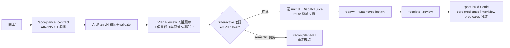

## Description

<!-- SECTION:DESCRIPTION:BEGIN -->
雙腿收斂續卡（依賴 AIR-135.1.1 acceptance_contract 編譯器落地）。把編譯器嵌進開發流程：卡開工→acceptance_contract→ArcPlan vN 組裝 validate→**Plan Preview 人話顯示（做什麼/work units/每 AC 對應 verifier/judgment-required 清單/驗收與 review 路徑/CR obligation/watcher obligation/風險與 plan_changes 偏差段——無偏差也標注）→interactive 確認（ArcPlan hash 一次確認，非逐 slice 重問）**→逐 work-unit JIT DispatchSlice→spawn＋watcher/collection owner→receipts→post-build 以同一 plan hash Settle。

做什麼：①deep-work 過渡注記退役（:233/:256 手動編譯條款→指向 compiler）②implement 開工步嵌編譯（baseline 釘住後 ArcPlan v1）③agent-workflow 步 5/6：JIT DispatchSlice 填欄＋preview 行追加 plan=<ver/hash> unit=<unit_id>；既有 [Dispatch] 機器行保留並存（機器對帳鍵與人類確認面分責）④work-order 檔頭 provenance 行（compiled-from: card/baseline/plan/unit——溯源不複製 acceptance source）⑤確認閘：interactive＝ArcPlan-version 硬 gate；autonomous/deep-work＝記 confirmation_mode=autonomous 沿既有紅黃線（紅線恆停；非紅線 human gate 入 pending 台帳 safe default）＋Plan Preview receipt 留痕；semantic recompile（acceptance contract／work-unit 集合／authority／風險邊界變更）才重確認——JIT runtime facts 不重問⑥post-build Settle 兩類謂詞分離：card predicates（acceptance_contract）＋workflow predicates（review ledger converged＋plan_changes closure＋precheck＋completion report）——review ledger 不得偽裝成 card AC goal；judge 加 plan_changes 複核項（what＋diff 齊、弱化/刪除/自利即駁回）⑦CR：compile 只產 trigger 事實 ref；crsurface→route 由 dispatcher JIT 探測投影（AIR-224 語法 executable wiring——不再手填自由文本）；ledger grammar 凍結沿用⑧四支週邊保持獨立（欄位接線非函數調用——arc_spec 邊界決策：編譯器不建引擎）。

不做：重新 compile（post-build 只消費已確認 ArcPlan）；新 watcher 形態（既有 collection-owner invariant 執行）；route 值域擴張；父卡 AIR-135.1（Done）回改。

dogfood 兩段：AIR-135.4 先驗 mixed-predicate 分類（compiler 卡 golden 已含）＋本卡落地後**下一張真實 code-changing 卡全程 lifecycle dogfood**（plan confirm→spawn→watcher→live CR→receipt→Settle；收線證據＝ledger lint 綠＋judgment-required 對帳零丟失）——bootstrap self-hosting 不得為唯一 acceptance。

<!-- SECTION:DESCRIPTION:END -->
