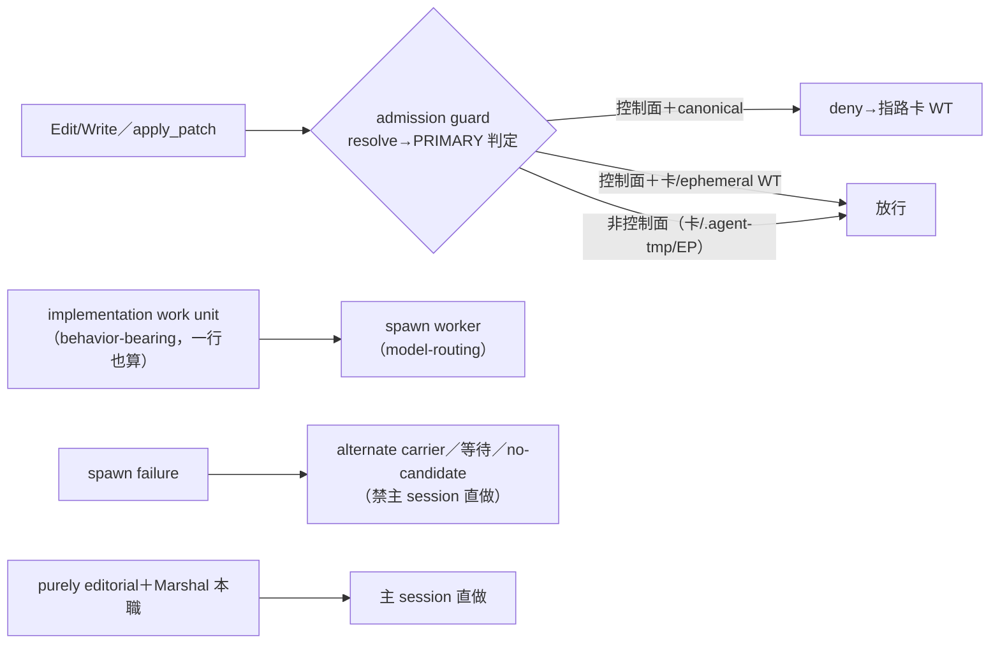

## Description

<!-- SECTION:DESCRIPTION:BEGIN -->
**一句話**：AI 主管（marshal）總忍不住自己動手改代碼，這張卡裝兩道閘——第一道在「動手編輯」當下就擋（控制面檔案只能去工作分身改，主工作樹直接改會被拒絕），第二道在制度上定死「寫代碼的活一律派給 worker agent，主管只做規格、派工、裁決、驗收」。治本實證：0921 session 主 session 親手改控制面數十次零阻擋。

**定什麼**：①Edit/Write admission guard（PreToolUse hook）：控制面路徑 × canonical 主樹 → deny；canonical 判定＝git-common-dir→PRIMARY（棄 wt-identity 存在性判據）；patterns 單一源＝control-plane-guard.sh 擴 `--match-path` 子入口共用；repo self-gate 防 he 殺其他 repo；crash fail-open；無 agent 自授權 bypass（break-glass＝human 停 registration）。②execution contract：implementation work unit＝改變 behavior-bearing artifact 或其驗證物（一行也算）；purely editorial＋Marshal 本職豁免；Build fallback「spawn failure→主 session 直做」退役（改 alternate carrier／等待／no-candidate）。③codex apply_patch adapter（semantic parity）。④spawn 證據不進 commit message（兩腿共識反對）。

**不做什麼**：不做 commit message spawn id gate（兩腿反對——DispatchTrace/registry 已承載）；不做 agent 自授權 bypass env；不擋非控制面路徑；不宣稱完整 write security boundary（Bash redirect／MCP write 覆蓋外——定位＝Marshal admission guard 非防惡意 sandbox）。
<!-- SECTION:DESCRIPTION:END -->

## Acceptance Criteria

<!-- AC:BEGIN -->
- [x] #1 admission guard hook（hooks/marshal_admission_guard.py，py3.9）：Edit/Write payload→resolve→PRIMARY 判定→repo self-gate→guard `--match-path` 共用 predicate→deny/allow；crash fail-open；deny 訊息指路卡 WT
- [x] #2 control-plane-guard.sh 擴 `--match-path` 子入口——patterns 單一源共用、regex 零複製
- [x] #3 codex apply_patch adapter（policy 共用、payload adapter 分開；多檔 patch 任一 canonical 命中即整 call deny）
- [x] #4 註冊：zcode.json＋cc.json 的 PreToolUse Edit|Write lane＋codex.toml＋governance manifest；新 session 生效說明＋Muse 側 coverage probe
- [x] #5 execution contract 改寫（agents/AGENTS.md）：implementation work unit 定義（role-based 非 LOC）＋Build fallback 退役；agent-workflow 衝突文字（「小範圍主 session 做」）移除；guide Marshal 段一行指針
- [x] #6 測試矩陣：relative／`../`／symlink 回 canonical／sibling WT／新檔 nearest parent／他 repo 同名 rules/／多檔 patch／malformed payload／py3.9 語法
- [ ] #7 覆蓋實證：主 session Edit 控制面＝deny；spawned agent 寫入不觸發＝放行（理想形態）；pre-commit guard 行為不變
<!-- AC:END -->

## Implementation Plan

<!-- SECTION:PLAN:BEGIN -->
〔baseline：ai-guide d5994d69〕〔已決策勿重辯：①canonical 判定＝git-common-dir→PRIMARY（兩腿共識，棄 wt-identity 存在性）②patterns 單一源＝guard --match-path 擴展（禁 Python 抄 regex）③break-glass＝human-only 無 bypass env ④C（spawn id 進 commit message）否決⑤B 定義＝role-based semantic 非 LOC〔已決策勿重辯：兩腿審查 job-muaiz7fs／job-muaiz7ha＋合流裁決；verdict 物 .agent-tmp/air-135/marshal-{muse,codex}-reply.md〕〕

〔範圍〕hooks/（新 guard＋註冊模板）＋.githooks/control-plane-guard.sh（--match-path）＋agents/AGENTS.md＋skills/agent-workflow/SKILL.md＋ai-development-guide.md（一行指針）＋tests/test_marshal_admission_guard.py。明示不動：pre-commit 既有行為、backlog/ 非控制面路徑。
<!-- SECTION:PLAN:END -->
