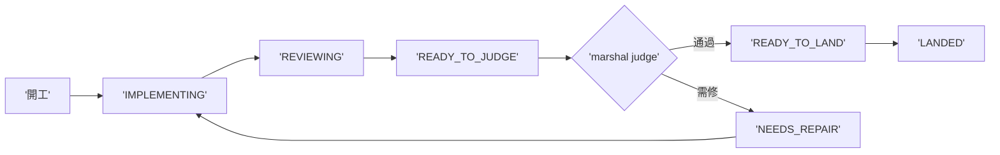
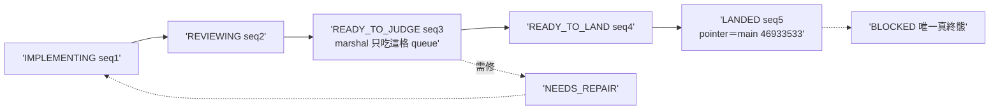

## Description

<!-- SECTION:DESCRIPTION:BEGIN -->
雙腿收斂續卡（設計權威 .agent-tmp/marshal-mode/verdict-{muse,codex}.md；user 裁示等 P0 dogfood 數據後再開——不做大收線自動化）。多弧值星時 marshal 成為唯一收線 CPU 的結構問題：每弧只存可重建的 projection state（IMPLEMENTING→REVIEWING→READY_TO_JUDGE→NEEDS_REPAIR→READY_TO_LAND→LANDED/BLOCKED），每個 state 帶 authoritative artifact pointer（不造第二個 card truth）；collection/watcher 平行推多弧、review legs 平行、marshal 只吃 READY_TO_JUDGE queue；judge 後 precheck/landing 機械推進。處理平行度不足與狀態腦內兩項結構問題。前置：P0 dogfood 四數顯示 settle_wait 是瓶頸時才開工。

<!-- SECTION:DESCRIPTION:END -->

## Implementation Plan

<!-- SECTION:PLAN:BEGIN -->
前置閘解除：user 2026-10-02「可以多開三個線去做吧？不過還是都要照流程」——P0 四數在手（settle_wait 107min／ready_to_judge 66min 佔弧大頭），開工。

機械面（最小 queue，禁大收線自動化——judge/consent 恆主 session）：scripts/arc_settle_state.py——per-arc settle-state 檔（.agent-tmp/settle-queue/<arc>.json：arc_id＋state〔IMPLEMENTING／REVIEWING／READY_TO_JUDGE／NEEDS_REPAIR／READY_TO_LAND／LANDED／BLOCKED〕＋artifact pointer＋seq 單調）＋子命令 set／advance（非法轉移 fail-loud 列合法後繼）／show／queue（按 state 列隊）；條文接線：deep-work Settle 段＋agent-workflow collection——marshal 只吃 READY_TO_JUDGE queue（watcher/collection-owner 機制不動，本卡是 per-arc projection state 非 watcher 替代）。平行線秩序：本卡與 AIR-235 併行，agent-workflow 編輯限本卡段落降 merge 衝突面（235 先 merge）。
<!-- SECTION:PLAN:END -->

## Acceptance Criteria

- [x] #1 set 建 state 檔（合法轉移） `uv run python scripts/arc_settle_state.py set --arc AIR-X --state READY_TO_JUDGE --pointer .agent-tmp/x.md --dir .agent-tmp/settle-queue` → exit 0 且檔在場
- [x] #2 非法轉移 fail-loud（LANDED 後 advance IMPLEMENTING） `uv run python scripts/arc_settle_state.py advance --arc AIR-X --state IMPLEMENTING --dir .agent-tmp/settle-queue` → exit 2 且輸出列合法後繼
- [x] #3 queue 按 state 列隊 `uv run python scripts/arc_settle_state.py queue --dir .agent-tmp/settle-queue --state READY_TO_JUDGE` → exit 0 且列出 AIR-X
- [x] #4 狀態機測試（全轉移表／非法轉移／指針完整性／seq 單調） `uv run pytest tests/test_arc_settle_state.py` → exit 0
- [x] #5 條文接線錨點（deep-work Settle＋agent-workflow collection——marshal 只吃 queue） `rg -c "READY_TO_JUDGE" skills/deep-work/SKILL.md skills/agent-workflow/SKILL.md` → 兩檔各 ≥1
- [x] #6 dogfood——本弧自身 settle-state 轉移史全程在場終態 LANDED `uv run python scripts/arc_settle_state.py show --arc AIR-135.11 --dir .agent-tmp/settle-queue` → exit 0 且 state 為 LANDED

## Implementation Notes

<!-- SECTION:NOTES:BEGIN -->
**四數量測（settle 結算）**：first_handback_complete＝TRUE（impl 首收 join 5/5 PASS 帶 evidence）；repair_rounds＝1（fresh A/B/C＋codex F1-F4 兩腿 findings → 單一修復批 R1-R4 全落地——兩個 Important 都是「測試把錯 oracle 釘死」＋「接線文字實際走不通」，codex 以 re-hash 實證）；marshal_direct_impl_violation＝0；settle_wait＝t_dispatch 1790950500 前後 → t_landed 1790953300（main 46933533）≈ 47min（含雙腿審查＋修復批；併行線 235 先 merge 的秩序等待未計入本弧瓶頸——多弧值星真實瓶頸數據待下輪值星）。

judge 裁決紀錄：F1 set 既有弧 seq 倒退（codex 實證 2→1）→裁「set 既有弧即拒用 advance」；F2 join 後跳級 READY_TO_JUDGE 接線走不通（codex 實證 exit 2）→裁三點接線；F3≡fresh A LANDED 終態矛盾→裁 LANDED→僅 BLOCKED 合法、文檔對齊；F4 WO --pointer drift→契約衛生記錄不改碼。
<!-- SECTION:NOTES:END -->

## Final Summary

<!-- SECTION:FINAL_SUMMARY:BEGIN -->
**as-built 終態**（main 46933533）：settle queue 落地——scripts/arc_settle_state.py（七態狀態機：IMPLEMENTING／REVIEWING／READY_TO_JUDGE／NEEDS_REPAIR／READY_TO_LAND／LANDED／BLOCKED；set 既有弧即拒保 seq 單調；非法轉移逐行列現態＋合法後繼 exit 2；原子寫）＋deep-work Settle 第 9 條＋agent-workflow 三點接線（impl set→review advance→verdicts 齊＋join OK 無 FAIL/NOT-DONE 才進 READY_TO_JUDGE queue）——marshal 只吃 queue、轉移恆顯式驅動、禁後台自動推進。**本弧 AC#6 自食狗糧完成**：本弧全程轉移史已入 .agent-tmp/settle-queue/AIR-135.11.json（seq 1→5 終態 LANDED，pointer＝main 46933533）。

<!-- SECTION:FINAL_SUMMARY:END -->
