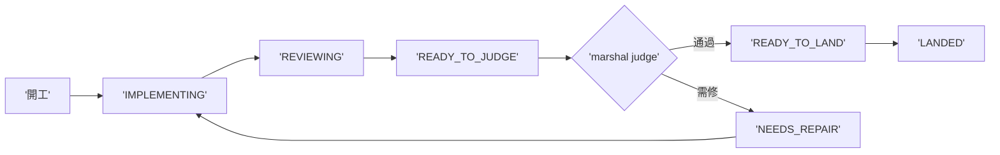

## Description

<!-- SECTION:DESCRIPTION:BEGIN -->
雙腿收斂續卡（設計權威 .agent-tmp/marshal-mode/verdict-{muse,codex}.md；user 裁示等 P0 dogfood 數據後再開——不做大收線自動化）。多弧值星時 marshal 成為唯一收線 CPU 的結構問題：每弧只存可重建的 projection state（IMPLEMENTING→REVIEWING→READY_TO_JUDGE→NEEDS_REPAIR→READY_TO_LAND→LANDED/BLOCKED），每個 state 帶 authoritative artifact pointer（不造第二個 card truth）；collection/watcher 平行推多弧、review legs 平行、marshal 只吃 READY_TO_JUDGE queue；judge 後 precheck/landing 機械推進。處理平行度不足與狀態腦內兩項結構問題。前置：P0 dogfood 四數顯示 settle_wait 是瓶頸時才開工。

<!-- SECTION:DESCRIPTION:END -->
