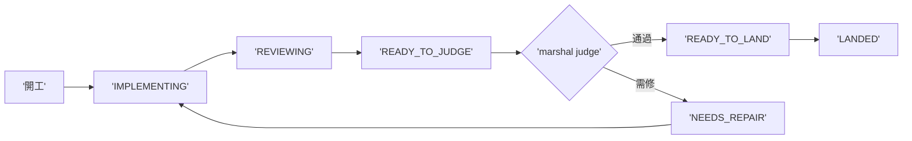

## Description

<!-- SECTION:DESCRIPTION:BEGIN -->
雙腿收斂續卡（設計權威 .agent-tmp/marshal-mode/verdict-{muse,codex}.md；user 裁示等 P0 dogfood 數據後再開——不做大收線自動化）。多弧值星時 marshal 成為唯一收線 CPU 的結構問題：每弧只存可重建的 projection state（IMPLEMENTING→REVIEWING→READY_TO_JUDGE→NEEDS_REPAIR→READY_TO_LAND→LANDED/BLOCKED），每個 state 帶 authoritative artifact pointer（不造第二個 card truth）；collection/watcher 平行推多弧、review legs 平行、marshal 只吃 READY_TO_JUDGE queue；judge 後 precheck/landing 機械推進。處理平行度不足與狀態腦內兩項結構問題。前置：P0 dogfood 四數顯示 settle_wait 是瓶頸時才開工。

<!-- SECTION:DESCRIPTION:END -->

## Implementation Plan

<!-- SECTION:PLAN:BEGIN -->
前置閘解除：user 2026-10-02「可以多開三個線去做吧？不過還是都要照流程」——P0 四數在手（settle_wait 107min／ready_to_judge 66min 佔弧大頭），開工。

機械面（最小 queue，禁大收線自動化——judge/consent 恆主 session）：scripts/arc_settle_state.py——per-arc settle-state 檔（.agent-tmp/settle-queue/<arc>.json：arc_id＋state〔IMPLEMENTING／REVIEWING／READY_TO_JUDGE／NEEDS_REPAIR／READY_TO_LAND／LANDED／BLOCKED〕＋artifact pointer＋seq 單調）＋子命令 set／advance（非法轉移 fail-loud 列合法後繼）／show／queue（按 state 列隊）；條文接線：deep-work Settle 段＋agent-workflow collection——marshal 只吃 READY_TO_JUDGE queue（watcher/collection-owner 機制不動，本卡是 per-arc projection state 非 watcher 替代）。平行線秩序：本卡與 AIR-235 併行，agent-workflow 編輯限本卡段落降 merge 衝突面（235 先 merge）。
<!-- SECTION:PLAN:END -->

## Acceptance Criteria

- [ ] #1 set 建 state 檔（合法轉移） `uv run python scripts/arc_settle_state.py set --arc AIR-X --state READY_TO_JUDGE --pointer .agent-tmp/x.md --dir .agent-tmp/settle-queue` → exit 0 且檔在場
- [ ] #2 非法轉移 fail-loud（LANDED 後 advance IMPLEMENTING） `uv run python scripts/arc_settle_state.py advance --arc AIR-X --state IMPLEMENTING --dir .agent-tmp/settle-queue` → exit 2 且輸出列合法後繼
- [ ] #3 queue 按 state 列隊 `uv run python scripts/arc_settle_state.py queue --dir .agent-tmp/settle-queue --state READY_TO_JUDGE` → exit 0 且列出 AIR-X
- [ ] #4 狀態機測試（全轉移表／非法轉移／指針完整性／seq 單調） `uv run pytest tests/test_arc_settle_state.py` → exit 0
- [ ] #5 條文接線錨點（deep-work Settle＋agent-workflow collection——marshal 只吃 queue） `rg -c "READY_TO_JUDGE" skills/deep-work/SKILL.md skills/agent-workflow/SKILL.md` → 兩檔各 ≥1
- [ ] #6 dogfood——本弧自身 settle-state 轉移史全程在場終態 LANDED `uv run python scripts/arc_settle_state.py show --arc AIR-135.11 --dir .agent-tmp/settle-queue` → exit 0 且 state 為 LANDED
