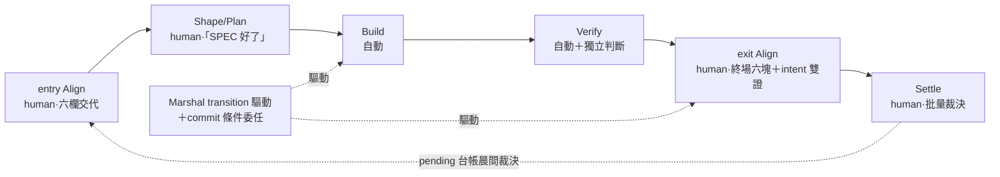

## Description

<!-- SECTION:DESCRIPTION:BEGIN -->
訂「流程的站牌」——開發切成固定幾站，每站誰在場、憑什麼過關。重新定義 semantic model，**不**把現行 commands/skills 升格成 lifecycle nodes。

**站牌**

- entry Align（human）：六欄交代，缺任一不得進 Shape——缺欄＝LLM 訪談補齊（你說「開始實作」時一次問齊，不用主動傾倒）。**這站的輸出＝自主執行的安全契約源：成功謂詞養 goal、預算／預授權養批量自治**；謂詞須含可執行檢查或 oracle 才算過站；中途改 intent＝回這站重來（舊 goal 作廢）
- Shape/Plan（human）：exit＝user「SPEC 好了」手勢
- Build／Verify（自動）：Verify 保留獨立判斷軸，與 machine verification 分責
- exit Align（human）：終場六塊＋**intent 雙證**——自報 intent-diff＋獨立 Intent Review 腿（fresh、排除中間鏈、問「仍解原本問題嗎」）；觸發閘＝standard＋full 且敞口過半／有 invalidated row／動過跨卡契約
- Settle（human）：批量裁決

**過關與打斷**

- Marshal 擁 phase transition 驅動＋commit 條件委任：bi/tri＋post-build 過關即授權，未過關或強 outward 無委任恆停
- priced-autonomy：強 outward／真分岔／自我擴權／預算超支才停；其餘自治扣款記錄理由不問
- pending 台帳＝未決人類裁決唯一住處（含批量浮出類 evidence-contradicts-intent／assumption-invalidated，晨間裁決消化）；批量停續二分——真分岔＝bi/tri 取結論續做（safe default）；預算超支／自我擴權＝邊界違反，停該卡晨間逐次授權；強 outward 紅線恆停；分類死線——分不清（bounded probe 一次後仍模糊）＝停該卡、依賴它的下游卡 skip；上游改跨卡契約→下游重走 entry
- 可觀察性＝Marshal cross-cutting：pull-only checkpoint；唯一合法推播＝破損警報

**不做**：WT/session/model routing/retry 等 mechanics 不進人類心智模型；node 必要性以 session audit＋gate-position 測試驗證；rename 裁決歸 parent S7。

<!-- SECTION:DESCRIPTION:END -->

## Acceptance Criteria
<!-- AC:BEGIN -->
- [ ] #1 用近期真實開發 session audit 對每個候選 node 做必要性驗證；每個 node 都能回答人/LLM在此刻必須共同知道什麼、exit evidence 是什麼，不能只因現有 command 存在而保留。每個 node 須標註 Two-Touch 八階段的覆蓋範圍（跨多階段者列 phase transition predicate 與 user viewport 需求）與 **human-present／Marshal-automated 旗標**：human-present＝entry Align、Shape/Plan（討論模式；exit predicate＝user「SPEC 好了」手勢，由 Marshal 登記為 transition evidence）、exit Align、Settle（批量裁決）；automated＝Build、Verify——此拓撲是「中間零介入」的語義錨。必要性判據含 gate-position 測試——該 node 是否為行動面憲法停點，否則降為 Marshal 內務或合併；假設台帳 slice 邊界審計的承載歸 135.1／135.7，本卡只在 transition 義務層點名
- [ ] #2 Align 被定義成 human shared-understanding obligation：entry Align 的 exit predicate 為六欄開頭交代（intent verbatim／non-goals／revert 預算／預授權類／假設台帳／成功謂詞），缺任一欄不得進入 Shape；**六欄產生方式＝訪談式 elicitation（0920 user 裁決）：user 觸發（「開始實作這張卡」）時 LLM 盤點卡面已備欄位（開卡已確認的 Description intent／non-goals 算已備），缺欄一次彙整發問（禁逐題輪問），user 回答後 LLM 寫回 canonical 卡面（住處歸 135.2 AC#3）即滿足 exit predicate——「開頭交代」的生產者是 LLM 問、user 答，非要求 user 主動傾倒**。**entry 輸出＝自主執行的安全契約源（0920 user 定調「實作就是依賴他」）：成功謂詞＝135.7 goal／Settle 契約的完成謂詞編譯源；revert 預算＋預授權類＝135.1 DispatchSlice 派工邊界與批量自治的安全上界（缺場 fail-loud）——entry Align 品質決定「不停到做完」的可行性，此站禁降級為儀式**。**0920 dry-run 補三則：①謂詞過站門檻＝可編譯——成功謂詞須含可執行檢查命令或 oracle（指標 convention／參考值），「欄位非空」≠過站；AC 產出即分三類 mechanical／judgment／human-only（夜間路由分類源：goal 只追 mechanical、judgment 走 reviewer 軸、human-only 進 pending——執行歸 135.7，禁 AI 自評勾選）②訪談＝提案＋確認制——LLM 帶候選預設值問、澄清至多一輪追問（bounded）③intent 中途變更（任何時刻）＝停當前卡＋append supersedes＋重走 entry Align：AC／goal／預授權全重編譯、舊 goal 失效、已產物留 provenance；強 outward arc（例：實盤接掛）結構上不可批量**；exit Align 驗 actual code reality／outcome。視圖選型歸 AIR-135.4，本卡只定義何時必須呈現與呈現語義，不把 artifact production 當 comprehension
- [ ] #3 Verify 明確區分 machine verification 與 independent judgment/review 的責任，即使最後 UI 顯示為同一 phase，也不能失去 independence axis
- [ ] #4 Marshal-owned mechanics 清單與 cross-repo boundary 清單明確；同 repo handoff/WT/session rollover 不再成 lifecycle node。**可觀察性＝Marshal cross-cutting obligation（非節點，地位同 Marshal）**：slice 邊界發佈 pull-only checkpoint（位置＋新鮮度錨；liveness 機制歸 135.7、視圖歸 135.4）；永不中途推播提問，唯一合法推播＝破損警報
- [ ] #5 產出名稱裁決與 migration map：現有 /spec、execution-plan、implement、post-build、commit、handoff、viewport skills、**review 鏈（code-review／audit-test／judge-review——Verify 站獨立判斷軸的程序載體，0920 補列：編譯歸 135.1 review/verify slices、三方權責歸 135.7、驗收證據論沿用 acceptance-evidence）**各自映射到 obligation/strategy/transport 哪一層；本卡產 proposal＋mapping，rename／deprecation 最終 verdict 歸 parent S7（parent AC#6），不另建真相源
- [ ] #6 Marshal 擁有 phase transition 驅動：在既有授權與 evidence predicate 滿足時自動推進 Shape/Plan→Build→Verify→exit Align→Settle，transition 覆蓋旅程⑤自動化執行、⑦ bi/tri＋post-build 過關後的 commit transition、⑧批量關卡（Settle 迴圈，非新節點）；**transition 附帶 status 欄同步義務（0920 user 補）：entry 過關＝In Progress（開工）、Settle 過關＋結案條件滿足（precheck 綠＋commit）＝Done——映射錨＝kanban-board skill 結案兩步＋收 Done 條件（單一源禁二刻）**；commit gate 為條件委任——bi／tri＋post-build 過關即視為 user 已授權 commit（0919 裁決），Marshal 不另停；未過關或強 outward 無委任時恆停並明示 pending decision（進 pending-decision 台帳）。**commit 委任＝可逆授權非最終驗收（0920 dry-run）：Settle 晨間否決→revert（成本已預標注、revert 預算內不再問）**。gate 分類採 priced-autonomy 語彙：強 outward 未委任／真分岔／自我擴權／預算超支才打斷；revert 預算內自治決策扣款記錄理由，不問。**pending 台帳語彙含批量浮出類（0919 外部收割——不增即時打斷類，晨間裁決消化）：`evidence-contradicts-intent`（證據與 user 交代的前提矛盾；即時場景併真分岔定義處理）＋`assumption-invalidated`（假設台帳 invalidated 且 affected 非空——belief update 的上浮面，schema 歸 135.2 AC#3）**
- [ ] #7 exit Align 的最低交付是終場六塊：comprehension receipt／intent-diff 防拉伸／決策紀錄含被拒選項／可逆點＋revert 成本標注／no-impact 機械證據／否決介面（否決必須比批准便宜；待決事項進 pending-decision 台帳）。有 UI／可呈現物一併開好是 exit predicate 的一項，不需 user 另說。圖／tour／Report Shell 選型依 AIR-135.4，不用大量 artifact 取代共同理解。**exit 義務升級為 intent 雙證（0919 外部收割）：弧內自報 intent-diff（實作方自述「我認為我解了 X」）＋獨立 Intent Review 腿（fresh context、只讀 intent verbatim＋成功謂詞＋final artifact＋機械驗證證據包〔test 輸出／invariant 結果——0920 dry-run 雙腿收斂：抓「表面符合、語義已偏」（look-ahead／復權／fee model 類）；排除的是 implementer reasoning 非驗收事實，135.1 chain-exclusion 定義連動修訂〕、排除中間 plan／review／court 討論——問「完成的東西仍解 Intent_0 嗎」）；觸發閘＝tier standard＋full 且任一（revert 敞口花掉過半／假設台帳有 invalidated row／本弧動過跨卡契約），閘外小弧自報為足；receipt 分欄——自報缺失＝弧不完整、獨立腿缺失（閘內）＝exit Align 未過關；編排歸 135.7（可複用 bi/tri 終場腿只改工作單組成）、read-set 排除規則歸 135.1 AC#2；**信任畢業前（首批）獨立腿恆跑不抽樣——低花費綠地弧三閘條件全 false＝silent drift 盲區（0920 dry-run）**；信任畢業後可降抽樣**
- [ ] #8 旅程②「卡內容討論」歸 entry Align 之內：討論中視圖＝卡面事實的機械投影（ephemeral、隨卡重生成、示於 SC 瀏覽器；禁 code-fact 圖——事實協商中）；批量關卡為 Marshal 驅動的 Settle 迴圈（AIR-135.7 擁有），逐卡不斷言視圖，只產一張多卡汇总 receipt——批量語義（0920 user 裁決——safe default＝dw 承諾制＋停續二分）：跨卡依次推進；human gate 入 pending 台帳、不阻弧。批量停續二分：**判斷阻塞（真分岔＝雙方可行的方案選擇）＝safe default——bi/tri 多家族取結論即續做（諮詢成本計入 revert 預算扣款）、pending 台帳記錄待晨間追認**；**邊界違反（revert 預算超支、自我擴權＝超出開頭預授權類——對 entry 六欄可機械判定、非判斷問題，bi/tri 無權代決）＝停該卡續下一卡＋pending 台帳晨間逐次授權（135.1「超支即停＋逐次授權」的批量形態）**；強 outward 紅線恆停該卡；pending 台帳晨間一次裁決（裁決清單視圖由 AIR-135.4 投影）。**0920 dry-run 批量補全：①分類死線——真分岔／邊界違反由 Marshal 機械查表判定（precedence：強 outward？預算餘額？預授權清單內？禁語感）；bi/tri 分裂或 bounded probe 一次後仍模糊＝停該卡續下一卡＋pending 台帳標 classification-pending（fail-conservative）②依賴傳播——上游未達可消費契約（promotable）→依賴卡 skip 不白跑；上游契約變更→下游 entry 凍結欄標 stale、重走 entry Align（編排歸 135.7 Settle 迴圈）③status 同步——Settle commit 後翻 Done（decision-5 過關直行＝結案條件鏈）；晨間否決→revert＋Done→In Progress（回滾語義）**
- [ ] #9 開卡簡則銜接（0919 v4 終版）：entry 六欄的 intent 基線＝已確認的 Description（user SC ext 點卡通過者）；entry Align 只驗 freshness/delta——卡面 semantic 變更或執行參數未定才重走描述確認，已確認 intent 禁重問
<!-- AC:END -->

## Implementation Notes

<!-- SECTION:NOTES:BEGIN -->
【content confirmed】user 0920（四輪修訂＋dry-run 三腿收編後點頭「OK」——edit 後確認；10:07 追補 status 同步義務——user 問「卡片狀態要根據進度更新有寫到哪」查證後補洞：kanban/metadata-sync 只蓋互動主鏈、Arc 批量形態為缺口，AC#6/#8 已補，映射錨＝kanban 結案兩步單一源）
【0918 authority 邊界】AC#6 的「既有授權」以 repo 既有紀律為單一源，本卡不重定義紅線清單：outward action（commit、跨 WT、跨 repo 回寫、外部寫入、刪共享資料）Marshal 恆停並明示 pending decision；紅線／黃線分級沿 outward-action-consent rule＋autonomous-execution skill；自主推進僅限授權面內 evidence predicate 滿足處。〔0919 superseded：commit 條件委任以 AC#6 修訂版為準（bi/tri＋post-build 過關即授權）；紅線清單仍以 outward-action-consent rule＋autonomous-execution skill 為單一源〕

【0919 北極星對齊審查（tri：muse＋codex＋GLM-fresh）】AC#2/#6/#7 依 Two-Touch 旅程修正（開頭六欄入 entry predicate／priced autonomy 語彙＋commit 條件委任＋批量 Settle／終場六塊＋否決介面＋UI 一併開好）；新增 AC#8（旅程②討論＝entry Align 內的 ephemeral 投影；批量關卡＝Marshal Settle 迴圈）；AC#1 補 gate-position 測試與八階段覆蓋標注；AC#5 補 proposal/S7-verdict 邊界。Code Lens 交叉表（節點×視圖）：**對齊即視圖、執行即謂詞**——entry/Shape-exit/exit Align 的 exit evidence 本身就是視圖（六欄交代／SPEC 呈現／receipt＋否決介面）；Build/Verify/Settle 預設沉默（exit 是 predicate／機械報告），Verify 失敗才產除錯全套、Settle 批量只一張多卡汇总 receipt。審查檔：.agent-tmp/air-135/align-135.3-{muse,codex,glm}.md。

【0919 v2】commit eligibility 規則歸本卡（⑦語義面；gate orchestration 歸 135.7）。co-first：與 135.2 並行開工、互為輸入唯讀互看。

【0919 外部收割（ChatGPT 四層缺口框架×muse job-mu88oodq／GLM-5.3 job-mu88osjx）】AC#6 補 pending 批量浮出兩類、AC#7 補 exit intent 雙證（歸屬細節見 parent notes 收割條）。Epistemic Merge 時序語義歸本卡：Verify exit／Settle 迴圈時點由 Marshal 跑 belief update（writer＝裁決後 Marshal 單一寫入；schema 歸 135.2 AC#3、觸發義務歸 135.7 AC#7）。七欄補欄／Attention KPI 公式／L0-L2 制度化判定已覆蓋拒收（論證見 parent 收割條）。
【0920 user 裁決（reconciliation——「我剛不是有說讓 deep-work 做到不停到做完，135.3 也要配合」）】AC#8 批量 safe default 定義＝dw 承諾制：判斷阻塞（真分岔／自我擴權／預算超支）不停等——bi/tri 多家族取結論即續做＋pending 台帳晨間追認；僅強 outward 紅線停該卡（唯一中途停權）。與 /goal Settle 契約接線（goal 完成謂詞＝卡 AC 全勾——見 135.7 0920 stop-early 診斷條）。cosmetic：mermaid 邊 label 統一引號 pipe 形式。上線模擬（量化交易策略分析平台六站旅程）＝0920 對話驗收材料。
【0920 user 裁決（reconciliation 第二輪）】①entry Align 六欄＝訪談式 elicitation——user 說「開始實作」時 LLM 盤點缺欄一次彙整發問、寫回卡面（生產者＝LLM 問 user 答，非 user 主動傾倒；AC#2 已補）②模擬跑題糾正：135.3 重心＝四個 human 站（共享理解），Build/Verify 是沉默中段——模擬敘事平衡修正③漏卡查證：全 family 無卡認領 elicitation 語義（rg 訪談|問我|開始實作 零命中；parent 旅程①「開頭交代任務」隱含 user 主動），判定併入本卡 AC#2（Align gate 語義＝本卡正職），不另開卡。
【0920 user 定調（reconciliation 第三輪——「這很重要，實作就是依賴他」）】entry Align 依賴鏈升級 invariant（AC#2）：六欄輸出＝goal 完成謂詞（135.7）＋派工邊界（135.1）＋批量自治安全上界的編譯源——entry 品質＝「不停到做完」的可行性，此站禁降級為儀式。停續二分修正（supersedes 第二輪 safe default 全類 bi/tri 粗版）：真分岔＝判斷阻塞→bi/tri 續做；預算超支／自我擴權＝對六欄可機械判定的邊界違反→停該卡＋晨間逐次授權（bi/tri 無權代決擴權）——dw 承諾制「沒法判斷就 bi/tri」僅涵蓋判斷阻塞。AC#8 已改。Verify 細節歸屬查證：語義＝本卡 AC#3、派工面＝135.1、編排面＝135.7、證據論＝acceptance-evidence；真缺口＝AC#5 migration map 漏 review 鏈，已補列。
【0920 dry-run 三腿審查（user 指派「5.3、CODEX 都去跑這一題」；場景＝量化交易策略分析平台；簡報＝.agent-tmp/air-135/dogfood/dryrun-brief.md）】雙腿 verdict 皆 GO-WITH-FIXES：codex job-mu94u0xh-l41mf5（chatgpt-web/high）、GLM-5.3 job-mu94u4z9-e7agk1（旗艦）。收斂發現：🔴①語義 AC 夜間路由缺（AC 分 mechanical/judgment/human-only，goal 只追機械子集、禁 AI 自勾——編譯面 135.7 題六②已有、完成語義面缺）②分類死線＋預設停卡（precedence 機械查表＋bounded probe→仍模糊＝停該卡續下卡 fail-conservative）③批量依賴傳播缺（上游未 promotable→下游 skip；上游契約變更→下游 entry 凍結欄 stale 重走）④intent 中途變更路徑缺（停卡＋supersedes＋重走 entry＋重編譯，舊 goal/授權失效；實盤 arc＝強 outward 結構上不可批量）⑤commit 委任≠最終驗收（Settle 否決→revert 語義需明文）。🟡 謂詞可編譯門檻（oracle/慣例強制入謂詞）、獨立腿 read-set 擴充（＋機械驗證證據包——連動 135.1 chain-exclusion）、雙證閘首批恆跑、預算計量單位（歸 135.1 既有落點）。撤：codex「六站只有 5 編號」＝簡報壓縮 artifact。處置待 user 裁決後落卡。
【0920 user 裁決「都改」——dry-run 收編（第四輪）】🔴①-⑤＋🟡6-8 全部落卡：AC#2（謂詞可編譯門檻＋AC 三分類＋提案確認制＋intent 變更重走 entry）、AC#6（commit 委任≠驗收、否決→revert）、AC#7（read-set＋機械驗證證據包＋首批恆跑）、AC#8（分類死線＋依賴傳播）；🟡7 連動＝135.1 chain-exclusion 已同步修訂（＋機械驗證證據包）。🟢 記錄：light tier fast path（simple 卡不進六站全流程——guide 分級 simple 指針）、revert 預算計量單位機械化＝135.1 budget context 既有落點、綠地新 repo commit 委任歸屬＝pending（decision-5 edge）、夜間 completion 三段定義（mechanical→judgment/pending→human pending）＝codex 建議、與 AC 三分類同構已涵蓋。

<!-- SECTION:NOTES:END -->
