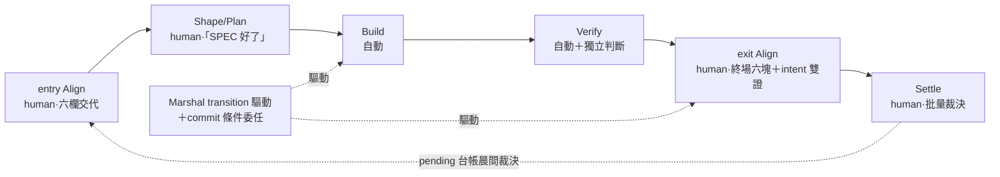

## Description

<!-- SECTION:DESCRIPTION:BEGIN -->
訂「流程的站牌」——開發切成固定幾站，每站誰在場、憑什麼過關。重新定義 semantic model，**不**把現行 commands/skills 升格成 lifecycle nodes。

**站牌**

- entry Align（human）：六欄交代，缺任一不得進 Shape
- Shape/Plan（human）：exit＝user「SPEC 好了」手勢
- Build／Verify（自動）：Verify 保留獨立判斷軸，與 machine verification 分責
- exit Align（human）：終場六塊＋**intent 雙證**——自報 intent-diff＋獨立 Intent Review 腿（fresh、排除中間鏈、問「仍解原本問題嗎」）；觸發閘＝standard＋full 且敞口過半／有 invalidated row／動過跨卡契約
- Settle（human）：批量裁決

**過關與打斷**

- Marshal 擁 phase transition 驅動＋commit 條件委任：bi/tri＋post-build 過關即授權，未過關或強 outward 無委任恆停
- priced-autonomy：強 outward／真分岔／自我擴權／預算超支才停；其餘自治扣款記錄理由不問
- pending 台帳＝未決人類裁決唯一住處（含批量浮出類 evidence-contradicts-intent／assumption-invalidated，晨間裁決消化）
- 可觀察性＝Marshal cross-cutting：pull-only checkpoint；唯一合法推播＝破損警報

**不做**：WT/session/model routing/retry 等 mechanics 不進人類心智模型；node 必要性以 session audit＋gate-position 測試驗證；rename 裁決歸 parent S7。

<!-- SECTION:DESCRIPTION:END -->

## Acceptance Criteria
<!-- AC:BEGIN -->
- [ ] #1 用近期真實開發 session audit 對每個候選 node 做必要性驗證；每個 node 都能回答人/LLM在此刻必須共同知道什麼、exit evidence 是什麼，不能只因現有 command 存在而保留。每個 node 須標註 Two-Touch 八階段的覆蓋範圍（跨多階段者列 phase transition predicate 與 user viewport 需求）與 **human-present／Marshal-automated 旗標**：human-present＝entry Align、Shape/Plan（討論模式；exit predicate＝user「SPEC 好了」手勢，由 Marshal 登記為 transition evidence）、exit Align、Settle（批量裁決）；automated＝Build、Verify——此拓撲是「中間零介入」的語義錨。必要性判據含 gate-position 測試——該 node 是否為行動面憲法停點，否則降為 Marshal 內務或合併；假設台帳 slice 邊界審計的承載歸 135.1／135.7，本卡只在 transition 義務層點名
- [ ] #2 Align 被定義成 human shared-understanding obligation：entry Align 的 exit predicate 為六欄開頭交代（intent verbatim／non-goals／revert 預算／預授權類／假設台帳／成功謂詞），缺任一欄不得進入 Shape；exit Align 驗 actual code reality／outcome。視圖選型歸 AIR-135.4，本卡只定義何時必須呈現與呈現語義，不把 artifact production 當 comprehension
- [ ] #3 Verify 明確區分 machine verification 與 independent judgment/review 的責任，即使最後 UI 顯示為同一 phase，也不能失去 independence axis
- [ ] #4 Marshal-owned mechanics 清單與 cross-repo boundary 清單明確；同 repo handoff/WT/session rollover 不再成 lifecycle node。**可觀察性＝Marshal cross-cutting obligation（非節點，地位同 Marshal）**：slice 邊界發佈 pull-only checkpoint（位置＋新鮮度錨；liveness 機制歸 135.7、視圖歸 135.4）；永不中途推播提問，唯一合法推播＝破損警報
- [ ] #5 產出名稱裁決與 migration map：現有 /spec、execution-plan、implement、post-build、commit、handoff、viewport skills 各自映射到 obligation/strategy/transport 哪一層；本卡產 proposal＋mapping，rename／deprecation 最終 verdict 歸 parent S7（parent AC#6），不另建真相源
- [ ] #6 Marshal 擁有 phase transition 驅動：在既有授權與 evidence predicate 滿足時自動推進 Shape/Plan→Build→Verify→exit Align→Settle，transition 覆蓋旅程⑤自動化執行、⑦ bi/tri＋post-build 過關後的 commit transition、⑧批量關卡（Settle 迴圈，非新節點）；commit gate 為條件委任——bi／tri＋post-build 過關即視為 user 已授權 commit（0919 裁決），Marshal 不另停；未過關或強 outward 無委任時恆停並明示 pending decision（進 pending-decision 台帳）。gate 分類採 priced-autonomy 語彙：強 outward 未委任／真分岔／自我擴權／預算超支才打斷；revert 預算內自治決策扣款記錄理由，不問。**pending 台帳語彙含批量浮出類（0919 外部收割——不增即時打斷類，晨間裁決消化）：`evidence-contradicts-intent`（證據與 user 交代的前提矛盾；即時場景併真分岔定義處理）＋`assumption-invalidated`（假設台帳 invalidated 且 affected 非空——belief update 的上浮面，schema 歸 135.2 AC#3）**
- [ ] #7 exit Align 的最低交付是終場六塊：comprehension receipt／intent-diff 防拉伸／決策紀錄含被拒選項／可逆點＋revert 成本標注／no-impact 機械證據／否決介面（否決必須比批准便宜；待決事項進 pending-decision 台帳）。有 UI／可呈現物一併開好是 exit predicate 的一項，不需 user 另說。圖／tour／Report Shell 選型依 AIR-135.4，不用大量 artifact 取代共同理解。**exit 義務升級為 intent 雙證（0919 外部收割）：弧內自報 intent-diff（實作方自述「我認為我解了 X」）＋獨立 Intent Review 腿（fresh context、只讀 intent verbatim＋成功謂詞＋final artifact、排除中間 plan／review／court 討論——問「完成的東西仍解 Intent_0 嗎」）；觸發閘＝tier standard＋full 且任一（revert 敞口花掉過半／假設台帳有 invalidated row／本弧動過跨卡契約），閘外小弧自報為足；receipt 分欄——自報缺失＝弧不完整、獨立腿缺失（閘內）＝exit Align 未過關；編排歸 135.7（可複用 bi/tri 終場腿只改工作單組成）、read-set 排除規則歸 135.1 AC#2；信任畢業後可降抽樣**
- [ ] #8 旅程②「卡內容討論」歸 entry Align 之內：討論中視圖＝卡面事實的機械投影（ephemeral、隨卡重生成、示於 SC 瀏覽器；禁 code-fact 圖——事實協商中）；批量關卡為 Marshal 驅動的 Settle 迴圈（AIR-135.7 擁有），逐卡不斷言視圖，只產一張多卡汇总 receipt——批量語義：跨卡依次推進；human gate 入 pending 台帳並套 safe default、不阻弧；僅強 outward 紅線停該卡、續下一卡；pending 台帳晨間一次裁決（裁決清單視圖由 AIR-135.4 投影）
- [ ] #9 開卡簡則銜接（0919 v4 終版）：entry 六欄的 intent 基線＝已確認的 Description（user SC ext 點卡通過者）；entry Align 只驗 freshness/delta——卡面 semantic 變更或執行參數未定才重走描述確認，已確認 intent 禁重問
<!-- AC:END -->

## Implementation Notes

<!-- SECTION:NOTES:BEGIN -->
【0918 authority 邊界】AC#6 的「既有授權」以 repo 既有紀律為單一源，本卡不重定義紅線清單：outward action（commit、跨 WT、跨 repo 回寫、外部寫入、刪共享資料）Marshal 恆停並明示 pending decision；紅線／黃線分級沿 outward-action-consent rule＋autonomous-execution skill；自主推進僅限授權面內 evidence predicate 滿足處。〔0919 superseded：commit 條件委任以 AC#6 修訂版為準（bi/tri＋post-build 過關即授權）；紅線清單仍以 outward-action-consent rule＋autonomous-execution skill 為單一源〕

【0919 北極星對齊審查（tri：muse＋codex＋GLM-fresh）】AC#2/#6/#7 依 Two-Touch 旅程修正（開頭六欄入 entry predicate／priced autonomy 語彙＋commit 條件委任＋批量 Settle／終場六塊＋否決介面＋UI 一併開好）；新增 AC#8（旅程②討論＝entry Align 內的 ephemeral 投影；批量關卡＝Marshal Settle 迴圈）；AC#1 補 gate-position 測試與八階段覆蓋標注；AC#5 補 proposal/S7-verdict 邊界。Code Lens 交叉表（節點×視圖）：**對齊即視圖、執行即謂詞**——entry/Shape-exit/exit Align 的 exit evidence 本身就是視圖（六欄交代／SPEC 呈現／receipt＋否決介面）；Build/Verify/Settle 預設沉默（exit 是 predicate／機械報告），Verify 失敗才產除錯全套、Settle 批量只一張多卡汇总 receipt。審查檔：.agent-tmp/air-135/align-135.3-{muse,codex,glm}.md。

【0919 v2】commit eligibility 規則歸本卡（⑦語義面；gate orchestration 歸 135.7）。co-first：與 135.2 並行開工、互為輸入唯讀互看。

【0919 外部收割（ChatGPT 四層缺口框架×muse job-mu88oodq／GLM-5.3 job-mu88osjx）】AC#6 補 pending 批量浮出兩類、AC#7 補 exit intent 雙證（歸屬細節見 parent notes 收割條）。Epistemic Merge 時序語義歸本卡：Verify exit／Settle 迴圈時點由 Marshal 跑 belief update（writer＝裁決後 Marshal 單一寫入；schema 歸 135.2 AC#3、觸發義務歸 135.7 AC#7）。七欄補欄／Attention KPI 公式／L0-L2 制度化判定已覆蓋拒收（論證見 parent 收割條）。

<!-- SECTION:NOTES:END -->
