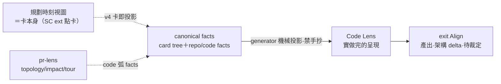

## Description

<!-- SECTION:DESCRIPTION:BEGIN -->
實做完的呈現（0920 scope 收斂）——canonical facts（card tree＋repo/code facts）機械投影成人類視圖：產出、架構 delta、待裁定事項。規劃階段不需要 Code Lens（該時刻視圖＝卡本身，SC ext 點卡）。不是 lifecycle node、不是第二 truth source。

**確認介面**

- 開卡確認＝**SC ext 點卡預覽**（卡本身即投影，ai-guide 側零平行 render）——規劃時刻（討論／SPEC）的視圖就是它，不另建
- mermaid 圖表化呈現面＝SC report viewer（`.html` artifact：srcdoc＋UMD mermaid@11＋pre.mermaid——離線渲染＋點擊 zoom）；`.md` 在 SC 兩面皆無 mermaid，卡面 fence 服務 repo 讀者/GitHub

**視圖規矩**

- Code Lens 只服務 exit Align 終場呈現：驗收 Walkthrough／Architecture delta／impact／終場 receipt＋否決介面（0920 scope 收斂——M1 規劃時刻視圖退役，由卡本身承接）
- generator 機械投影禁手抄（P9 實證）；帶新鮮度錨（禁用 updated_date——每次 edit 自動蓋寫），stale 自稱 stale
- 選型 manual-first，門禁句：渲染前自問消費者是誰、時刻是哪個、理解層在哪——答不出就不跑
- 執行中沉默（liveness 歸 135.7）；批量只一張汇总 receipt；SC 只消費 view contract
- pr-lens＝code 弧視圖主場參考實作（walkthrough／architecture delta／impact；slice-1＝原 AIR-130 producer，mosaic tools/prlens——收編凍結，等 SC 決定），卡投影與其為 Code Lens family 兄弟

<!-- SECTION:DESCRIPTION:END -->

## Acceptance Criteria
<!-- AC:BEGIN -->
- [ ] #1 定義 canonical fact layer 與 derived view layer：任何 Code Lens 輸出都可追溯 card/repo facts，view 本身不成 authoritative planning/workflow state。**視圖須由 generator 從 canonical facts 機械投影（禁手抄——P9 v1 漂移實證），每份輸出帶 provenance sidecar＋新鮮度錨（stale 自稱 stale；錨禁用 updated_date——每次 edit 自動蓋寫，135.2 0920 契約）**
- [ ] #2 code tour 與架構圖共用一份最小 projection contract（底層 producer SC 自決，pr-lens 為參考實作）；同一 change 可切 narrative 與 topology/impact 視角，不重算／複製彼此已有的 core facts。**視圖時刻收斂（0920 user 裁決）：Code Lens view mapping＝單時刻 exit Align——終場 receipt、intent-diff、decision、否決介面、架構 delta/impact；規劃時刻（entry Align 卡內容、Shape exit SPEC）＝卡本身即投影（SC ext 點卡預覽），非本卡交付物——卡面語義（解什麼／定什麼契約／不做什麼＋承接上游 direct deps 深度=1、transitive 只計數／影響＋現況／待裁決）由 canonical 卡面直讀，禁手抄、禁爬 transitive 鏈、Code Lens 直讀 canonical 卡面（投影禁成真相）。事實協商中禁 code-fact 圖**
- [ ] #3 viewport 選型＝manual-first：先交付生命週期手冊式選型指南（①開工前／計畫討論＝❌不用 Code Lens——0920 裁決規劃階段不需要，卡本身即投影；graph.db 波及查詢屬工具能力非 Lens 視圖交付、user 手動可查 ②執行中不產 Lens 視圖：活的面歸 135.7 liveness 台帳 ③驗收 Walkthrough＋Architecture delta（主場）④除錯＝producer 原生全套（user 主動觸發）⑤結案 Walkthrough 一步一弧＋M3 delta；user override 永遠可用）。**門禁句：渲染前自問消費者是誰、時刻是哪個、理解層在哪（0919 外部收割——L0 實作／L1 架構／L2 問題模型；user 注意力 L2↑、L1＝人機溝通 vocabulary 不全外包）——答不出就不跑。**自動化選型須待 AC#4 dogfood 帶回誤選成本證據後另行評估
- [ ] #4 AIR-135 自身至少 dogfood 一次 exit Align（0920 收斂：規劃階段不再——entry checksum 一問隨 M1 退役，規劃時刻驗收＝SC ext 點卡本身），驗證 human 能快速指出「AI 理解與我的意圖哪裡不同」而非只看漂亮圖。**執行依賴 SC 對應卡交付（135.5 首例 handoff 已啟動）——本 AC 於 SC 卡交付後驗**。**聯合 dogfood**：與 135.2 AC#5 共用同一投影產物（同一 artifact 同時滿足本 AC exit Align 驗收與 135.2 verdict 裁決呈現——POC 已實做，codelens-poc-ep-verdict.html）；dogfood 驗證含 exit evidence→view 的可追溯鏈——每個 exit evidence 必能指向對應 Code Lens 呈現物或明確標註不需呈現
- [ ] #5 與 Report Shell、/illustrate 的 ownership/embedding 邊界明確；SouthChariot 端實作自決（0920 裁決——producer／rendering 歸 SC 控制面，「projection contract 歸 ai-guide」ownership 宣稱撤除），ai-guide 側唯一要求＝**資料來源紀律：SC 呈現內容須可對回 ai-guide canonical state（卡面＋code facts），禁手繪無中生有**。**邊界三句**：①執行中沉默——liveness 台帳歸 135.7，Lens 在 Build 期預設不產視圖 ②否決介面渲染（135.3 AC#7 終場六塊之一，否決須比批准便宜）由本卡視圖面承載、SC control 面承接（135.5 contract）③批量只一張多卡汇总 receipt 視圖（節點語義 135.3 AC#8、載體 135.2 AC#7），逐卡不斷言視圖
- [ ] #6 確認介面與圖表呈現（0919 v4 終版）：①確認介面＝SC ext 點卡預覽（卡本身即投影）②圖表化輸出＝SC report viewer 慣例的 `.html` artifact（srcdoc＋UMD mermaid@11 精確路徑＋pre.mermaid——離線渲染＋點擊 zoom overlay；SC 剝 CSP 重注入）掛 references[]（workspace 相對路徑）③卡面 mermaid fence 服務 repo 讀者；SC card detail 現無 mermaid 為已知限制（SC 側補 gem 走 135.5 reverse-first）④top-level ESM 形態渲染但無 zoom——確認視圖等一次性小物可接受，要 zoom 的殼不用。驗收＝9 卡 reconciliation 的圖在 SC report viewer 實開 zoom PASS
<!-- AC:END -->

## Implementation Plan

<!-- SECTION:PLAN:BEGIN -->
〔slice-1（原 AIR-130；mosaic repo worktree mos-prlens-slice1 from mosaic main，純新增檔案）〕
〔0920 凍結（user 裁決 c）：slice-1 收編義務暫停——Code Lens 底層實作歸 SC 端決定（SC 對應卡 handoff 已啟動，＝135.5 開卡協議首例 dogfood）；pr-lens 降為現成參考實作。SC 決定沿用→收編流程復活；SC 自寫→本段退役＋mosaic WT（mos-prlens-slice1）處置另議〕

〔已決策勿重辯（tri 三腿＋slice 0 POC）〕①POC 已驗：CJK 渲染 PASS／determinism 兩次 render byte-identical／strictObject 拒 extension 欄→provenance/coverage/known-unknowns 走 sidecar 不進 document②零 fork：npx @coldtea/pr-lens-cli 消費 upstream③producer＝Python 住 mosaic tools/prlens/，雙源＝delta tour（變動面 nodes/delta colors）＋graph.db（模組關係 edges——slice 0 實證 tour 不帶關係、edge 必查 graph.db）④LLM 退出 document 路徑——事實層全 deterministic；lane 命名/敘事＝overlay/sidecar 輸入（後續 slice）⑤.tour/AIR-80 manifest 凍結面零改動⑥Id 禁中文→slug⑦walkthrough 用 schema 原生承載不自造⑧觸發制（boundary/topology 弧）非常態；map export 累積歸 AIR-122 freshness 閘⑨成本基準：slice 0 手寫 ~160 行 30min——producer 自動化此曲線。

〔範圍〕tools/prlens/producer.py（輸入 arcId→snapshot pair＋delta tour→nodes/lanes/deltas＋graph.db 邊查詢→graph document＋sidecar）＋tools/prlens/tests/。明示不動：.tours/ 本體、mosaic 其他檔、ai-guide 條文。

〔slice AC〕①producer 對既有弧產 document、npx validate PASS②render 兩次 byte-identical③同輸入重跑 byte-equal④edges 全來自 graph.db 查詢（禁 tour 推測/禁 LLM）⑤CJK lane 名渲染 PASS⑥.tour 與 manifest 零改動⑦pytest 綠⑧sidecar 帶 provenance。
<!-- SECTION:PLAN:END -->

## Implementation Notes

<!-- SECTION:NOTES:BEGIN -->
【content confirmed】user 0920（scope 收斂＋SC handoff 連動＋v4 殘留清掃＋AC 對應調整＋consistency 95/100 後點頭「OK」——edit 後確認）
【0918 自動選型門檻】AC#3 的「自動選 viewport」屬 dogfood 後演進項：先以手冊式選型指南（條件對照＋user override 永遠可用）交付；AC#4 dogfood 帶回誤選成本證據後，才評估是否自動化。

【0918 POC 實證】AC#1 反例實證到手：手抄 topology（v1）漏 135.5→135.3、parent 誤標 deps，vision agent 判 FAIL；改由 arcspec.json 機械生成（v2）後 edge 集合 11/11＋7/7 零漂移。結論＝Code Lens 視圖禁手抄，必須 generator 從 canonical facts 投影——AC#1 的機械生成要求由本實證支撐。產物：.agent-tmp/air-135-poc/（p9-*、demo_p9_project_views.py）。

【0919 吸收 AIR-130】pr-lens deterministic producer（原 AIR-130 slice-1）併入本卡為首個 implementation slice——它就是 AC#1/#2 與上條 P9 教訓（視圖禁手抄）的具體化。原卡已 superseded/archive（backlog/archive/tasks/，tri 三腿定案與 slice-0 POC 全文可查）。

【0919 聯合 dogfood 綁定（user 指定）】135.2 的 EP 退場 verdict 將以本卡的 Code Lens POC 呈現——AC#4 的 entry/exit Align dogfood 與 135.2 AC#5 裁決呈現合併執行（同一投影產物兩個用途）。

【0919 使用設計收斂（bi-muse＋user 生命週期批判）】選型指南 v2：以任務生命週期為軸取代 session 事件軸。①開工前＝Impact/Architecture 預判（graph.db 查波及，改動未發生即可查——user 批判補出的格子）②計畫討論＝❌不用 pr-lens（事實協商中，口述＋輕量 mermaid）③執行中＝❌（liveness 台帳，135.7 的活）④回來驗收＝Walkthrough＋Architecture delta（原生主場，最高價值）⑤除錯＝原生全套⑥結案回顧＝Walkthrough 一步一弧＋M3 delta 著色。三硬規：Data-flow payload 面 card/arc 層禁用（決策無 payload）；agent-skill analyze 禁（LLM 退出 document 路徑）；walkthrough steps 只接受機械來源。門禁句進 AC#3 選型指南：「渲染前自問消費者是誰、時刻是哪個——答不出就不跑」。findings：.agent-tmp/air-135/prlens-usage-muse.md（bi-codex 腿環境死未產出——擇期補派）。

【0919 user 修正：M1 討論中要產視圖（推翻 muse 裁決的過度部分）】討論中的視圖＝**卡內容的機械投影**（卡就是 canonical facts，討論中的視圖從卡面/AC/deps 確定性生成）顯示於 SC 整合瀏覽器——與 P9 v1 手抄漂移不衝突：v1 錯在憑空手繪不存在的邊，討論視圖只投影既有卡面事實。定位：ephemeral 對話輔助（不入 fact layer），投影片隨卡內容即時重生成。SC 側：VSCode 整合瀏覽器顯示（135.5 contract→SC 卡）。

【0919 prlens-WT 處置（user 指令）】mos-prlens-slice1（mosaic repo WT；commit 7b403d94f＝原 AIR-130 slice-1 已完成未合併實作 1134 行、唯一拷貝、mosaic main 無 tools/prlens）——本卡開工首段＝收編該 commit（slice AC 逐條複核→rebase owning 線→merge）；**收編完成後必砍**：WT 目錄＋branch mos-prlens-slice1 都不留（user 0919：「做完要砍掉」）。收編前禁砍。

【0919 v2】scope 擴涵「①前期 alignment viewport」（tri 題二三腿裁決）：projection mechanics 契約——ephemeral／新鮮度錨／renderer 解耦（projection≠HTML）／可引用座標／版本 supersede。deps 定著＝135.2、135.3。

【0919 v3 總修】晨間批量裁決清單視圖歸本卡（parent:70——135.3 AC#8 批量語義的視圖面）；旅程①前期 alignment viewport 交付句併入三時刻列（①M1 討論中投影已有 notes 依據）。

【0919 L1 SA content view 定型（user 投影目的校正＋bi 雙腿 muse job-mu846sgb／codex job-mu846shg）】user 裁決：投影主體＝「依賴裡面的內容」、形態＝人類可讀 SA 式（指針＝parent 卡 Description 敘述層）——前框影「讀少量／聚合掃視」作廢；v3 整卡倒 HTML 失敗例教訓＝搬運≠投影。AC#2 M1 改版為五塊結構（本卡 SA capsule＋direct deps SA:EXPORT 組合）＋深度=1＋transitive 只計數＋composite digest 段級 stale＋禁 projection-on-projection（Code Lens 直讀 canonical 卡面）＋禁 renderer 爬鏈（缺前提＝修 dependency 表達，爬鏈＝renderer 變語義作者）。SA capsule（CONTRACT／BOUNDARY／EXPORT）source/storage schema＝135.2 契約⑫-⑯（本卡只擁視圖／組裝／render 契約）。findings：.agent-tmp/air-135/projection-bi-{muse,codex}.md。

【0920 user 裁決（reconciliation 前置——「Code Lens 現在收斂到是實做完的呈現了吧，規劃階段不需要他了，這點要注意」）】Code Lens scope 收斂＝終場呈現（exit Align viewport：產出＋最終架構＋待裁定事項＋impact/topology 投影）；規劃階段（旅程②卡面討論／③SPEC 呈現）不再需要 Code Lens——該時刻視圖由 v4「卡即投影」（SC ext 點卡）結構性承接。連動義務：①本卡 AC#2 三時刻 view mapping 待修（收斂為終場單時刻）②parent AC#4「視圖須覆蓋旅程②③⑥三時刻」措辭待同步（規劃時刻＝SC 點卡，Code Lens 覆蓋⑥）③135.2 聯合 dogfood（AC#5 verdict POC）已實做完成、為歷史證據不受影響。詳細修訂待 flash 簡報＋點卡流程合併執行。
【0920 v4 殘留清掃（flash 簡報）＋修訂落地】歷史 notes 不改寫、標記 supersede：【0919 M1 討論中要產視圖】【0919 L1 SA content view】的 ephemeral generator／SA capsule／SA:EXPORT／composite digest／⑫-⑯ ownership——全屬 v4 已撤 marker schema 時代；現行＝規劃時刻視圖＝卡本身（SC ext 點卡）、Code Lens＝exit Align 單時刻、ownership 對偶＝135.2 AC#7「存儲即視圖源，投影禁成真相」。「receipt」（終場六塊／批量汇总塊名）與「新鮮度錨/stale 自稱 stale」概念存活；Diagram V2「confirmation digest」節點隨 Description 重繪移除。Description／AC#1/#2/#3/#4 已按 scope 收斂改寫。
【0920 user 六問裁決（SC handoff 需求對齊）】①「projection contract 歸 ai-guide」ownership 宣稱撤——user 指正：術語無意義應問「現在這有意義嗎」；降級為資料來源紀律一條②pr-lens 收編凍結（c）③本 handoff＝135.5 開卡協議首例 dogfood（b）④AC 權＝SC 自擬回貼確認（spec 只給需求＋契約指針）⑤交付＝Code Lens＋code tours 整合：架構圖理解本次修改→code tour 跳重要 callstack 實作細節⑥交接＝markdown 交 user 貼到 SC session（不經 bridge）。連動：Plan slice-1 凍結、AC#5 降級——均已改。spec 檔＝.agent-tmp/air-135/dogfood/sc-codelens-handoff.md。
<!-- SECTION:NOTES:END -->
