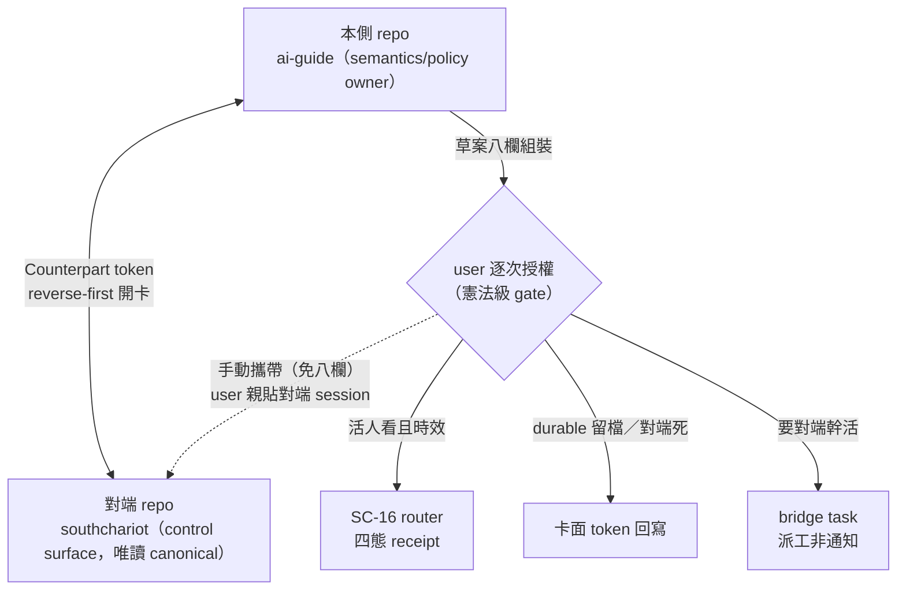

## Description

<!-- SECTION:DESCRIPTION:BEGIN -->
跟別的 repo 握手的規矩——mosaic／SC／bridge 多方，誰擁有真相、跨 repo 送東西必經你點頭。

**identity 與 ownership**

- qualified text identity（0920 定案 v1，通例——適用所有跨 repo 卡對）：**Counterpart 行**，通用格式 `<repo-id>/<card-id>`（第一段＝stable repo 邏輯名——取各 repo 公認的 repo basename，不是機器路徑、不是 git remote；第二段＝該 repo 原生卡 id）。規則只有兩條：①每張跨 repo 對應卡在 Notes 寫一行「**對方**的 `<repo-id>/<card-id>`」（雙向互寫）②禁絕對本地路徑作 identity（換機器即腐）。例子中的 `ai-guide`、`southchariot`、`AIR-135.5`、`SC-99` 均僅為首例值（首例互寫＝SC 卡 `Counterpart: ai-guide/AIR-135.5`、ai-guide 卡 `Counterpart: southchariot/SC-99`）；references[]／https 僅可點捷徑不作 identity；parentTaskId／dependencies 維持 repo-local
- ai-guide 擁 semantics／policy／Marshal obligations（projection contract ownership 已撤——0920 隨 135.4 降級為「**資料來源紀律**：對端呈現內容須可對回 canonical 事實，機制對端自決」）；SC 擁人機 control surface（唯讀 canonical、產 derived projection/cache），不另存第二套 lifecycle truth

**開卡與發送**

- reverse-first：SC 先建卡寫 reverse `Counterpart: ai-guide/<id>`，ai-guide 補 forward `Counterpart: southchariot/<id>`；絕對本地路徑禁作 identity。**首例先導豁免（0920 user 拍板）：Code Lens 對應卡＝本契約首例 dogfood，contract 未全固定即開跑——摩擦回報收斂本卡**；協議四步（首例 spec 已用）：①SC 卡 Description 先行（人話＋一張圖）→貼回 user 確認 ②SC session 自擬 AC→回貼確認 ③雙邊 Counterpart 行互寫 ④摩擦回報→本卡收斂
- 跨 repo 發送＝outward 憲法級逐次授權（0919 commit 委任不及於此）：草案八欄組裝→transport 分流——活人看且時效→SC-16 router、durable 留檔→卡面 token 回寫、要對端幹活→bridge task、**user 手動攜帶（markdown 貼對端 session）＝第四形態免草案八欄（發送動作＝user 本人，逐次授權天然滿足——0920 首例實用形態）**
- 單一發送路徑、草案可排隊禁批量發送；禁自建跨 repo session 目錄
- parties：本側 ai-guide＋delegate-bridge，對端 mosaic＋SC

<!-- SECTION:DESCRIPTION:END -->

## Acceptance Criteria
<!-- AC:BEGIN -->
- [ ] #1 stable repo id 與 cross-repo token schema v1（0920 定案——codex job-mu96y8ef 建議採用 RFC 3986 relative-reference 既有標準，user「有類似標準就用」授權）：**Counterpart 行**＝`ai-guide/AIR-135.5` ↔ `southchariot/SC-N`（第一段 stable repo id、第二段 repo 原生卡 id；不加 sc 前綴），各一行住兩邊卡 **Notes**（rg `^Counterpart:` 直搜——撤 references[]＋Description 雙寫，單寫防 drift）；references[]／https 僅可點捷徑不作 identity；禁止跨 repo parentTaskId/dependencies。schema v1 含 **session-level target token 格式（harness:sessionId pair，pair＝harness 名＋sessionId、可附 WS 尾名；workspace fs 絕對路徑禁入）**——a-bar 卡 A「Copy target token」之拍板依據。
- [ ] #2 定義 ownership matrix：ai-guide / Backlog card tree / code-fact producers / Code Lens / SouthChariot / Marshal 各自可讀、可寫、authoritative 的範圍；SC 只能持有 canonical identity/link 與 derived projection/cache。**SC-164 落地後增補（0920 查證）**：session store 本體＝SC 與 ZCode desktop app 共享（同 inode 實證）、SC 唯讀消費；ZCode desktop tasks-index（投影層）＝SC 可寫（createSession 自動投影 INSERT、fail-soft 帶 desktop 驗證語義）——「寫對端投影層」即 derived projection 產出動作，與「不另存第二套 lifecycle truth」不衝突；bridge 子 session 對雙邊皆結構性不可見（HOME 分家兩缺口文件化歸 SC-164，缺口② bridge HOME 聚合兩邊未排）。
- [ ] #3 定義 projection/action contract：SC 可讀哪些 canonical/derived state、哪些 human actions 必須回寫哪個 owner、衝突/stale 如何 fail-loud；https/blob URL 只作 convenience，不作 canonical identity。
- [ ] #4 SouthChariot implementation card readiness gate：本卡 contract 固定後先在 SC 建 repo-local card，SC card 先寫 reverse `Counterpart: ai-guide/AIR-135.5`（Notes 一行），再回 ai-guide 補 forward `Counterpart: southchariot/SC-N`；不得使用絕對本地路徑作 identity。**首例（Code Lens 對應卡）＝先導豁免（0920 user 拍板）：contract 未全固定即開跑，摩擦回報收斂本卡**。開卡協議四步：Description 先行→user 確認→SC 自擬 AC 回貼確認→雙邊 Counterpart 互寫（＋摩擦回報迴路）。委任邊界（0919）：⑦直接 commit 委任僅覆蓋本 repo 審查通過弧的 commit；寫對端 repo 卡（token／comment 回寫）＝跨 repo 寫入，Marshal 恆停＋逐次授權，本側 forward token 補寫是本 repo 寫。SC 側卡（含 a-bar A＝v1 選單、B＝v2 pin＋手勢 gated 於 SC-16 router 落地）同走 reverse-first 協議。**transport preservation（0921 旗艦裁決 B5——治 sess_c5edae9e 式「底層做完就停」）**：來源卡的 user-visible surface AC＋Preview 指針必須進 receiving card contract；對端禁只搬 backend work package——跨 repo handoff 的 work package 若剝掉 user-visible 面，即為剝掉 user 的驗收面。
- [ ] #5 跨 repo dogfood：fresh session 僅憑 card 內 qualified token + repo-local 搜尋即可重建關係；任一 repo 暫時不可達時仍能辨識對端 identity，不需要人工 handoff 文件維持持久狀態。對帳＝雙邊 Counterpart 行互指一致（ai-guide/<id> ↔ southchariot/<id>），drift 即 fail-loud（單寫於 Notes——0920 撤雙寫）。MVP 分期：router 落地＋升級信號（一次 verdict 丟失事故或連兩週手動搬運成常態）出現前，Counterpart 對帳＝人工 dogfood 行，不做對帳／草案工具。**開工即註冊**：開工／dispatch 時把預期對端 Counterpart token（無對應卡時記 user 口語點名原文）寫進本卡 notes，即為 registry 登記（135.7 AC#3 同軸）；臨時發現對端需求由當場 user 點名＋補記
- [ ] #6 cross-repo handoff 的 Arc/card/artifact/session identity 與 current verdict/context 由 Marshal 從 canonical state 自動組裝；SouthChariot SC-15/SC-16 的 messaging/router/receipt 能力負責 transport/delivery，AIR-135 不重造 courier protocol。user 不需複製 session id、verdict 或重新口述 context，transport identity 也不得成第二 lifecycle truth。**確認 gate（憲法級）**：跨 repo 發送＝outward，須逐次 user 授權，0919 直接 commit 委任不及於此——UX 首選 SC-15 result card＋手動 Continue（只填 composer 不自動送）；CLI 等價＝草案全文＋SEND to <target>? [y/N]＋AUTH line 入 sent-record（住發起卡 notes）；發送逐條確認，草案可排隊、禁批量發送。**草案八欄 schema**：target identity（對端 session ref：harness:sessionId［＋WS 尾名］＋對端 Counterpart token 若有對應卡）、source identity（本側 Counterpart token）、verdict 摘要＋卡座標、artifact pointers＋hash、expected response type、correlation id、context delta、expiry。**transport 四路分流**：活人看且時效→SC-16 router（四態 receipt；現況＝設計收斂未開工——SC-164 store 共享已實證 zcode 腿目標可見性，寫入腿待 SC-16 落地，落地前此路的實用形態＝第四路手動攜帶；**0920 R3 對端判斷：SC-16 revision pending**——round4 修訂凍結開工，router authority 或上移 ~/.sc 層、SC-16 重定位為 adapter/consumer，待 user 對 ~/.sc 方向拍板）；durable 留檔／對端已死或唯讀→卡面 token 回寫；要對端幹活→bridge task（派工非通知，計費落對方 lane，禁拿 task 當 courier）；**user 手動攜帶（markdown 貼對端 session）＝第四形態、免草案八欄——發送動作＝user 本人、逐次授權天然滿足（0920 首例實用形態）**。提議＋組裝＝LLM；target 確定＋發送＝user；禁自建跨 repo session 目錄（target 解析程序細節與 carrier 限制住 Notes）。**single-send-path（0920 邊界裁決：gate 管 AI 發起）**：AI/LLM/Marshal 發起的跨 repo 發送，任何通知入口（a-bar 選單／pill／快捷）只產 draft 永不發送，唯一路徑＝本 AC 確認 gate；**user 親手在 SC UI compose-to-target（SC-16 UC）＝user 本人動作、授權天然滿足，屬第四形態的 UI 延伸，不在 gate 範圍**。**過期草案視為 stale**：expiry 到達後禁確認發送，須以 fresh facts 重組草案（新 correlation id 或註記 supersedes）後重排；sent-record 記 expiry＋重組原因
- [ ] #7 projection/action contract 必能呈現 derived active-work/liveness/terminal status 與 pending-human-decision projection，且每項可追溯 authoritative owner；SC 可顯示與觸發 action，但不得靠 user 手動輪詢或在 SC 另存一套 arc state。owner pointer：pending-human-decision 的仲裁語義**歸 AIR-135.3**（AC#6 pending-decision 台帳＋AC#7 否決介面）；跨 repo 投影的產出可由 AIR-135.7 Settle 迴圈驅動，本卡不另建仲裁語義。**SC-18 catalog 落地前不宣稱 peer session liveness**：SC 僅呈現最近一次 transport receipt（四態）＋observed-at／expiry 與卡面 target 註記，並把 session liveness 明示為 unknown——真實 alive／terminal 狀態只能由 authoritative runtime／catalog source 投影；receipt 不得升格為 liveness oracle；SC-164 同 store 直讀的 session 存在性／metadata 同理——存在可見≠alive，同禁升格
<!-- AC:END -->

## Implementation Notes

<!-- SECTION:NOTES:BEGIN -->
Counterpart: southchariot/SC-162

Muse source review：Backlog parent create 會在單一 project working-copy 查 parent，miss 即拒絕；dependencies 亦在 local corpus fail-closed；references 只做 trim/去空/去重，無 target existence/scheme 驗證，因此可承載 cross-repo token。但 task search 不索引 references，所以 token 必須同步進 Description/Notes；web 只把 http(s) render 成可點連結。MCP roots 同時只持有一個 active project。結論：不改 Backlog.md、不 upstream；現成 references + searchable text token + optional https 是目前 contract。

【0918 跨 repo 通知設計——bi 雙腿收斂（muse job-mu7c71br＋codex job-mu7c71ct，九題除 Q2 時間軸差外零分歧）】user 命題「已知對端 repo session→組裝草案→user 確認→發送」具體化如下，歸本卡 AC#6 notes 層（雙腿共識不新增 AC 不開新卡）：①草案＝Marshal 自 canonical state 組裝的 derived artifact，欄位八項（target/source identity〔x-arc token〕、verdict 摘要＋卡座標、artifact pointers＋hash、expected response type〔FYI/提問/請求動作〕、correlation id、context delta、expiry）——落 .agent-tmp＋chat 呈現，禁進卡 comment/SC inbox（未確認物不進 durable plane）②確認 gate：通知＝outward 逐次授權；UX 首選＝SC-15 result card＋手動 Continue（只填 composer 不自動送）；CLI 等價＝草案全文＋SEND? [y/N]＋AUTH line 入 sent-record；批次只准排草案禁批量發送③transport 分流判準：活人看且時效→SC-16 router（非搶占留言＋四態 receipt）；durable 留檔/對端死了→卡面 token 回寫；要對端幹活→bridge task（派工非通知，計費落對方 lane）④registry：SC-18 catalog 落地前＝user 斷言＋卡面註記（現例：sess_2f4d6ea5）；落地後 catalog 為源；禁 ai-guide 自建跨 repo session 目錄（絕對座標必腐）⑤失敗態：SC-16 四態誠實呈現＋降級卡面回寫＋本側 sent-record，禁 broker 禁靜默丟失⑥MVP（零新建設施，先手動跑兩週）：schema＋逐次確認＋分流慣例＋sent-record 格式；觸發升級信號＝出現一次 verdict 丟失事故或連兩週手動搬運成常態。YAGNI 紅線：SC-16 router 未落地前只留慣例不做草案工具。例子清單 12 條（SC-15/16/18/24/25/39/40/41/55/89/103/DRAFT-2）見 .agent-tmp/air-135/bi-crossrepo-notify-muse.md。

【0918 使用協議補充（user 設計拍板後追問，納入定案）】①target 指定：user 口語點名（如「通知 DB 那邊」）→ LLM 自卡面註記/bridge runs/registry 解析候選 target 並組草案（target identity 在草案欄位內）→ 確認 gate 時 user 核對 target＋內容＝拍板。LLM 判斷邊界＝提議＋組裝；target 確定＋發送＝user。②不預開對端 session（idle session 燒 muse 窗口/codex 訂閱，違計費鐵律）：開工時把「預期對端」寫進卡（deps/notes x-arc token 已涵蓋）即為註冊；臨時發現（如跨 repo bug）＝當場 user 點名。

【0918 a-bar 互動設計 bi 諮詢（muse job-mu7cuvzh＋codex job-mu7cuw0h）】共識：v1＝右鍵選單三項（Copy session ID bare／Copy target token＝harness:sessionId pair／設為傳訊目標＝fill composer 不發送）＋single-send-path 不變式（所有次表面只產 draft 永不發送，draft-2 紅線推廣）＋copy workspace path 永不做（AC#4 禁絕對路徑）；v2（gate＝SC-16 router 落地）＝drag-to-chat（target pill、drop 誤落 no-op 無 toast）＋pinned-SET（globalState triple key、SET not list 免合併語義）＋SC-103 region 硬規則回歸測。分歧一條：v1 是否做 reorder——muse 反（零 DnD 基建、時間分組第二真相源、J7 合併成本；建議 pinned-SET 替代）、codex 贊（presentation preference 風險低）——留 SC 側裁。implementation 錨點：a-bar 現無 dragAndDropController、六 contextValue when 表需機械對帳測、multi-select copy＝換行 join 需一行 spec、identity 雙層分離（runtime id vs display alias）。歸屬：advisory 歸本卡 notes；SC 側兩卡提案（A＝v1 選單、B＝v2 pin＋手勢）由 SC 建（AC#4 協議 reverse token 先行）。full findings：.agent-tmp/air-135/abi-abar-{muse,codex}.md。

【0919 v2】non-mixing gate：liveness 六欄（dispatch 登記）≠草案八欄（發送 payload）；跨 repo 寫恆停 invariant 引用不重刻。deps 定著＝135.3。

【0919 user 補充（scope 多方化）】跨 repo contract 的 parties 不只 ai-guide↔SC：delegate-bridge 也是 contract 對象（transport/courier 層），消費者含 mosaic。ownership matrix 與 token schema 須涵蓋 ai-guide＋delegate-bridge 為本側 party、mosaic＋SC 為對端 consumer 的多方拓撲——bridge 的 task/review 介面與卡面 token 的對接歸本卡範圍。
【0920 reconciliation（首例 dogfood 啟動同步）】①registry 登記（AC#5 開工即註冊）：user 口語點名原文「可能留給SC 決定，然後這應該跟ＳＣ有關系，應該要 ＳＣ那邊有對應卡」；對端＝SC Code Lens 對應卡（未建，Description 先行中）；handoff spec＝.agent-tmp/air-135/dogfood/sc-codelens-handoff.md（已含 Counterpart addendum）。②token schema v1 定案（codex job-mu96y8ef-ite6qv 建議＋user「有類似標準就用」授權）：Counterpart 行＝RFC 3986 relative-reference `repo-id/card-id`，兩邊卡 Notes 各一行單寫；不加 sc 前綴；撤 references[]＋Description 雙寫（codex 實查 SC checkout 無 origin remote→GitHub URL 不可當 repo identity）。③首例先導豁免（user 拍板首例先跑＝選項 b）④transport 第四形態＝user 手動攜帶免八欄 ⑤projection contract ownership 隨 135.4 撤除降級為資料來源紀律。Description／AC#1/#4/#5/#6 已同步改寫。
【0920 定向接續實驗（user 開 SC session sess_52966b61 供試「bridge 跨 repo 接續」）——三發收斂，診斷閉環】機制事實：**bridge headless carrier 用隔離 ZCODE_HOME（.delegate-bridge/zcode-home，當初為 config 隔離），session 視野不含 user 互動 session（~/.zcode）——跨 store resume 架構上不可達**。三發：①`--resume <id>`＝flag 誤用（--resume 是布林＝resume-last，task.rs:369/2186），fallback 撈 ledger 最新 glm session（sess_a8729b90）②同誤＋SC cwd＋--model：撈到無關 SC-159 session（sess_536476a4）③正確 flag `--session-id`（codex 同款 muse 語義）＝誠實 fail-loud `Session not found`（job-mu981gxi-841xrk，failed-usage）——證明隔離 store 內無此 session、flag 語義正確。定性：**非 delegate bug**——attempt 1/2 為 flag 誤用（--resume 布林被當帶值用，id 字串遭吞），attempt 3 證明 fail-loud 正確。處置：跨 repo 接續互動 session＝user 手動攜帶第四形態（已明文化）；bridge 自建 session 的 `--session-id` resume（同 store）理論可行未驗。queued（delegate-bridge 維護弧，非本卡）：(a) 維持隔離＋文件化「bridge resume 只服務同 store session」(b) **session import/fork——DB 修改已查清（0920 結構實查）**：對話住 `db/db.sqlite` 的 session/message/part 表（兩邊 store 布局對稱、與 config.json 物理分檔）；修改＝隔離 db ATTACH 互動 db 唯讀→複製目標 session 的 session/message/part 三表 rows（exec/artifacts 目錄不搬＝side-channel 非上下文；一次性複製無並發；欄位名實作時對 schema 校準、待驗證）→headless `--session-id` 即可接續，config 照舊隔離零 symlink (c) UX：無值 --resume 誤用時提示布林語義。**設計脈絡（user 問「何必整顆 ZCODE_HOME 隔離」→user 正解「對話不需要隔離」）**：隔離 home 實際扛兩事——credential staging 安全（TG4 approved-deviation：staging 鏈逐層拒 symlink）＋headless worker 免踩互動 hooks/plugins；對話隔離是整顆換 home 的副作用非需求。修法兩路＝bridge 短線三表複製（(b)）或上游 ZCode `ZCODE_CONFIG_HOME`/`ZCODE_DATA_HOME` 分離（長線；db/exec/artifacts 歸 data、config.json+plugins 歸 config——物理分檔已是現成基礎）。model-routing 矩陣 glm 格 update（--session-id 為正確 flag、cwd 條件、跨 store 不可達）queued 條文收編批。【0920 reconciliation 狀態：verdict 暫緩】gate＝bridge 定向接續修復＋驗證通過（handoff 已出→delegate-bridge 維護弧，baseline c680ced）；修好＋接續實驗 PASS 後本卡才裁決。修訂內容（token v1／豁免／四路／實驗證據／原則）全部在卡未 commit，隨 verdict 一起 commit。
**設計北極星（user 定調 0920）**：最小隔離——config/credential/hooks 才隔離，session／對話共享；終態＝跨 repo 交接後 bridge/subagent 可在對端 repo 同線接續（(b) 三表複製是通往該終態的第一步）。**config 唯讀原則（0920 深思定調，user 二次修正後終版）**：隔離 config＝**唯一寫入者＝user 在對應 repo 的互動／provisioning session**（bridge、carrier 皆零寫入權、唯讀消費——消滅「受信任程式」殘餘攻擊面：bridge 被攻破也只能讀不能偽造 staging）；hooks/plugins 在隔離 home 恆空、carrier 寫入企圖＝tamper 信號 fail-closed（同 muse session-end bypass 教訓：gate 外寫入路徑＝持久化攻擊面）；per-run 設定走 flag／ephemeral store 不住 config；配套＝staging hash pin＋每跑前驗 hash、drift 即 fail-loud（同投影紀律 manifest＋hash）；spawn 時 config 缺/舊＝**不自動補**、fail-loud＋provisioning 指引（queued 修法 (d)：spawn-time auto-staging 廢除）。

【135.5 dogfood——session-level token 首例】zcode:sess_2c1d13c6（watcher 弧）→ zcode:sess_b9e0c3b8（本卡 session）：雙向通道實驗，訊息在 .agent-tmp/session-bus/to-sess_b9e0c3b8-e261-4fc3-877b-7ad2f2076645.md（fs bus——append-only 最單純同 repo 通道）。請讀取並依指示回覆暗號。channel 註記：fs bus 為 session 級流量通道；卡面只掛指針（避共檔 Edit 衝突）。

【0920 R3 回執收割（SC 對端試驗 2 sess_c5edae9e 四任務完成；forward 行已補——首例 Counterpart 雙邊互寫閉環）】①**開卡 A/B/C＝SC-167/168/169**（Description 先行未 commit，user SC ext 點卡預覽確認後對端才 commit＋補 AC）：SC-167＝進場 stale snapshot（卡 A）、SC-168＝subagent 清單觸達（卡 B，修法 A/B/C 待決）、SC-169＝directory 大小寫（獨立小卡，併 sc-103/112/117 workspace-matching 家族）。②**~/.sc router 研究**：報告＝.agent-tmp/air-135/dogfood/sc-router-research.md（muse 反解＋1.3.0 活體補探＋codex 腿 job-mu9uljfk＋glm flash 腿 job-mu9ulnnq 交叉）；推薦＝~/.sc 自建輕量 registry+router（SQLite/maildir、無 daemon；語義抄 muse、投遞借 MQTT/NATS、NATS/Redis footprint 超標不採）；**muse 與 Claude Code v2.1.224+（file registry＋per-session unix socket＋crossSessionInbound trust＋loop guard）已獨立收斂同一形**；P0＝現狀 fs bus 搬 ~/.sc/session-bus/（零程式）。③**SC-15/16 處置建議（待 user 拍板）**：兩卡都改版不拆併——SC-16 不照原案開工（跨 process 0 live deltas 削弱 zcode 腿、~/.sc 若成立 router authority 上移、SC-16 重定位為 adapter/consumer 避免做兩次；codex 腿 durable queue 站得住），SC-15 維持 blocked 跟隨；差異化收斂到「VS Code UI 內 compose-to-target 體驗」。④**首例收斂**：SC-161 archive 撤銷（backlog/archive/tasks/）、SC-162 為 Code Lens 唯一卡；教訓＝開卡防撞只防 id 不防同題、「刪除讓位」動作未機驗不得記完成；SC-162 協議四步＝Description 修正版待 user 確認（確認後對端自擬 AC）、reverse 行已落＋本側 forward 行同步補齊（本段）。雙邊 Counterpart 行互指一致——AC#5 對帳首例通過。
【0920 跨 repo session 誕生＋雙向溝通試驗（user 提議並全程參與；R2 完證）】**第五形態候選實證：LLM headless 自開對端可見 session＋開場交代管道**。配方：carrier headless **直跑主 HOME**（不經 bridge＝不設隔離 ZCODE_HOME）、`--cwd` 指對端 repo、`-p` 單發——session 萬主 store、`task_type='interactive'`、進 SC ext a-bar/recent。**cwd 大小寫判準（一發/二發單變數對照）**：大寫 `SouthChariot`（sess_066c67de）store 健康但清單不見；小寫 `southchariot`（sess_c5edae9e）可見——兩發 project_id 規範化相同、唯一變數＝directory 原始字串大小寫，carrier `session/list` 大小寫敏感比對實證（sc-103 workspaceKey 規範化家族新案例）。**清單資料源（subagent 調查 arc 修正）**：SC 兩清單（a-bar drawer＋右上 recent）同源吃 app-server `session/list` RPC（不讀 tasks-index）；carrier handler 硬編碼 `taskTypes=["interactive","fork","workflow_parent"]` 排除 `subagent_child`＝三面一致刻意設計（store 查詢排除＋desktop 投影 early-return＋repair 補刀＋協議層 subagentReadOnly 唯讀）；SC 側四條刷新路徑全是同一 pull 的重畫——查詢層排除下刷新無效。**session 形態可見性光譜（終版）**：interactive（含 headless -p）→清單可見（directory 大小寫須匹配 user 慣例）；subagent_child→parent 視圖 inline（timelineMarker）、清單設計性排除；bridge headless（隔離 store）→結構性不可見（SC-164 缺口② queued）。**bus 協議演進（R1→R2）**：R1＝watcher 首例（to-/from- 檔＋暗號）；R2＝對端 session 自主升級——append-only 檔名演進（-r2 後綴不覆寫歷史）＋逐字回抄要求（防見新檔未讀內容的假陽性）＋自證拓撲（查 db 認 orchestrator）——兩側無事先協調即相容，fs bus 慣例可進化性實證。**四節點通訊矩陣全通**：orchestrator→對端（headless 開場交代；`--resume <id> -p` 定向接續備援）、對端→orchestrator（bus 寫信＋本側 watcher 10s 收割）、user→對端（SC vscode 互動）、user→orchestrator。**契約意涵**：第五形態＝跨 repo 發送的半自動形態（比第四形態 user 手動攜帶多自動、比 bridge task 多可見性與可互動性），**仍屬 outward 憲法級逐次授權**（對端 session 誕生＋其後續行動都是發送面；本日兩發＝user 提議試驗的授權）；誕生 session 的行為邊界以開場交代約束（READ-ONLY＋僅寫 bus）已實證可行。試驗殘留：sess_066c67de（不可見幽靈，store 在案）、sess_c5edae9e（SC 清單可見，bus 端點）——處置待 user（留作通訊端點或關閉）。findings：.agent-tmp/air-135/dogfood/abar-recent-refresh-findings.md。
【0920 reconciliation 續（handoff session）——SC-ZCode 雙向查證＋三裁決＋verdict gate 解除】①「SC 支援 ZCode 雙向」查證＝**SC-164（Done，release 0.4.19）**：SC 與 ZCode desktop app 共用同一顆 session store（lsof 同 inode），SC createSession 自動投影 INSERT 進 ZCode desktop tasks-index（fail-soft 帶驗證語義），hydration 實測 PASS（重啟 desktop→點開 SC session→歷史立即顯示）——雙向＝session 查看／接續層（互看互開互續），非傳訊、非卡片互通。②user 三裁決：(a) single-send-path 邊界＝gate 只管 AI 發起、user 親手 compose-to-target 豁免（第四形態 UI 延伸；AC#6 已改）(b) SC-161／SC-162 雙卡並存以 162 為準、撤 161（161 references 帶舊 x-arc 殘留；撤卡＝跨 repo 寫，走 user 攜帶或授權派工）(c) SC-164 事實三處小增補入契約正文（AC#2/#6/#7 已同步）。③**verdict gate 解除**：前段「verdict 暫緩」以 bridge 2.0.22 落地＋三發 rerun PASS（.agent-tmp/air-135/dogfood/threeshot-rerun.log）清除——shot1 建 session 帶暗號、shot2 `--session-id`＋`--model` 定向接續暗號「SC-COUNTERPART-2026」一字不差（bridge 同 store 接續實證）、shot3a model 不符 fail-closed 附 hint、shot3b `--resume` 布林 guard exit 2；跨 repo（互動 session）接續維持第四形態手動攜帶；bridge 三表複製修法歸 delegate-bridge 維護弧（queued，非本卡 gate）。④registry 具體化（AC#5 續登記）：首例對端卡＝`southchariot/SC-162`（Code Lens「實做完的呈現」，To Do）——本側 forward 行 `Counterpart: southchariot/SC-162` 待 SC 側 reverse 行落卡後補寫（reverse-first）。⑤首例摩擦登記：SC-161/162 雙卡並存（建卡 7 分鐘差、161 x-arc 殘留未撤）、SC-162 Description 內 x-arc 兩行待改 Counterpart 格式、SC 側 Counterpart 行未寫（SC backlog rg `^Counterpart:` 零命中）、協議進度＝第一步 Description 待 user 確認（AC 未擬）——撤 161＋162 修格式的 addendum 已備（.agent-tmp/air-135/dogfood/sc-session-continuation-prompt.md，走 user 手動攜帶第四形態）。
【0921 終態圖契約誕生（user 指示「結案時卡上要有最後實作 mermaid」＝開卡協議①結案對偶；觸發例＝AIR-149）】codex 設計討論（job-muaewcdv-aas0et）六題裁決全採：①落點＝Final Summary 內嵌終態圖（不新增 AS_BUILT section、不改寫 desc 圖——兩圖並存＝intent-diff 輸入事實）②卡面手寫不違 135.4 禁手抄（禁手抄约束 Lens derived view；卡面圖＝design assertion 非 code graph oracle）③機械化＝card-diagram-guard v3 閘二（non-Done→Done 且 entry baseline 有圖 ⇒ Final Summary 須帶有效 mermaid；entry 無圖 legacy 卡豁免；Done 後續修改不重觸發；v3 順手修 v2 潛伏 bug——`src is None` 曾把純 M 也判 entry，靠全卡都有圖掩蓋）④長期定義源＝kanban-board skill「終態圖契約」段（本卡只登記不複刻；135.3／135.4／metadata-sync 各為 consumer）⑤回補只補實質誤導卡（AIR-149 首例：desc 圖仍是已死的凍結偵測流程、FS 已補 as-built 圖；146/147 語義一致不強制回補）⑥SC parity＝語義 parity（共享「有 entry 圖者結案須有終態圖」契約句，enforcement 自決）。術語：implemented＝as-built；未實作即結案＝terminal disposition。
<!-- SECTION:NOTES:END -->
