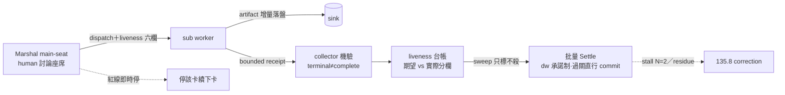
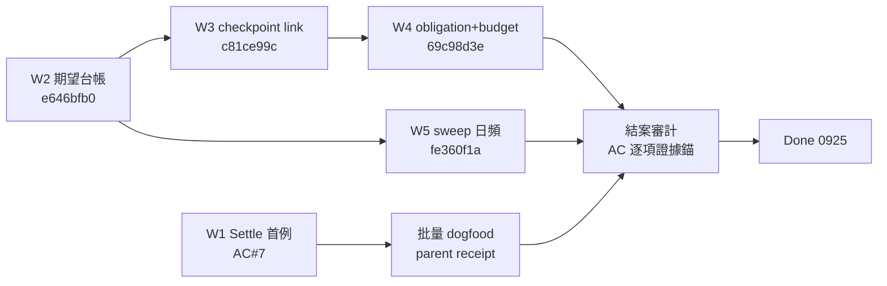

## Description

<!-- SECTION:DESCRIPTION:BEGIN -->
派出去的活不搞丟——DispatchSlice／Marshal 的 orchestration 可靠性契約（自 AIR-135.1 拆出，2026-09-18 user 裁決）。

**互動 session**

- main-seat invariant：主 agent 留 human 討論／steering／decision 座席，可獨立執行的工作 delegate-first（≤2 檔小查證可直做）

**派工與回收**

- artifact-first：dispatch 前指定 sink＋accept；worker 增量落盤回 bounded receipt（含 pending-human-decision 指針）；terminal≠complete——collector 機驗 artifact（存在→非空→錨點）才算完成
- dispatch⇄collection 配對：liveness 六欄登記；spawn／jobId 存在≠完成；完成偵測由 Marshal 主動維護
- bounded slices＋checkpoint-before-next-slice：無 checkpoint＝slice incomplete，縮 slice／改交付形態，禁原樣重派

**批量收線**

- dw 承諾制：承諾做完卡 AC；判斷阻塞→bi/tri 取結論→續做；報告僅終場
- stall N=2 停；批量過關直行 commit（decision-5）；僅強 outward 紅線停該卡續下一卡；額度耗盡讀 spine 排 /at 接續（換班非收工）
- liveness 台帳＋唯讀 sweep：只標不殺、只報狀態轉移；期望與實際分欄、漂移即訊號
- 裁決觸發 belief update（推翻假設→寫 decision＋掃 affected，schema 歸 135.2）＋Intent Review 腿編排（fresh 無中間鏈、verdict 進 exit receipt）

兩次 GLM output-limit 事故實證：delivery contract 必須可編譯，不能只靠 worker 自律。

<!-- SECTION:DESCRIPTION:END -->

## Acceptance Criteria
<!-- AC:BEGIN -->
- [x] #1 互動 session 的 Marshal 保留 main-seat invariant：主 agent 持續承擔 human discussion／steering／decision seat；可獨立執行的探索、audit、機械驗證與可安全切片工作在 authority／budget／latency 允許時優先 background/delegate。≤2 檔已知路徑小查證、當前步驟立即阻塞依賴與 human judgment 可由主座席直做；user 不需反覆提醒「主 agent 待命／開 sub」
- [x] #2 DispatchSlice 有 artifact-first delivery contract：預期輸出大、需可恢復或可能撞 response/output limit 時，dispatch 前先指定 workflow evidence sink 或 .agent-tmp/<arc-or-run>/...；worker 增量落盤並只回 bounded receipt（status／top findings／artifact paths／blockers/unverified／**pending-human-decision＋owner 指針**——receipt 的 pending 欄即 SC 投影的 read-model，仲裁語義跟 AIR-135.3 終場六塊之否決介面，本卡只定 surfacing 欄位），collector 驗 artifact 存在且可讀才算完成。output-token-limit 若已有完整 artifact 可恢復，無 artifact 則 incomplete；user 不需提醒「大輸出寫 temp」。**機械化**：work-order 模板必填 sink:（artifact 預期路徑；無 artifact 填 receipt-only）與 accept:（預設 exists＋readable＋nonempty）；判定句為 terminal≠complete——有 sink 登記者以 artifact 驗收為完成，無登記者以 bounded receipt 非空為完成；任一驗收不過記 terminal-sink-missing（非 completed），進 AC#4 縮小 slice／改交付形態判定，禁原樣重派。**攜跨 repo 通知內容的 dispatch／回收物須重走 AIR-135.5 AC#6**（草案八欄組裝＋逐次 user 授權，發送逐條確認、草案可排隊禁批量發送）；0919 直接 commit 委任不及於任何跨 repo 發送／回寫
- [x] #3 每個 background/external DispatchSlice 必須在 dispatch 時同時建立 collection contract：collector/terminal owner、collection mode、liveness source、artifact/receipt sink 都可追溯；Arc transition 不得只因 spawn/jobId 存在就視為完成，必須收回 terminal state 並驗收交付物。liveness／完成偵測由 Marshal 主動維護，user 不需問「做完了沒／背景是不是停了」。**collection contract 登記欄位以 liveness 六欄為 dogfood 實例**：dispatch id（zcode-native sess/agent 路徑或 bridge job id）／carrier（決定 stuck 閾值）／dispatch 時間（wall-clock UTC）／sink（artifact 預期路徑；收斂型查證填 receipt-only）／collection mode＋owner（foreground-wait 或 detached／owner）／liveness source（metadata.json 或 jobs.json 所屬 ledger）。registry 立場：禁 ai-guide 自建跨 repo session 目錄；「已知對端 session」＝user 斷言＋卡面註記（SC-18 catalog 落地後以 catalog 為源）；registry 只存期望、實際狀態以 metadata／ledger 為準，漂移即訊號。MVP 定序：先手動跑慣例（六欄登記＋三自然檢查點輪詢：session 啟動／下一 slice 前／收線-compact 前），sweep 工具／ledger schema 變更／草案組裝工具化須待 dogfood 出現重複手工負載、恢復失敗或 verdict 丟失證據後再議——**✓ 0925 結案審計：W2 期望台帳（e646bfb0，六欄 register 面）＋W3 show c81ce99c＋W5 日頻 fe360f1a；批量實踐＝九 job 派工全配 watcher→CollectionReceipt 機驗（terminal≠complete 閉合，晨間 receipt 在 parent Final Summary）**
- [x] #4 artifact-first 不能只靠 prompt 建議：對高輸出／長分析 work unit，DispatchSlice 必須內嵌 bounded slices 與 checkpoint predicate（由 AIR-135.1 compiler 依本契約產出）；worker 在進入下一 slice 前先建立／更新 artifact checkpoint，retry/resume 從最後已驗 checkpoint 接續。若 response/output limit 發生且 checkpoint 未建立，該 slice 明確 incomplete，Marshal 應縮小 slice／改交付形態而不是原樣重派——**✓ 0925 結案審計：S1 arc_spec sink/accept 欄（compiler 內嵌）＋W3 w3_checkpoint_link.py（compiler 產出面→台帳接線，smoke 六段含 JIT fail-loud）＋W1 bounded receipt 三錨驗收實踐（MINIBATCH-DONE-WHEN 等）**
- [x] #5 與 AIR-135.6 Context Continuity 對接：ArcPlan/DispatchSlice 在 semantic boundary 能產 checkpoint obligation 與 context-delivery budget（artifact pointer、bounded receipt、collector state、next read-set），避免把完整歷史／穩定材料重貼進每次 dispatch；跨 window/session re-resolution 從 latest verified checkpoint＋actual runtime facts 接續。schema 語義源＝task-recovery.md（135.6 v2 rescope 定案）；packet 為 transient、checkpoint 為 durable——**✓ 0925 結案審計：W4 scripts/checkpoint_obligation.py（69c98d3e；task-recovery 十欄投影指針不重抄、packet transient/durable 分離、boundary 枚舉；真實 dispatch-W1 smoke rc=0，58 tests）**
- [x] #6 liveness 台帳＋sweep reporter 由本卡擁有（承接 AIR-135.5 AC#7 owner 指針；SC 側只作 derived 投影）：①台帳＝dispatch 期望登記（欄位見 AC#3）＋實際狀態（metadata.json／jobs.json 終態 row）期望vs實際分欄存放，卡面只放未回收清單指針，禁全文複製；②sweep＝唯讀 reporter（跨 ledger 匯總＋sink 驗收存在／可讀／非空），日頻＋session 啟動按需手跑，只報狀態轉移不報存量，偵測與處置分離（永不自動重派／殺）；③ledger schema 提案（dispatchAt／sink／collector-owner／終態 heartbeat 留痕）掛本卡 implement 段，bridge repo 落點由卡主定。升級為 actor（自動標記／重派）時另開卡或 amendment，不預支——**✓ 0925 結案審計：W2 台帳＋sweep reporter（唯讀只報轉移）＋W5 launchd 日頻 plist（fe360f1a，手動裝載清單在檔頭）；liveness 源唯讀對接 jobs.json；SC 側 derived 投影歸 sc-254 線（135.5 帳已清）**
- [x] #7 批量 Settle 迴圈由本卡擁有（135.3 AC#8 明文）：半夜／user 不在場的批量關卡＝跨卡依次推進；human gate 入 pending 台帳並套 safe default、不阻弧；僅強 outward 紅線停該卡、續下一卡；pending 台帳晨間一次裁決（裁決清單視圖由 AIR-135.4 投影）；批量模式逐卡不斷言視圖，只產一張多卡汇总 receipt（載體＝parent 卡 Final Summary）。**裁決觸發 belief update＋Intent Review 腿編排（0919 外部收割）：bi/tri／judge／Settle 裁決結論推翻假設台帳任一 row→當下寫 belief-update decision（schema 歸 135.2 AC#3；Marshal 單一寫入）＋機械掃 affected 卡指針；Intent Review 獨立腿＝fresh context 無中間鏈、回獨立 verdict 進 exit receipt（可複用 bi/tri 終場腿只改工作單組成，零新建設施；語義歸 135.3 AC#7、read-set 排除歸 135.1 AC#2）**〔0925 勾選——批量夜 #2 兩子義務首例實證：BELIEF-UPDATE-DECISION 落 exit receipt（invalidated row 有真實推翻證據）＋Intent Review 獨立腿 job-mufs9iug GO 回寫 INTENT-REVIEW-VERDICT（工作單＝135.1 intent_review.py generate() 產物——「零新建設施」成立）；證據節＝card WT .agent-tmp/air-135.1/minibatch-receipt.md；晨間一次裁決隨 parent Final Summary 交付〕
- [x] #8 約束區（entry 六欄——AC#2 演練 residue 修復）：intent verbatim＝「預設都要開 sub 去做，你要留下來待機跟我討論」＋「接到 dw 指令承諾要做到，然後就做……直到最後才跟我報告」（user 0919 親述，凍結基線）；non-goals＝不重複 compiler 實作、不自建跨 repo session 目錄、commit eligibility 歸 135.3、registry 禁自建；revert 敞口帽＝條文/git 可逆 3 輪＋腳本單 commit 可逆＋ledger 誤報視噪音（數值待 user 追認，追認前按此運作）；預授權類＝批量過關直行 commit（decision-5）＋sweep 唯讀（AC#6）＋跨 repo outward 恆 gate；成功謂詞＝AC#1-#7（#8 為約束區非謂詞）——**✓ 0925 結案審計：intent verbatim 凍結＝S3 intent_review.py 工作單段＋W1 Intent Review 腿 chain-exclusion 實踐；revert 帽三態（unlimited/null/number）＝S1 _check_budget_cap（mini-batch 兩卡驗證）；預授權類運作中（批量過關直行 commit 實踐＋sweep 唯讀落地）；non-goals 全程零違（registry 未自建、跨 repo outward 全程 gate、commit eligibility 歸 135.3）**
<!-- AC:END -->

## Implementation Plan

<!-- SECTION:PLAN:BEGIN -->
【假設台帳（Plan 首節）】A1 本卡執行的弧皆在本 repo（跨 repo outward 恆 gate——135.5）／A2 spawn 面模型可用性隨 spine 條目浮動，sweep 分類閾值（6h zombie 線）為 tentative 待校準／A3 main-seat 委任的對象＝可寫 working tree 的 sub，其產出未 commit 前屬可回收——破網 fallback＝owning session attach 驗收

〔Planning Contract——standard 級；錨點＝本卡 AC＋decision-2/5＋parent 旅程〕
1. Baseline（0919；main 7ffb2115）：contract 契約面設計完成（題六三腿），implement 段未開
2. 已決策（勿重辯）：main-seat delegate-default 即日生效（user 0919）／dw 承諾制（user 0919：判斷阻塞→bi/tri→續做、報告僅終場）／批量過關直行 commit（decision-5）／無額度帽（decision-5）／准入 standard＋full（decision-5）／sweep 唯讀只標不殺（AC#6）
3. Scope：動＝liveness sweep 工具化（scripts/agent_liveness_sweep.py，v1 進行中）＋Settle 契約 product 化（typed predicate contract——題六十條）＋批量 goal 輪換協議；不動＝135.3 節點語義（consume）／135.6 packet schema（**0923 已定案：本卡消費 task-recovery.md 語義——transient packet＋durable checkpoint，見 135.6 Description v2**）／commit eligibility（135.3）／bridge repo ledger 內部（其卡主定）
4. Scenarios：job 終態但 sink 缺→terminal-sink-missing 標記非 complete；stall N=2→cap-stop 三擇（縮 slice／改形態／紅線停卡續下卡）；spawn sub 撞額度事件→spine 查證→/at 排 reset 接續
5. Integration：135.6（packet schema 為本卡→其邊驅動面）／135.3（節點語義、commit eligibility）／135.1（DispatchSlice 攜帶本卡欄位語義）／C8=135.8（stall 進 correction 挖掘）
6. 驗證式：sweep 對真實 jobs 資料實跑分類正確（v1 已有樣本）＋contract 欄位被 135.1 編譯器消費無缺口＋批量 dogfood 一晚產出匯總 receipt
<!-- SECTION:PLAN:END -->

## Implementation Notes

<!-- SECTION:NOTES:BEGIN -->
【0918 orchestration gap research】既有 conversation-dispatch 已有「查證外派、主 agent 保持討論座席」但只屬 per-question heuristic；agent-workflow 有 background/liveness，implement 與 cross-verify 各自已有 long-output／artifact-first 先例。歷史 user correction 又反覆出現「開 sub agent 做事，主 agent 留著跟我討論」與 background monitoring burden。故本卡把 main-seat/delegation-first 與 artifact-first delivery 升成 Marshal/DispatchSlice 的統一 contract；兩者是 orchestration mechanics，不新增 Development Arc lifecycle node。`.agent-tmp` 僅作可恢復 evidence sink 預設，不承擔 card/session/artifact identity。

【0918 artifact-first dogfood failure】兩個 GLM-5.3-Flash 今日對話 audit（job-mu6vgx5f-7a7qw5 / job-mu6vgxic-vheufr）在工單已明寫「增量落 .agent-tmp、response 只回 bounded receipt」後，仍各自撞 provider 4096 output token limit；bridge 終態皆 output-token-limit，report 檔均未建立，因此不是有效 reviewer verdict。這證明 delivery contract 必須可編譯成 bounded slices + checkpoint-before-next-slice + resume-from-artifact，不能只把「請先寫檔」留給 worker 自律。

【0918 flash 腿 root cause（補充 artifact-first dogfood failure 條）】4096 output limit 已定位為 delegate-bridge `glm.rs` `stage_glm_personal_provider_config()` 自行 materialize `maxOutputTokens.max = 32000` 並丟失 option mapping（ZCode 原生 GLM-5.3／-Flash 皆 128k；4096 疑為 SDK 對 unknown model 的 fallback，wire-level proof 待 DB 弧補）。bridge 修正已由 user 另開 session（sess_2f4d6ea5）進行；本卡 AC#2/#4 的 bounded slices＋checkpoint contract 是此缺陷的 workflow 層對策，兩者互補不重疊。

【0919 liveness 設計收斂（flash 調查＋bi 雙腿）】flash 四源盤點（2546 agent／40 running 中 36 殭屍最老 23.8 天；bridge 23 jobs 僅 56.5% completed；**最危險缺口＝殭屍成功對所有訊號不可見，唯一攔截點＝collector artifact 機驗**）→ bi 雙腿（bridge-muse＋GLM-fresh）設計零分歧收斂：**MVP 慣例即日生效**＝①dispatch 時台帳一行六欄（id/carrier/ts/sink/expect/collect；有卡走卡 notes、無卡走 session-journal）②work-order 必填 SINK/DONE-WHEN 欄位③terminal 驗 sink 三步（存在→非空→錨點；receipt path 不可取代檔案本身）④三觸發點輪詢（waiter exit／喚醒對帳／開場掃未收項）⑤sweep＝唯讀 reporter 日頻（只標不殺、只報轉移；不塞 governance-health-monitor）。工具化（scripts/agent_liveness_sweep.py）＋ledger 擴充（dispatchedAt/sink/heartbeat 留痕→delegate-bridge repo 另案）歸本卡 implement 段。設計檔：.agent-tmp/air-135/liveness-design-{bi-muse,glm-fresh}.md＋liveness/findings.md。bi-codex 腿環境死未產出（本卡 AC#3 的活案例）——擇期補派作第三確認。

【0919 北極星對齊審查（tri：muse＋GLM-fresh＋5.3；codex 殭屍）】AC 全 aligned；新增 AC#6（liveness 台帳＋sweep ownership——承接 135.5 AC#7 指針）與 AC#7（批量 Settle 迴圈——135.3 AC#8 的 owner 落點）；AC#2/#3 吸收機械化名詞（sink:/accept: 欄位、terminal≠complete 判定、terminal-sink-missing 狀態）＋跨 repo 單向引用＋receipt 擴 pending-human-decision surfacing。審查檔：align-135.7-{muse,glm}.md。名詞辨義（兩腿共識）：liveness 六欄＝dispatch 期望登記；草案八欄＝跨 repo 發送 payload——目的正交禁混用。

【0919 webgpt noop-completion P0 文檔落地（TRI 收斂執行）】receipt 契約三載體＋model-routing 第 8 類補層：ai-guide skills 三檔（work-order 具名 receipt 必填欄／kanban 收 Done 指針／model-routing 第 8 類收法補層＋收法≠驗收尾注）走 air-135 WT；delegate-run-output skill 新節 Receipt acceptance（程序唯一定義）走 delegate-bridge repo。落地前審查閘 boundary 雙腿全回收：fresh code-reviewer（C1 跨 repo 落地時序→deployment-surfaces=pending；D1 表注實證源錨置換已修；D2 receipt 欄補機械可掃填寫形態已修；B1 bridge-dispatch rule「無登記者」詞彙對齊 receipt-only 宣告面留下次 rule 觸碰弧；A1 派發端錨點預驗證＝已知殘餘、收法 L2 為攔截點；E1 receipt 術語多義知悉）＋GLM-5.3 跨家族（6 minor：F2 L1 處置越權改 caller 政策指涉、F3 案例敘事改系統性框架避兩腿事實爭議、F5 片語表失效句加形態限定、F6 skill desc 補觸發詞；F1/F4 與 fresh D2/D1 同點先修——兩腿獨立收斂同處）。dogfood 實證：glm 首派 plan mode 擋 sink 寫入、receipt 機驗 L1 當場攔截未交付、--write-mode edit 修因重派交付——寫入能力走 flag 不走 prompt 散文。回執：classification=boundary；review=bi 雙腿（修 6 延 3，findings 存 .agent-tmp/webgpt-noop-p0/）；session-freshness=fresh；deployment-surfaces=pending——四指針的節住 delegate-bridge 未 commit 工作樹，兩 repo commit 綁定同批落地（bridge 先行），plugin cache 2.0.18 待 re-release。commit 待 user 授權。

【0919 deployment 回執更新】delegate-bridge release 2.0.19 落地：commit e4f3e3f（兩 manifest 2.0.19、dist 重建含 Receipt acceptance 節、parity 2/2 綠、working tree 乾淨；組裝順序教訓＝先 assemble-release.mjs 再 package-marketplace.mjs 否則 provenance mismatch）。原延後三項之 plugin re-release 已閉合。deployment-surfaces 現況：bridge 端＝發佈面閉合（消費端 restage 待 user 逐項：ZCode 開新 session、codex/CC remove+add、prune 舊 cache——清單在 DB session）；ai-guide 端＝pending（skills 三檔在 air-135 branch 5d08ceaf，待 135.5 session 收線 rebase main＋ff-merge 後 live symlink 生效）。

【0919 noop-completion 批收線（user 授權）】四指針全落地：①bridge repo Receipt acceptance 節＝3c60192＋release 2.0.19（e4f3e3f，main 乾淨）②ai-guide skills 三載體＝air-135 branch 5d08ceaf（work-order 具名 receipt／kanban 收 Done 指針／model-routing 第 8 類——live 生效隨弧收線 merge）③air-135.5 再修正 8 行＝0faefc10（開工即註冊＋single-send-path＋receipt 禁升格 liveness oracle）④plugin cache 三端全 2.0.19（CC installPath／ZCode registry 逐字核對 updatedAt 0919 12:09／codex cache；2.0.18 已 prune，registry pin 解析斷鏈風險解除）。deployment-surfaces：pending→已落地（bridge live；ai-guide skills 隨 branch merge 生效）。

【0919 v2】tier＝standard＋promotion trigger（dogfood 證明 dispatch⇄collection 需跨卡 invariant→升 full）；⑦分工＝post-build/review gate orchestration 歸本卡、commit eligibility 歸 135.3；批量 Settle 與 autonomous-execution 紅線枚舉組合。deps 定著＝135.3、135.6。

【0919 user 裁決（contract baseline 提前生效）】main-seat delegate-default＝預設開發模式——user 原話「預設都要開 sub 去做，你要留下來待機跟我討論」。本卡 AC#1/#3 的 main-seat invariant 自即日按此基準 dogfood（非待本卡開工才適用）；dispatch⇄collection 台帳照 0919 慣例運轉中。

【0919 v3 總修（gap-mining 四腿）】①本卡＝Marshal mode 使用契約單一 owner：隨行互動／批量夜間檔位的進出條件、每檔預算與預授權邊界（taxonomy 草案待 user 裁決——pending 台帳在案；批量已落 C2/C5 零件，本卡收攏不重刻）②信任畢業制：首批小額預算＋可不看的 checkpoint，否決率低→升級（escalation 路徑入 AC 面）③早期方向探針義務：artifact 不提問（parent 北極星④）。

〔0919 日審 F4 指針補〕G3 mode taxonomy pending＝D-002，住 repo root DECISIONS-PENDING.md（decisions_pending.py 台帳，gitignored）——D-002 [open] AIR-135.3：Marshal mode taxonomy 裁決——隨行互動／批量夜間之外是否還有第三檔？每檔的預算與預授權邊界數值。

〔0919 codex 日審 D-002 owner 澄清——supersedes 前述「單一 owner」句〕Marshal mode 的 taxonomy 語義 owner＝AIR-135.3（D-002 在案待裁）；本卡 owner＝mode 契約的 runtime 執行面（檔位進出的機械執法、批量 Settle 引擎）。語義與執行分欄，不重刻。

【0919 題六 tri 三腿裁決：/goal 機制整合——Settle 契約設計輸入（muse job-mu81n603 條件放行／codex job-mu81n62e CONDITIONAL GO／flash 採原生修正兩缺陷；共識度高）】①三層：runtime＝harness 原生 goal（續跑/帽/pause-resume 不重建；harness 能力矩陣選載體——ZCode 原生實據校驗可用、CC transcript-only 需 agent 型 Stop hook 先真跑 gate）／內容＝deep-work／條件＝Settle typed predicate contract ②生成範圍：只編譯已有明確 verifier 的 AC（command+expected、artifact 三步、schema invariant、state transition）——生成＝投影既有 verification spec 非 LLM 解讀 AC；語義 AC fail-closed 成 judgment-required 留 reviewer ③生成時點＝Planning Contract 當下人過目（非進場即時）；goal 條件屬 I 級 oracle 須標注 ④三方權責機械測試：evaluator verdict 只靠 artifacts 可重現、禁讀 review 結論（程序完成 vs 語義對錯分軸）；judge-review 僅仲裁 ⑤Bounds：N=2 輪無 evidence delta（evidence_digest＝predicate states＋artifact 錨＋reviewer verdict id 機械化——codex/flash 同構）；三種停法 cap-stop/stall-stop（縮 slice 禁原樣重派）/紅線-stop（停卡續下卡）；停後＝checkpoint＋completion report＋stall 進 C8＋卡 notes resume set ⑥分軸鐵律：execution completion 與 governance pending 分軸——pending 不阻 goal Met（否則永不收工）⑦priced autonomy 兩軸分欄：revert 預算＝敞口帽、goal 用量＝花費帽（135.1 budget context 落地時分欄）⑧與 autonomous-execution 紅線的 commit 權威衝突須在 Settle 碰 commit predicate 前消解（decision-2 競合條款擴及 Settle 場景）⑨one-goal-per-session vs 多卡批量＝goal 輪換協議（每卡 replace、跨卡汇总 receipt 住 parent Final Summary）⑩落點：本卡先定契約→deep-work skill 修訂為 C5 交付走條文閘（與卡結算同批，循 noop-P0 先例）；deep-work 尾端裸 /goal 範例＝過渡期缺口標記待修禁傳播。

【0919 user 裁決：dw 承諾制（Settle 契約核心語義——supersedes 題六三腿的 stall-stop 停等語義）】user 原話「他們要接到 dw 指令承諾要做到，然後就做；沒法判斷就 bi or tri 結論，就繼續做，直到最後才跟我報告；理論上卡上應該都做完，除非 POC 做太少」。設計含義：①dw 指令＝完成承諾，goal＝卡 AC 全做完（機械可驗）②判斷阻塞→bi/tri 升級取結論→續做——人不在中途迴圈裡（批量模式的中途判斷解析器＝多家族審查，諮詢成本計入預算扣款）③報告僅終場一次（終場六塊）④紅線（強 outward／破壞性）仍即時停——唯一中途停權 ⑤「POC 做太少」＝規劃債非執行失敗：tri 救得動就救＋續做；救不動記 residue＋correction（回饋 C1 規劃契約品質），不空手停。前提依賴：卡-first 規劃品質（AC 即完整 spec）——這就是 135 program 存在的理由。

【0919 user 三裁決（AskUserQuestion）→decision-5，D-002 結案】①批量過關弧直接 commit（decision-2 延伸至批量檔位；autonomous-execution 紅線的本條 user 顯式例外，限 goal-governed 批量＋限本 repo）②無額度帽——停機＝stall N=2＋紅線＋額度自然耗盡 ③首批准入＝standard＋full tier（跨 repo outward 恆 gate 不變）。Settle 契約數值齊備：N=2 stall／無額度帽／准入 standard＋full／過關直行——契約設計完成，本卡可進實作。codex 日審 F2 權威衝突由 decision-5 消解。

【0919 user 補充（批量排程器兩個設計輸入）】①/at 接續機制：額度自然耗盡不是終點——Marshal 讀 spine reference_model-runtime-entitlements（窗口重置事件／尖峰減用政策／各 family 額度現況）＋既有探測基建（AIR-98 launchd probe 每小時＋usage-ping cron）→算出下次 reset 時刻→排 /at 接續批量佇列。夜間批量因此可跨多個 usage 窗（額度耗盡＝換班非收工；真收工＝佇列清空或紅線）。②spine 消費分工：135.1＝使用規劃與 JIT resolve 的輸入源（AC#2/#7 已載）；本卡＝批量排程的即時消費者（哪個 model 現在可派、reset 幾點、尖峰減用政策——例平日 14:00-18:00 GLM 減用改 muse）；C8 不直接消費 spine，但 model 健康事件（429／1308／token expired）經 liveness 台帳→correction 挖掘間接入 C8。先例：今日 tri 腿的 family 選擇即 spine 政策的人工版。

【0920 stop-early 診斷（user 回報「deepwork 還是很快就停了」＋要求把 goal 用起來）】根因＝deep-work skill 唯一 /goal 接線（AIR-131 裸範例「all TaskCreate tasks completed, pytest exits 0…」）條件綁 session todo list 而非卡 AC——todo 清完即 goal Met 提前收工；無 stall bounds、無批量輪換、無 dw 承諾制語義。即本卡已標記的「deep-work 尾端裸 /goal 範例＝過渡期缺口」的實證案例。C5 交付要求據此強化：goal 條件＝Settle 契約編譯（只取有明確 verifier 的 AC；完成謂詞＝卡 AC 全勾＋precheck 綠＋completion report 落盤，禁綁 session todo）＋stall N=2（連續兩輪無 evidence delta 即停）＋批量每卡 /goal replace 輪換（receipt 住 parent FS）。ZCode 原生 /goal 機制已由官方文檔鏡像證實（ref-docs/harness/zcode/cn/docs/goal.md：每輪獨立校驗、看實據——改出的檔／命令輸出／測試結果才算數，計畫與待辦清單不算；未達成自動續輪；pause/resume/replace/clear；第三停＝用量上限）。過渡期操作契約（C5 條文落地前，零條文變更）：本 program 場景 deep-work 進場時由 invoking session 依上述規則手動編譯 /goal。mirror 附帶發現：ref-docs/harness 部分檔案 goal→il 文字腐損（contracts.md、codex config-reference 等），修復歸 mirror LIFECYCLE 流程（非本卡）。

【0923 現況盤點（marshal 帳面；muse/codex 審查腿同日派）】已落地：bridge_waiter.py 1310 行（AIR-146 Done；CollectionReceipt/1＋bounded-receipt AC#2 欄位投影＋--wake-on-stuck 版本閘雙模＋liveness.jsonl 事件）＋test_bridge_waiter.py；liveness 六欄＋sink 三步機驗 canonical（AGENTS.md bridge-dispatch 條三面部署生效）；work-order sink:/accept: 必填＋receipt-only＋terminal≠complete（0919 noop-P0，bridge 2.0.19）；main-seat invariant 0919 起常態運轉；agent_liveness_sweep.py v1 在場；契約數值齊（decision-5：stall N=2／無額度帽／standard+full／過關直行）；ZCode 原生 /goal 機制鏡像查證完成（goal.md）。缺口（按大小）：①C5 deep-work Settle 契約修訂未落——skill L240 仍是 AIR-131 裸 /goal 範例（0920 stop-early 根因本體），過渡期由 invoking session 手動編譯 ②批量 Settle 多卡夜間 dogfood 未跑（AC#7 驗證式；0922 deep-work 為單弧收線非批量）③AC#4 compiler leg 上游 135.1 To Do ④AC#5 須按 135.6 0923 v2 對錶（packet→on-demand transient projection、checkpoint 常駐——等待已解除）⑤sweep 日頻接線待重複手工負載證據（MVP 門檻未觸）。優先序建議：C5 修訂＝下一最小弧（standard 級）；批量 dogfood 湊多卡夜晚。

【0923 雙腿審查收斂（codex job-mud9c4sc＋muse job-mud9c4x5；兩腿 verdict 均 approve-with-findings，報告 .agent-tmp/air-135-disc/review-1357-{codex,muse}-result.md）】盤點五項機械抽查確認（bridge_waiter 1310 行／sweep 682 行／test 984 行／deep-work L240 末行即裸範例／AIR-146 Done）；缺口無漏項；C5＝下一最小弧（standard 級）成立；跨卡邊界（135.9／135.3／135.1）乾淨。套用：F1 Plan Scope『等其定案』→消費 task-recovery.md 語義（已改）；F2 AC#5 補 schema 語義源指針（已改）；F3 正典錨點＝rules/bridge-dispatch.md L22（repo root AGENTS.md 無 bridge-dispatch 段——部署面是 user bundle）。列 C5 弧要求：①skill L240 下先加 3 行過渡注記（條件＝卡 AC＋precheck＋report，禁綁 todo；stall N=2；批量 replace）②work-order 明寫禁動 skill L171 旗艦裁決段（135.9 面）fence。

【0924 批量夜 #1 證據判讀（Explore 腿 agent_f2bc15ed；全文＝.agent-tmp/air-135/ac-audit-135.7.md——腿唯讀未落盤，主 session 代轉）】三態總覽：可勾 2／部分 5／真缺 0。AC#1 勾（main-seat：0919 基線裁決＋批量夜 impl/review/judge 全走 sub＋無正當理由打斷＝0）；AC#2 勾（work-order receipt 欄位＋bounded receipt 實運＋collector 代跑三錨機驗＋0918 反證因果鏈；附兩條未演練分支注記：output-limit 恢復分支、跨 repo 零樣本）。部分五條缺口：AC#3 期望登記台帳缺（liveness.jsonl 是運行事件流非 dispatch 期望表）；AC#4/#5 等 135.1 compiler 產出面（批量夜手動編譯）；AC#6 sweep 日頻未接線＋ledger schema 未落 bridge repo；AC#7（parent 點名）主體實證拿到（多卡依次＋單張汇总 receipt＋pending 台帳＋dw 承諾制＋Intent Review 腿首例）但兩子義務未閉——belief-update 觸發零樣本（無 invalidated row）＋Intent Review verdict 進 exit receipt 未閉（135.3 當時未過關）——等批量夜 #2。

【0925 凌晨 AC#7 勾選——兩子義務首例實證（批量夜 #2）】①belief-update 觸發首例：invalidated row＝S1『budget 0-佔位可用到 135.7 定案』假設（推翻證據＝mini-batch 編譯摩擦 #1 同值異義實證）；decision 落 exit receipt BELIEF-UPDATE-DECISION 節（affected 掃描 135.7/135.2/135.1＋null 分流提案；Marshal 單一寫入已守）②Intent Review 獨立腿首例：job-mufs9iug（GLM-5.3 fresh context 唯讀 chain-exclusion 自述已守）verdict GO 無偏移→回寫 exit receipt INTENT-REVIEW-VERDICT 節。工作單＝AIR-135.1 S3 intent_review.py generate() 產物（mini-batch/AIR-135.7/intent-review-wo.md）——『可複用終場腿只改工作單組成零新建設施』實證：零新建設施成立。批量 Settle 迴圈機制面全運轉實證（多卡依次推進＋pending 台帳登記＋bounded receipt 收驗）；晨間一次裁決＝本批量 Settle 最後步，隨 parent Final Summary 交付 user。範圍注記（腿自述）：verdict 為 W1 slice 級；卡級 AC#1-#7 全閉留 W2-W8。fix-forward 三條（receipt status 收訖注記已落／W2 起真實 JSON intent_review 欄／provenance relay 標注）已記。

【0925 W2 落地】job-mug3ejl6（flash）——dispatch 期望登記台帳＋唯讀 sweep reporter：期望面六欄（AC#3）與實際面（jobs.json 唯讀對接）分欄、漂移即訊號；reporter 只報轉移、永不自動處置（AC#6 語義）。merge main e646bfb0（W2 開了本卡自己的 card WT ai-guide-air-135.7——wt-open 身份閘實證；worker 聽 brief 絕對路徑寫去 135.1 樹的偏差由 marshal 搬正歸位）。marshal 收線修正：resolve_row 前綴 plain-startswith（ambiguous 靜默未解析）。2342 tests＋smoke ALL GREEN。卡面未動（board single-writer）——W2 對應 AC#3 勾選留 user/結案審計（W2 機制在場＋smoke 實證＝AC#3 期待面成立；日頻排程與派工接線照卡面 MVP 定序未做）。W3-W8 待下批。

【0925 W3 回鍋——seal RED 誠實記錄】job-mug4mw7i 交付 delivered 但 seal RED：smoke（正確規格＝register --artifact 模式＋JIT --dispatch-id 補位 fail-loud）與 CLI 實作（--id/--carrier 簡介面）介面未對齊——worker 介面幻覺，無 Bash 面未機驗暴露（批量夜同型破口第三次）。marshal 收線：resolve 前綴修正已併＋WIP commit 留 air-135.7 branch（未 merge）。W3 完成條件＝補 register artifact-driven 面→smoke 全綠→merge——下批首件。W2 產出不受影響（已 merge e646bfb0）。

【0925 W3 收網完成】worker（glm flash job-mug5yim7）補 show 子命令（唯讀查詢＋`-` 邊界前綴解析，load 借 dispatch_ledger.load_ledger 單一源）；marshal seal＝smoke 全綠（W3 SMOKE: OK——真實上游抽取/JIT fail-loud/register/show/唯讀保證/W2 機驗接縫六段）＋註解修正一處（worker 誤註 resolve_row 為裸 startswith——實為 id+"-" 邊界，已對齊）；merge main＝c81ce99c（含 tests/test_w3_checkpoint_link.py）。W3 DONE——下批 W4。

【0925 W4-W6 收網】W4：scripts/checkpoint_obligation.py＋24 條測試——AC#5 obligation＋context-delivery budget（task-recovery 十欄投影指針不重抄；packet transient/durable 分離；boundary 枚舉）；marshal seal＝58 tests（含 W3 回歸）＋真實 dispatch-W1 smoke rc=0（runtime exact-key-set fail-loud 實證）；merge 69c98d3e。W5：deploy/dispatch-ledger-sweep.plist（日頻 08:05；render 佔位＋手動裝載同 AIR-110 決策；sweep 顯式子命令；admission guard 擋 canonical 直寫→--ephemeral fast-path 完成）；merge fe360f1a＋ephemeral WT 零殘留。W6：誠實 noop——deep-work skill Settle 投影四點（a-d）＋尾端 /goal 病根全在場（job-mug70jp8-c1b6bc 逐點引文證據），零 diff、零閘觸發。
<!-- SECTION:NOTES:END -->

## Final Summary

<!-- SECTION:FINAL_SUMMARY:BEGIN -->
**交付**（W1-W8 全弧）：①dispatch 期望登記台帳＋唯讀 sweep（W2，e646bfb0）②checkpoint link＝compiler 產出面接線（W3，c81ce99c）③checkpoint obligation＋context-delivery budget（W4，69c98d3e）④sweep 日頻 launchd plist（W5，fe360f1a）⑤deep-work C5 同步＝誠實 noop（W6）⑥批量 Settle 迴圈＋belief-update＋Intent Review 腿（AC#7，W1 首例實證）。W7/W8＝批量 dogfood 本身（匯總 receipt 住 parent Final Summary）＋結案審計（本卡 AC 逐項證據錨勾選，0925）。全量 2437 tests passed。後續接線：SC 側 derived 投影歸 sc-254；sweep 安裝＝launchd 手動裝載三步（plist 檔頭）；actor 化（自動重派）另卡不預支。

<!-- SECTION:FINAL_SUMMARY:END -->
