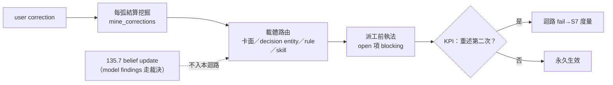

## Description

<!-- SECTION:DESCRIPTION:BEGIN -->
user 反覆教同樣的事（0919 一天六條親口糾正：commit 委任、plugin 授權、main-seat 預設、前期投影、講人話、修卡不建卡；0918-19 十幾次無正當理由打斷違規）＝沒有系統保證 correction 被捕獲、收編、執行；135.2 AC#6 只有回寫路徑。本卡把「教一次永久生效」做成有 KPI 的完整迴路：每弧結算（post-build 鏈）機械挖掘 correction 候選（基建種子＝corrections-weekly 的 mine_corrections.py，週報顆粒升級為每弧，清單落 session journal）→ 按性質路由載體（卡面 section／decision entity／rule／skill——條文面走 instruction 落地前審查閘，路由表為本卡交付）→ Marshal 派工前機械檢查 open 項 blocking（執法點歸 135.7 DispatchSlice 義務）→ KPI：同一 correction 重述第二次＝迴路 fail，計數與重述率併入 parent S7 三欄。邊界：model findings 的 belief update 不入本迴路（走 135.2 假設台帳＋135.7 裁決觸發）——KPI 語義 user correction 專屬，混源會讓 finding 繞過 bi/tri 直改信念。

<!-- SECTION:DESCRIPTION:END -->

## Acceptance Criteria
<!-- AC:BEGIN -->
- [ ] #1 session 級挖掘：每弧結算（post-build 鏈）機械掃 correction 候選——基礎設施種子＝corrections-weekly 的 mine_corrections.py，從週報顆粒升級為每弧；挖掘清單落 session journal 並入 pending 機制
- [ ] #2 載體路由：每條 correction 按性質寫進對應載體——卡面 section（intent/procedure）／decision entity（跨卡長壽）／rule／skill（條文面，標注走 instruction 落地前審查閘）；路由表為本卡交付
- [ ] #3 派工前執法：Marshal dispatch 前機械檢查未收編 correction 清單——open 項 blocking（機制可比 decisions_pending.py lint --card 模式）；執法點歸 135.7 DispatchSlice 義務
- [ ] #4 KPI：同一 correction user 需重述第二次＝迴路 fail；correction 計數與重述率併入 parent S7 三欄度量
- [ ] #5 與 135.2 邊界：載體契約（什麼進 decision entity vs Notes）歸 135.2 AC#3；本卡只做迴路（挖掘/路由/執法/度量）
<!-- AC:END -->

## Implementation Notes

<!-- SECTION:NOTES:BEGIN -->
【0919 外部收割邊界（討論腿雙腿一致禁擴）】model findings 的 belief update 不入本卡迴路——KPI 語義＝user correction 專屬（同一 correction 重述第二次＝fail），model finding 未經裁決非信念，走 135.2 AC#3 belief schema＋135.7 AC#7 裁決觸發（權威路徑不同，混源會讓 finding 繞過 bi/tri 直改信念）。未來線：dogfood 證明「裁決時漏寫 belief update」→AC#1 mining 候選擴及 review verdict 的假設矛盾（觀察項，現不動）。

<!-- SECTION:NOTES:END -->
