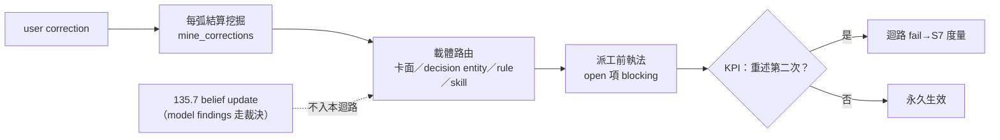

## Description

<!-- SECTION:DESCRIPTION:BEGIN -->
你教一次永久生效——correction 的完整迴路。user 反覆教同樣的事（0919 一天六條親口糾正：commit 委任、plugin 授權、main-seat 預設、前期投影、講人話、修卡不建卡）＝沒有系統保證 correction 被捕獲、收編、執行；135.2 AC#6 只有回寫路徑，本卡補成有 KPI 的迴路（旅程④北極星直接落實）。

**迴路四步**

- 挖掘：每弧結算（post-build 鏈）機械掃 correction 候選（種子＝corrections-weekly 的 mine_corrections.py，週報顆粒升級為每弧；清單落 session journal）
- 路由：按性質寫進對應載體——卡面 section／decision entity／rule／skill（條文面走 instruction 落地前審查閘）；路由表為本卡交付
- 執法：Marshal 派工前機械檢查 open 項 blocking（執法點歸 135.7 DispatchSlice 義務）
- KPI：同一 correction 重述第二次＝迴路 fail；計數與重述率併入 parent S7 三欄

**邊界**

- model findings 的 belief update 不入本迴路（走 135.2 假設台帳＋135.7 裁決觸發）——KPI 語義 user correction 專屬，混源會讓 finding 繞過 bi/tri 直改信念

<!-- SECTION:DESCRIPTION:END -->

## Acceptance Criteria
<!-- AC:BEGIN -->
- [ ] #1 session 級挖掘：每弧結算（post-build 鏈）機械掃 correction 候選——基礎設施種子＝corrections-weekly 的 mine_corrections.py，從週報顆粒升級為每弧；挖掘清單落 session journal 並入 pending 機制
- [ ] #2 載體路由：每條 correction 按性質寫進對應載體——卡面 section（intent/procedure）／decision entity（跨卡長壽）／rule／skill（條文面，標注走 instruction 落地前審查閘）；路由表為本卡交付
- [ ] #3 派工前執法：Marshal dispatch 前機械檢查未收編 correction 清單——open 項 blocking（機制可比 decisions_pending.py lint --card 模式）；執法點歸 135.7 DispatchSlice 義務
- [ ] #4 KPI：同一 correction user 需重述第二次＝迴路 fail；correction 計數與重述率併入 parent S7 三欄度量
- [ ] #5 與 135.2 邊界：載體契約（什麼進 decision entity vs Notes）歸 135.2 AC#3；本卡只做迴路（挖掘/路由/執法/度量）
- [ ] #6 約束區（entry 六欄——0924 user 拍板「照預設」）：intent verbatim＝「你教一次永久生效——correction 挖掘→路由→執法→KPI 閉環」；non-goals＝model findings 不入本迴路（走 135.2 假設台帳＋135.7 裁決觸發）、載體契約歸 135.2 AC#3、不重複 135.2 AC#6 即時回寫路徑；revert 敞口帽＝條文/doc git 可逆 3 輪＋腳本單 commit 可逆；預授權類＝backlog metadata 例外①②、條文/腳本走卡 branch＋bi 審查＋post-build 過關直行、批量夜過關直行 commit（decision-5）、跨 repo 恆停；成功謂詞＝AC#1-#5（#6 為約束區非謂詞）
<!-- AC:END -->

## Implementation Plan

<!-- SECTION:PLAN:BEGIN -->
〔baseline：ai-guide 6e2f955d（main）〕

【假設台帳（Plan 首節——0924 entry Align 落卡）】
- A1 [unverified] mine_corrections 關鍵詞召回足夠（重大 correction 不漏）——驗證＝批量夜挖掘清單 vs user 實際糾正記憶對照；漏＝擴關鍵詞或補信號源，路由面不變
- A2 [unverified] decisions_pending kind 擴 correction 不破壞既有 row 解析——tests/test_decisions_pending.py 在場，RED→GREEN 覆蓋

〔已決策勿重辯（provenance＝本卡 AC/Notes）〕①迴路邊界＝user correction 專屬——model findings 走 135.2 假設台帳＋135.7 裁決觸發（AC#5＋Notes 0919 外部收割條）②載體契約（decision entity vs Notes）歸 135.2 AC#3，本卡只做迴路（AC#5）③KPI 謂詞＝同一 correction 重述第二次＝fail（AC#4）④0924 user 核可本計劃落卡——僅計劃非實作（marshal mode 續行他題）

〔提案四步 ↔ 既有基建（0924 marshal 計劃落卡；開工 entry Align 訪談補六欄後實作）〕
1. 挖掘（AC#1）：skills/corrections-weekly/scripts/mine_corrections.py 擴 --since/--until 弧窗參數（現僅 --days N）；post-build 鏈新增 checkpoint（形態比照同檔階段 4「CR wiring telemetry checkpoint」——candidate 偵測便宜、非相關弧空跳）；清單落 session journal＋decisions_pending 台帳
2. 路由（AC#2）：四載體分流——卡面 section（append supersedes；接 135.2 AC#3/AC#6）／decision entity（backlog CLI；decision-2/3 先例）／rules／skills（後兩者走 instruction 落地前審查閘＋控制面隔離閘）；LLM 判讀沿用 corrections-weekly 七類＋疑似不硬歸
3. 執法（AC#3）：scripts/decisions_pending.py kind 擴 correction＋派工前 lint 模式（比照既有 lint --card Done-gate 形態）；義務掛 135.7 DispatchSlice 契約＋skills/_common/work-order.md 一行（dispatch 前查目標卡 open correction）
4. KPI（AC#4）：append-only jsonl 比照 AIR-151 improvement funnel（git common dir 錨點跨 WT 單一副本）；漏斗 detected→routed→incorporated；重述偵測＝新候選 vs 已收編項比對（LLM 聚類＋機械記數）；計數併 parent S7 三欄

〔開放決策（開工 entry Align 拍板；marshal 建議非裁決）〕
- D-a 路由表住處：建議內嵌 post-build checkpoint 節，變長再抽 _common/
- D-b 弧時間窗：建議 baseline commit 時間＝弧起點（機械可判定）
- D-c 與 corrections-weekly 關係：共存——per-arc 管當下收編、週報管趨勢（Heat 聚合依賴週報）；SKILL.md 註明腳本共用
- D-d 執法 blocking 語義：建議按卡關聯擋（台帳 row card 欄），非全域擋
- D-e 執法載體：建議流程義務（DispatchSlice＋work-order 條文）非 hook；dogfood 出現系統性漏擋再議 hook 化

〔範圍〕動＝mine_corrections.py 窗口參數、post-build checkpoint 節、decisions_pending.py kind/lint、work-order 一行、KPI jsonl、路由表；不動＝corrections-weekly 週報本體（僅註記共用）、135.2 載體契約（消費）、135.7 契約本文（消費＋掛點一行）

〔規模分級〕standard——跨檔既有基建接線、零新 boundary 決策；D-e 若拍板 hook 化才升 full 評估
<!-- SECTION:PLAN:END -->

## Implementation Notes

<!-- SECTION:NOTES:BEGIN -->
【0919 外部收割邊界（討論腿雙腿一致禁擴）】model findings 的 belief update 不入本卡迴路——KPI 語義＝user correction 專屬（同一 correction 重述第二次＝fail），model finding 未經裁決非信念，走 135.2 AC#3 belief schema＋135.7 AC#7 裁決觸發（權威路徑不同，混源會讓 finding 繞過 bi/tri 直改信念）。未來線：dogfood 證明「裁決時漏寫 belief update」→AC#1 mining 候選擴及 review verdict 的假設矛盾（觀察項，現不動）。

【0924 marshal 計劃落卡（未實作）】脈絡＝user 關切「計劃落卡後有人會去討論執行嗎」——本卡 deps（135.2/135.7）所需上游面均已定義，可隨時開工；領取仍需 session 派工（夜間批量 Settle 機制屬 135.7 產出，過渡期每卡需明確領取）。Plan 節＝四步提案＋五開放決策（D-a~D-e，marshal 建議非裁決）；開工時 entry Align 一次問齊六欄。
<!-- SECTION:NOTES:END -->
