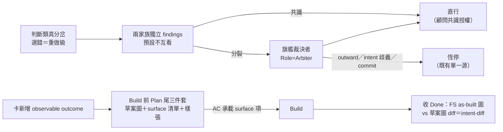

## Description

<!-- SECTION:DESCRIPTION:BEGIN -->
**一句話**：deepwork 模式下遇到「選錯要重做」的方案分歧，讓兩個 AI 家族各自獨立研究、再由旗艦模型裁決後直接做下去不用等你回來；同時規定動工前先把「成品長怎樣」寫成預告（草案圖＋驗收清單＋樣張），治「底層做完就停、user 看的畫面沒人做」這種事故（實例：sess_c5edae9e）。

**定什麼**：①旗艦裁決的畫線——verdict 權只管「怎麼做」（判斷類真分岔），outward／破壞性／需求歧義／commit 恆停（指既有單一源不重刻）；觸發分級＝瑣碎取捨不燒裁決、選錯＝重做級才啟 ②Mockup 契約——會改變 user 看得到/摸得到的產出時，Build 前在 Plan 尾寫三件套（終態圖草案＋user-visible surface 清單＋MOCKUP 樣張），AC 才是 authority、樣張只是預告。

**不做什麼**：不碰 push/deploy 等其他 outward、不新增 lifecycle node、不做 mockup 機械 guard／schema 形式化（旗艦裁決⑤ YAGNI 六項）；135.3 AC#6 vs outward rule 的 commit 權衝突已由 user 0921 裁決解掉——outward rule 修訂為 conditional commit delegation（receipt gate；muse＋codex bi 審查後落地）。

**附註**：本卡內容＝GLM-5.3 旗艦裁決（job-muageypp-05kry2）的落地物，程序源＝deep-work「旗艧裁決授權」第三形態、mockup 定義源＝kanban-board「Mockup 契約」段（均已隨裁決落地 commit 516e0a56）；本卡為登記＋追蹤載體，135.3 AC#7/#8、135.5 AC#4 的 ship-time 指針已同步修訂。verdict 物與兩腿 findings＝.agent-tmp/air-135/topicb-flagship-verdict.md＋topicb-{glm,codex}-reply.md。
<!-- SECTION:DESCRIPTION:END -->
