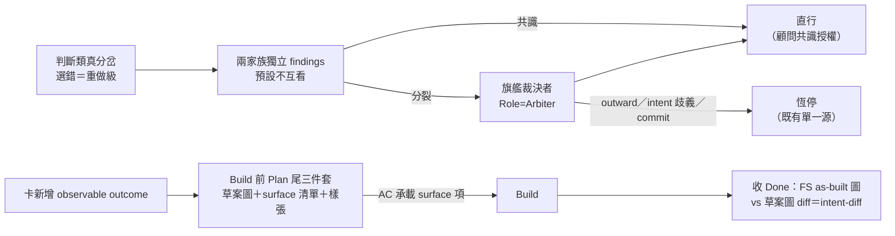
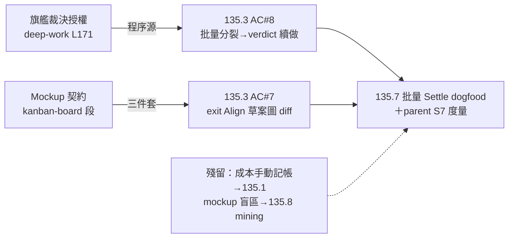

## Description

<!-- SECTION:DESCRIPTION:BEGIN -->
**一句話**：deepwork 模式下遇到「選錯要重做」的方案分歧，讓兩個 AI 家族各自獨立研究、再由旗艦模型裁決後直接做下去不用等你回來；同時規定動工前先把「成品長怎樣」寫成預告（草案圖＋驗收清單＋樣張），治「底層做完就停、user 看的畫面沒人做」這種事故（實例：sess_c5edae9e）。

**定什麼**：①旗艦裁決的畫線——verdict 權只管「怎麼做」（判斷類真分岔），outward／破壞性／需求歧義／commit 恆停（指既有單一源不重刻）；觸發分級＝瑣碎取捨不燒裁決、選錯＝重做級才啟 ②Mockup 契約——會改變 user 看得到/摸得到的產出時，Build 前在 Plan 尾寫三件套（終態圖草案＋user-visible surface 清單＋MOCKUP 樣張），AC 才是 authority、樣張只是預告。

**不做什麼**：不碰 push/deploy 等其他 outward、不新增 lifecycle node、不做 mockup 機械 guard／schema 形式化（旗艦裁決⑤ YAGNI 六項）；135.3 AC#6 vs outward rule 的 commit 權衝突已由 user 0921 裁決解掉——outward rule 修訂為 conditional commit delegation（receipt gate；muse＋codex bi 審查後落地）。

**附註**：本卡內容＝GLM-5.3 旗艦裁決（job-muageypp-05kry2）的落地物，程序源＝deep-work「旗艧裁決授權」第三形態、mockup 定義源＝kanban-board「Mockup 契約」段（均已隨裁決落地 commit 516e0a56）；本卡為登記＋追蹤載體，135.3 AC#7/#8、135.5 AC#4 的 ship-time 指針已同步修訂。verdict 物與兩腿 findings＝.agent-tmp/air-135/topicb-flagship-verdict.md＋topicb-{glm,codex}-reply.md。
<!-- SECTION:DESCRIPTION:END -->

## Final Summary

<!-- SECTION:FINAL_SUMMARY:BEGIN -->
註冊收線（registration complete）：兩機制程序載體已落地，dogfood 責任歸消費端卡，本卡無剩餘工作。

**as-built**：①旗艦裁決授權＝skills/deep-work/SKILL.md L171（兩家族獨立 findings→旗艦 Arbiter verdict 直行；verdict 物四欄記卡 Notes；觸發分級＝選錯＝重做級；verdict 權僅及判斷類、commit/outward 不在內）②Mockup 契約＝skills/kanban-board/SKILL.md「Mockup 契約」段（Build 前三件套：終態圖草案＋user-visible surface 清單＋樣張；AC 承載 surface 項）③落地 commit＝516e0a56，ship-time 指針已接 135.3 AC#7/#8、135.5 AC#4。

**殘留（歸消費端，非本卡）**：①dogfood 演練由 135.3 AC#7/#8（exit Align mockup 對照、批量分裂→旗艦 verdict）與 135.7 AC#7 批量 Settle dogfood 自然覆蓋 ②過渡期旗艦諮詢成本＝手動記卡 Notes（135.1 budget context 落地後機械化）③mockup 合規觀察盲區（無場景 vs 靜默跳過無法區分）交 AIR-135.8 per-arc mining 觀察。

終態圖（as-built 落點拓撲）：

三圖對照：desc 圖（機制流程 intent）與 as-built 落點圖並存；機制零 pivot——落地位置即登記內容，無偏差。
<!-- SECTION:FINAL_SUMMARY:END -->
