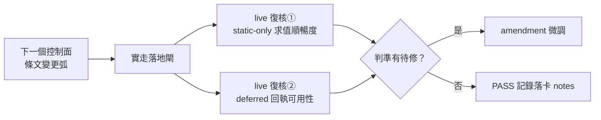

## Description

<!-- SECTION:DESCRIPTION:BEGIN -->
驗證落地閘判準在**真實案例**的可用性——AIR-129 兩輪 dogfood 全是歷史 diff replay，測不到兩件事（EP §4 S2 live 腿規定）：

- ①static-only 判準對真實 staged diff 的求值順暢度——含「作者證明渲染輸出 byte 等價」義務的實際操作成本
- ②deferred 回執在真實 no-candidate 情境（額度緊弧）的可用性

**觸發與回寫**：下次任何控制面 instruction 條文變更弧，實走落地閘時順手復核；結果回寫判準（微調走既有 amendment 路徑；PASS 記錄即可）。判準現行條文：skills/instruction-writing/SKILL.md 落地前審查閘節第 4／5 款。

<!-- SECTION:DESCRIPTION:END -->

## Acceptance Criteria
<!-- AC:BEGIN -->
- [x] #1 下弧首個真實落地閘案例完成 live 復核（static-only 求值＋deferred 欄位可用性）
- [x] #2 復核結果回寫：判準微調（走 amendment）或 PASS 記錄落卡 notes
<!-- AC:END -->

## Implementation Notes

<!-- SECTION:NOTES:BEGIN -->
【0919 live 案例#1 紀錄】案例＝AIR-139 audit-test 五條＋AIR-136 判定示例行的落地閘歸級：author（5.3）提案 boundary→雙腿（muse/codex）各自分類五格全 boundary（10/10，歷史分歧 muse 恆 ordinary 消除）→跨家族 findings 11 條→5.3 judge 全採修正。gate 運作正常：fail-safe 方向維持、無腿配置不確定。本案例同時完成 AIR-136 AC#2 dogfood。

【0919 live 案例#2】probe 誤報更正弧（hook_registration）：bi 雙腿諮詢（muse job-mu7kwxyj＋codex job-mu7kwxzl 零分歧）→修法（cc.json 補面，降權不採——muse 論證：降權零收益純增漏報）→TDD RED→GREEN 71 tests→非 main checkout 實地重跑 critical 0。歸級：腳本修復非條文語義——code 鏈普通審查（bi 即審查腿）。

【0919 live 案例#2 收口】tri 腿 fresh code-reviewer（in-harness 獨立 context）：5 findings（1🟡4🟢）全 confirmed——F1 claude_only 契約矛盾✅（清空＋合成 inv 釘機制＋模板面迴歸鎖）、F2 fixture 真實形✅、F3 匹配器對齊 _wiring✅（負向測試）、F5 docstring✅；F4 claude parity invariant 記後續弧。73 tests 綠。tri 鏈完成：muse＋codex＋GLM-fresh。

【0919 live 復核 PASS 結算（AC#1/#2 收口）】commit 佐證：案例#1＝d6a0d47b（五條落地＋歸級 dogfood 10/10 boundary；落地閘跨家族 muse job-mu7e6b9j＋codex job-mu7e6bal）＋9e0336a9；案例#2＝8021e342（hook_registration 誤報更正，bi 雙腿一致）＋a7fe4501。判準對照：案例#1 實證第 1/2 款（風險分類＋配審查腿）——author 提案 boundary、跨家族 10/10 收斂、judge 全採，fail-safe 方向維持、無腿配置不確定、無求值摩擦；案例#2 實證第 4 款入場判定——code hunk 非 markdown 條文 hunk 不入場、逕依第 1 款落 code 鏈普通審查，正確落袋。判定：PASS——gate 求值順暢、判準無待修項，不觸 amendment。範圍揭露（未命中分路，主動記錄）：static-only 正命中形態（whitespace/typo＋作者 byte 等價證明義務）與 deferred 回執（no-candidate／額度緊情境）本次兩弧均未出現——EP S2 live 腿本意的「額度緊 pending 動機」實測留待自然命中（下個額度緊的控制面弧順手補測即可，判準現況無缺陷，不開專卡）。
<!-- SECTION:NOTES:END -->

## Final Summary

<!-- SECTION:FINAL_SUMMARY:BEGIN -->
live 復核 PASS——兩真實案例（#1 歸級 boundary 全套 d6a0d47b／#2 code hunk 入場判定 8021e342）實證落地閘運作正常、判準無待修項；static-only 正命中與 deferred 回執兩分路未命中，留自然命中補測（範圍揭露見卡 notes）。
<!-- SECTION:FINAL_SUMMARY:END -->
