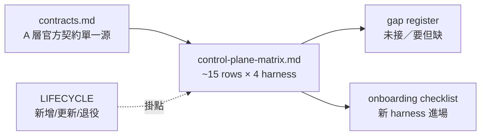

## Description

<!-- SECTION:DESCRIPTION:BEGIN -->
把四個 AI coding harness（Claude Code／ZCode／Codex／Muse）的掌控面整理成**單一導航矩陣**——harness 本身支援到哪＋ai-guide 實際接了哪些。之後分配工作或新增 harness 照表查，不用再考古散落各處的實測紀錄。

**矩陣結構**

- ~15 capability rows × 4 harness：A 層＝native 能力（官方契約，附鏡像 file:line＋版本斷言）；B 層＝ai-guide 結論狀態（wired/partial/unwired/n-a/unknown）＋authority pointer
- 雙檔制：contracts.md 管「harness 能做什麼」（A 層詳細單一源）；矩陣新檔 ref-docs/harness/control-plane-matrix.md 管「這台這版本實際掌控到哪層、證據到哪層」
- gap register 在場（harness 有未接／要但缺）；新 harness onboarding checklist 附錄＋LIFECYCLE 新增/更新/退役流程掛引用

<!-- SECTION:DESCRIPTION:END -->

## Acceptance Criteria
<!-- AC:BEGIN -->
- [ ] #1 contracts.md 補 Codex 對照欄（A 層官方契約、附鏡像 file:line、符合同步義務）
- [ ] #2 矩陣文檔在 ref-docs/harness/ 落地：~15 capability rows×4 harness，每格 A 層 native 能力（版本斷言）＋B 層 ai-guide 結論狀態＋authority pointer；頂部 version/config snapshot
- [ ] #3 B 層狀態固定 vocabulary（wired/partial/unwired/n-a/unknown），definition 不複製（manifest 權威面引 key、非 manifest 面標各自 authority）
- [ ] #4 gap register 在場（harness 有未接／要但缺，含兩家討論實證項）
- [ ] #5 新 harness onboarding checklist 附錄＋LIFECYCLE 新增/更新/退役流程掛引用（退役殘留掃描含矩陣）
<!-- AC:END -->

## Implementation Plan

<!-- SECTION:PLAN:BEGIN -->
〔baseline：ai-guide e190d05b〕
〔已決策勿重辯：①雙檔制——contracts.md 補 Codex 欄（A 層官方契約詳細單一源，codex 鏡像 148 頁已新鮮在場）；矩陣新檔 ref-docs/harness/control-plane-matrix.md（operational projection，定位句：contracts.md 管「harness 能做什麼」、矩陣管「這台這版本這 surface 實際掌控到哪層、證據到哪層」）②B 層＝結論狀態（wired/partial/unwired/n-a/unknown）＋authority pointer，definition 不複製——manifest 有權威面引 manifest key＋base pin，非 manifest 面（skills symlink 活視圖／delegate-bridge／LSP workaround）標各自 authority（bi 分歧裁決：muse 主張純指針 vs codex P1 舉證 slash/bridge/LSP 不歸 manifest 管——採 codex「projection 可有結論、definition 不複製」＋muse 的 key 引用紀律）③維度 schema＝~15 rows：原 12 維中⑧權限拆 sandbox boundary／approval reviewer／command policy-trust 三行（codex runtime 實證 approval 是多軸組合非 mode enum）、⑩拆 scheduling／背景執行 lifecycle、⑪改名 external invocation＋session continuation（bridge 是 B 層非 harness-native）、headless/SDK 併入此行、新增 observability 維（existence→activation/trust→behavior 三態，configured≠loaded≠trusted≠fired）；IDE/desktop/web/cloud 不作 row、作每格 cross-cutting surface 屬性；每格另帶 activation/reload boundary 與 trust/approval gate 兩屬性；每 harness 頂部 version/config snapshot metadata（鏡像 freshness＋runtime version＋config evidence timestamp——codex AGENTS.md 32KiB default vs 102400 configured 是 A/B 分層標準反例）④LIFECYCLE 掛點＝新增操作序插矩陣 onboarding gate 強制引用步驟（checklist 本體住矩陣附錄，每維結算 native/ai-guide/surface/activation/evidence/gap 六欄）；更新流程契約變化同步 A 層、部署變化同步 B 層；退役流程矩陣列連動點＋殘留掃描含矩陣檔 ⑤bi 顧問已跑（0918）：muse job-mu6topwb-e4eyud、codex job-mu6topyf-2s1z6a（ledger .delegate-bridge/）——工單與討論稿在 .agent-tmp/harness-control-surface-{brief,muse-wo,codex-wo}.md〕
範圍：contracts.md 補 Codex 欄（源＝ref-docs/harness/codex/ 鏡像，附 file:line）→矩陣文檔（A 層逐格鏡像 file:line 或實測紀錄＋版本；B 層結論＋authority 指針；gap register——已知候選：muse probes 不含 hooks 存活〔malformed project hooks 靜默跳過〕、codex ~/.codex/skills compatibility discovery vs ~/.agents/skills canonical、codex hooks.state positional key 非 stable identity、untrusted workspace 仍讀 muse project memory；onboarding checklist 附錄）→LIFECYCLE 三流程掛點。驗證腿：A 層抽樣 file:line 覆核＋B 層 authority 指針可達性機械檢查。機械盤點段可派 lite；相關子集：draft-9（muse 換主 harness 缺口盤點）待矩陣落地後消費。
<!-- SECTION:PLAN:END -->

## Implementation Notes

<!-- SECTION:NOTES:BEGIN -->
【0919 結案】矩陣落地：control-plane-matrix.md（15×4 全格非空、B 層五詞彙零出圈、A 層 file:line 抽樣 3/3 逐字吻合）＋contracts.md Codex 欄（+26/−17，20 處鏡像引用）＋LIFECYCLE 三掛點＋殘留掃描含矩陣檔。gap register 8 條（plan 四候選全入）。AC#1-5 全數達成。known unknowns：CC ~/.claude.json mcpServers（row 5 unknown）、muse LSP bridge 未實測——已標註在案。
<!-- SECTION:NOTES:END -->
