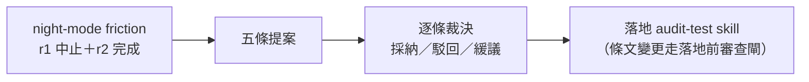

## Description

<!-- SECTION:DESCRIPTION:BEGIN -->
mosaic audit-test --night 首跑（night-mode-0918，r1 中止＋r2 完成）的 friction 實證回饋，五條 skill 改進提案素材。源弧＝mosaic 主 repo pending-decisions〔night-mode-0918-r2〕（AIR-124 notes 有完整 verdict 與指針）；逐條來源＝弧 WT friction.log。

**五條提案**

1. night-mode 契約 4 補條款：零 commit 環境下 P5 rerun 必須 `rm -rf mutants/` 全清——mutmut git-change-detection 對未提交變更不失效快取（r1＋r2 兩次實證）
2. mutmut timeout 分類≠config artifact（60× 不變，r2 證偽 r1 假設）——基線口徑應把 timeout 單獨列示、不入 kill-rate 分母
3. 契約 1 補 verbatim 條款：manifest／工單 invariant 逐字引用來源，壓縮措辭＝改 oracle（r1 codex 偽陽性根因）
4. 執行主體 repo 歸屬（user 已拍板）：專用弧 worktree 形態（main WT 唯一寫入＝sink append）——SKILL night-mode 節 open item 可回填
5. P2 工單模板補：muse sandbox 擋 `uv run`（cache 拒寫）→ 直接指定 `.venv/bin/python`

<!-- SECTION:DESCRIPTION:END -->

## Acceptance Criteria
<!-- AC:BEGIN -->
- [ ] #1 五條提案逐條裁決（採納／駁回／緩議），裁決結果回執 mosaic 對應卡（跨 repo 指針照 135.5 token 慣例）
- [ ] #2 採納條目落地 audit-test skill 條文與（可行處）測試，條文變更走 instruction-writing 落地前審查閘
- [ ] #3 SKILL night-mode 節既有 open item（執行主體 repo 歸屬）回填收斂
<!-- AC:END -->

## Implementation Notes

<!-- SECTION:NOTES:BEGIN -->
【0918 開卡】源＝mosaic night-mode-0918 audit 弧跨 repo 通知（素材由 mosaic 側整理、ai-guide 側固化——「ai-guide 檔案由你側固化；素材僅指針」分工）。provenance：muse job-mu6yzg11-m5pm16＋codex job-mu6yzg4f-plwh5a（bridge ledger 在 mosaic 弧 WT）。查證層級：friction.log／ledgers 檔案存在性已驗，提案內容為 mosaic 側自報，落地前逐條對 friction.log 原文核對。

【0919 mosaic 補充三條提案（素材待裁決；同源 night-mode-0918-r2，與已落地 1-5 同批摩擦面）】6. 契約 1 manifest 來源補「事故面」軸：過去 incident 測試面納入輪選（r2 實證：UI 出口 double-÷＝事故 F-B 同面，因不在 AGENTS 標記面漏出射程）→建議 ✅（契約 1 輪選來源加一行）。7. 域 2 制式步驟「載體對帳」：manifest source 須驗 production caller——被測物≠生產路徑時 invariant 零證偽力（r2 T4 實證：16 tests 全綠釘零-caller 載體）→建議 ✅（域 2 Traceability 加制式步驟）。8. 慣例輸出擇一（tests/AGENTS vs python-standards）：比較式驗證對非有限值 fail-open（IEEE 754）——gate 慣用法 not (x > 0)＋finite 驗證 helper 化（mosaic 已落地 86dd5279c＋MOS-111；ai-guide 端為慣例條文固化）→建議 ✅ 擇 python-standards rule（全域 *.py；一句話條文：比較式 gate 對 NaN/inf fail-open——用 not (x > 0) 形＋finite 前置驗證）。數字更新：393 mutants／survived 26→17／49.2%（修復後口徑）。

【0919 五條落地（D1 user 全准）】契約 1 verbatim＋來源錨點／契約 2 sandbox 聲明＋工單逐字封堵／契約 4 rerun 全清（pwd 斷言）＋timeout 口徑（分母零 n/a）／open item 回填（＋sink adapter 關係）——全部經落地閘雙腿審查＋judge 修正（muse F1-F7＋codex F1-F4 全數處理）。6/7/8 雙腿一致 ✅ 待 user 最終拍板後落地（素材在 0919 notes）。

【0919 6/7/8 落地（user「ＯＫ拉」拍板）】契約 1 補事故面軸、域 2 載體對帳制式步驟（production caller 驗證，零-caller 載體全綠不計覆蓋）、python-standards IEEE 754 fail-open 防護節。post-build followup closure 11/11 rg 綠（雙腿 findings 全修正＋三提案全落地）。85c23cd7。

【0919 結案】回執已交 user 轉發，mosaic session 確認收訊：「AIR-139 回執——8/8 全採納落地，這條回饋迴路正式閉環」。AC#1 回執達成（mosaic 側 drift 修正：readout sink 行＋MOS-111 卡改弧 WT 絕對路徑＋標注 gitignored 隨 WT 生命週期、關鍵數字已內聯）。AC#2 八條全落地（skill 條文＋python-standards；skill 無獨立測試面——驗證＝落地閘審查＋followup rg 11/11）。AC#3 open item 回填完成。附註：本卡與 AIR-124 notes 的弧 WT 絕對路徑指針（friction.log／ledgers）在 mosaic 弧 WT 清除後失效——關鍵數字已內聯於 mosaic readout 與本卡，指針屆時標 historical。
<!-- SECTION:NOTES:END -->
