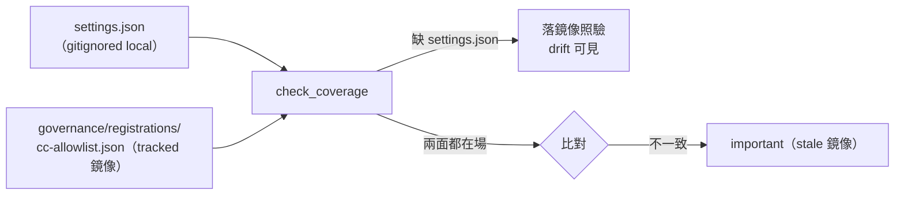

## Description

<!-- SECTION:DESCRIPTION:BEGIN -->
check_single_source.py 的 `skill_allowlist_coverage` invariant 有個盲點：證據源只有 `settings.json`（gitignored local-only）——非 main checkout 缺場時 `check_coverage` 靜默 `return []`（方向＝false negative，skill rename drift 全不可見；muse 0919 全表掃描：REGISTRY 唯一同型殘留）。修法＝**tracked 鏡像**：`governance/registrations/cc-allowlist.json` 收納 permissions.allow 投影，probe 改讀「settings.json 優先、缺場落鏡像」，兩面都在場時比對 drift。

<!-- SECTION:DESCRIPTION:END -->

## Acceptance Criteria
<!-- AC:BEGIN -->
- [ ] #1 tracked 鏡像檔在場（governance/registrations/cc-allowlist.json），內容＝settings.json permissions.allow 投影
- [ ] #2 check_coverage：settings.json 缺場時改用鏡像驗證（skill rename drift 在非 main checkout 可見）；兩面都在場且不一致→important（stale 鏡像）
- [ ] #3 測試三態：缺 settings.json＋鏡像在場→照驗；兩面同步→pass；兩面 drift→important
- [ ] #4 invariant note 誠實標示覆蓋語義（沿 check_forbidden_pattern 的 important 揭露風格）
<!-- AC:END -->

## Implementation Notes

<!-- SECTION:NOTES:BEGIN -->
【0919 開卡】源＝muse 全表掃描（probe-fix-muse.md Q5：REGISTRY 唯一同型殘留）＋修復弧實測（非 main checkout 跑 probe 的 skip 行為）。鏡像同步紀律：settings.json permissions 變更時人工同步鏡像（drift 檢查兜底防忘）。

【0919 結案】flash impl-lite TDD 實作＋fresh review 通過（鏡像 274=274 identical 實證、coverage 三態測試、drift→important）。AC#1-4 全數達成。
<!-- SECTION:NOTES:END -->
