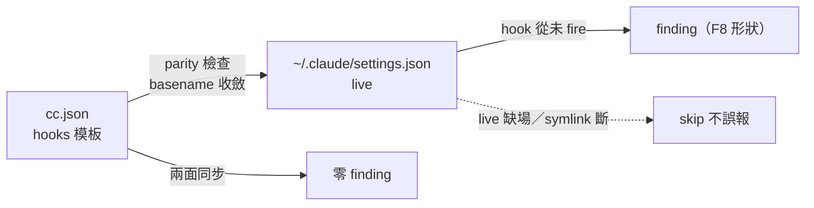

## Description

<!-- SECTION:DESCRIPTION:BEGIN -->
cc.json 進場成為 Claude 端權威模板面後（0919 hook_registration 誤報更正），缺對應的 **template→live parity 防線**：cc.json 加接線、live settings.json 忘 merge → hook 從未 fire（F8 形狀）無人抓——zcode_live_parity／codex_live_parity 皆有此防線，CC 面缺（tri F4 列為後續弧候選）。本卡新增 `cc_live_parity` invariant：複用 _wiring 三元組語義（event＋matcher＋script basename）；{{REPO}} 模板與 live 絕對路徑由 basename 收斂；live 缺場（非本機或 symlink 斷）skip 不 false positive；單向 template→live。

<!-- SECTION:DESCRIPTION:END -->

## Acceptance Criteria
<!-- AC:BEGIN -->
- [ ] #1 REGISTRY 新增 cc_live_parity invariant＋check 函式（形態對齊 codex_live_parity／zcode_live_parity）
- [ ] #2 測試：模板 hook live 缺→finding；兩面同步→零 finding；live 缺場（symlink 斷/HOME 隔離）→skip；basename 收斂（{{REPO}} vs 絕對路徑）
- [ ] #3 實機驗證：本機跑 probe 全綠（模板與 live 現況一致）
<!-- AC:END -->

## Implementation Notes

<!-- SECTION:NOTES:BEGIN -->
【0919 開卡】源＝tri F4（probe fix 弧 fresh reviewer）＋muse/codex Q3 共識（live parity 另立 invariant，不混入 hook_registration）。CC 部署＝symlink 型（settings.json 直連 live），drift 形態與 zcode/codex 的 merge 型不同——live 缺場判準＝檔案不存在或 symlink 斷。muse 0919 註：若將來 CC 改 merge 部署，再評估 installer drift gate 整合。

【0919 結案】cc_live_parity 落地（REGISTRY＋check 函式＋wiring 三元組 basename 收斂）；fresh review F1 修正——live 改 ~/.claude/settings.json 走 HOME hop（repo 相對路徑會在 symlink 斷鏈時盲綠）；實機 12=12 missing=0。AC#1-3 達成。
<!-- SECTION:NOTES:END -->
