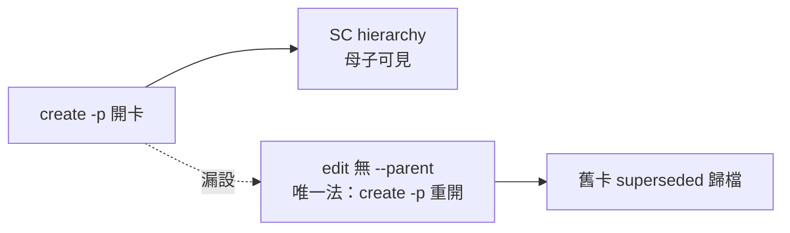

## Description

<!-- SECTION:DESCRIPTION:BEGIN -->
把 backlog CLI 開卡結構欄位的旗標行為寫進 kanban 建卡文件：parent 只能在 create 設（-p 自動編號 母卡.1/.2；edit 無 --parent——漏設只能 create -p 重開）；deps/ordinal/milestone 開卡即設，關係只寫進 Plan 文字不算數（MOS-115-123 教訓：SC hierarchy 看不見＋precheck 少依賴面，重開 8 卡）。

<!-- SECTION:DESCRIPTION:END -->

## Acceptance Criteria

<!-- AC:BEGIN -->
- [x] #1 skills/kanban-board/SKILL.md 建卡段含 -p／--dep／--ordinal／-m 旗標行為文檔，含「edit 無 --parent——漏設只能 create -p 重開」限制（rg 命中）
- [x] #2 uv run python scripts/sync_agents.py --check 綠；scripts/deploy_agents.py regenerate 完成
- [x] #3 mosaic 端提案檔 ai-analysis/_inbox/ai-guide-patch-kanban-card-fields.md 已刪（commit 在）
<!-- AC:END -->

## Implementation Plan

<!-- SECTION:PLAN:BEGIN -->
①baseline：mosaic_alpha 70bbc12a（提案檔 ai-analysis/_inbox/ai-guide-patch-kanban-card-fields.md）；ai-guide main 對時 ②已決策勿重辯：條文落點＝kanban 建卡段 code block（mosaic 提案＋instruction-writing 規範潤稿）；meta 詞根/playbook 不在範圍 ③scope：動＝skills/kanban-board/SKILL.md 建卡段；不動＝其他 skills/rules ④scenarios：agent 開子卡→用 -p/--dep/--ordinal；漏設→create -p 重開＋superseded 歸檔 ⑤integration：deploy_agents.py 部署鏈；mosaic 端 symlink 同源 ⑥驗證式：rg parent 命中建卡段＋sync_agents --check 綠＋提案檔刪除
<!-- SECTION:PLAN:END -->
