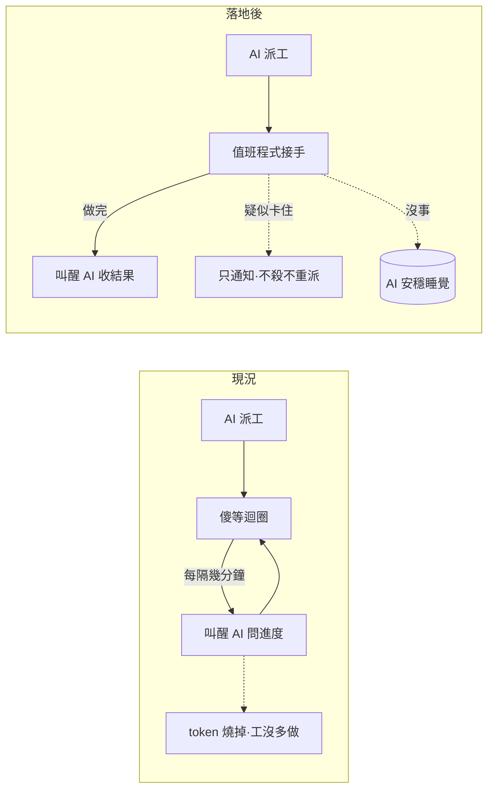

## Description

<!-- SECTION:DESCRIPTION:BEGIN -->
**一句話**：寫一支值班程式（watcher），盯著背景 worker 做完事才叫醒 AI——中間不管跑多久，AI 都不用被吵醒。

**現在的痛**：AI 派長工給背景 worker 之後，系統每幾分鐘就把 AI 叫醒一次「還沒好、繼續等」——一小時的工被吵醒十幾次，每次都燒 token；夜間批量也照樣被折騰（0920 實證）。

**做完之後**：AI 派完工就去睡。值班程式接手盯場——worker 做完了，叫醒 AI 收結果；worker 疑似卡住，只通知、不亂殺不重派（處置權留在 AI）；其他時間靜悄悄。

**附註**（實作細節，不影響上面理解）：設計源＝SC 弧 codex 報告 job-mu9hmdar 轉交＋marshal 裁決；形態＝`scripts/bridge_waiter.py` 單顆包多工、動態等隔、worker／runtime 雙軸卡死判準、收工回執欄位沿用 AIR-135.7 AC#2、bridge CLI 版本 pin；狀態機四態為 frozen spec（轉移表見 AC）。
<!-- SECTION:DESCRIPTION:END -->

## Acceptance Criteria
<!-- AC:BEGIN -->
- [x] #1 124→內部自動 re-arm、零 redispatch（真實歷史 job replay 驗證，H 級 oracle）
- [x] #2 fresh progress 調大下一 arm（×1.5 cap 20m）；runtime silence 跨 floor 僅產 stalled-advisory（exit 3），不 stop 不重派
- [x] #3 terminal completed 恰一次 collect、terminal failure 立即喚醒 caller；CollectionReceipt JSON 於 stdout（欄位＝AIR-135.7 AC#2 bounded receipt 投影）
- [x] #4 N-job fan-in 至最後一顆 terminal 才 completion
- [x] #5 restart／generation mismatch → unknown/reconcile 喚醒，禁自動 retry；missing/corrupt status fail-loud
- [x] #6 watcher 無 stop/judge/commit 路徑（代碼面保證）；bridge CLI 版本不符 fail-loud 附升級指引
<!-- AC:END -->

## Final Summary

<!-- SECTION:FINAL_SUMMARY:BEGIN -->
bridge wait watcher 落地——fan-in 包 wait、exit 124 內部 re-arm 零 LLM 喚醒、動態 T、heartbeatAt/lastEventAt 雙軸 advisory、exit 2 四面貌重探分流、CollectionReceipt（AIR-135.7 AC#2 投影）、bridge CLI 版本 pin。AC#1 證據：T4 advisory 節制＋T5 collect 各 H 級真 job 實證（round 3 advisory 攔截後 job 自行完成＝節制價值活體驗證）；124-re-arm 面 I 級如實記錄（glm 靜默>10m 即 advisory 攔截，自然不可達）。fresh 審查 7 findings（1 Critical single-id 零 collect）＋followup 驗收 pass＋N1 gap 帶併修，44 測試＋全套 1075 綠

**0921 frozen spec amendment（雙模型調查 drift finding 修復）**：①stalled 判準對齊 bridge producer canonical（task.rs 單一實作「no ageable data is never reported」）——`crossed_floor(None)＝False` 取代原 fail-closed True（兩套判準在缺 stamp 時行為相反＝現行 drift；terminal/124/not-found wake 路徑不受影響）②binary 不可達＝clean fail-loud exit 2 附修法指引（取代 traceback 崩潰；bare shell 忘帶 DELEGATE_BRIDGE_BIN dogfood 實證）③實證附帶：codex web 長生成期 heartbeat 滯後→worker 5m floor 常態性誤報（×3），`--kind research` 緩解。調查源＝glm job-muafjfcl＋codex job-muafppoe（bridge 原生 wait 已有 N-job batch＋雙軸 stuck＋reconcile——watcher 增量定位＝124 透明 re-arm／advisory wake／receipt 機驗；長期 liveness 語義下沉回 producer）。

**0921 消費同步排程（bridge 端 wake-on-stuck ship 後）**：delegate-bridge 2.0.23 新增 `--wake-on-stuck`／`--wake-axis`（exit 3＋stdout wake JSON；對端 session sess_0fdfeb50 實作中，工單＝.agent-tmp/air-135/bridge-handoff-prompt.md 項目二）——ship 後 bridge_waiter.py 退役自算雙軸（crossed_floor／_job_stalled），改消費原生 wake 訊號＋版本 gate 升 2.0.23；「liveness 語義下沉 producer」閉環。

**0921 消費同步落地**——雙模版本閘控（≥2.0.23 native wake／<2.0.23 legacy 輪詢；MIN pin 維持 2.0.22，feature 閘 `native_wake_supported` 另立——排程段「gate 升 2.0.23」修正為 feature 閘，舊 binary 環境 watcher 續用）；`--wake-axis runtime`（worker 誤報消化）；ZCode pin 翻轉後自動走 native。bridge 端 ship＝f325e63（2.0.23）。
<!-- SECTION:FINAL_SUMMARY:END -->
<!-- SECTION:FINAL_SUMMARY:END -->
