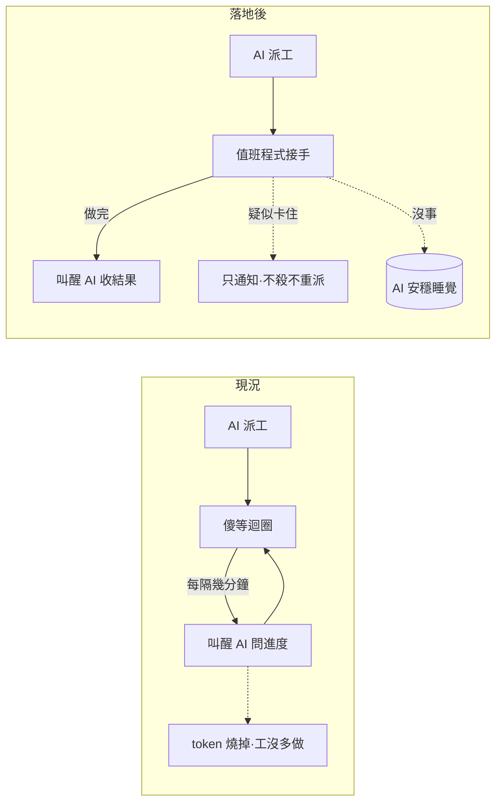

## Description

<!-- SECTION:DESCRIPTION:BEGIN -->
**一句話**：寫一支值班程式（watcher），盯著背景 worker 做完事才叫醒 AI——中間不管跑多久，AI 都不用被吵醒。

**現在的痛**：AI 派長工給背景 worker 之後，系統每幾分鐘就把 AI 叫醒一次「還沒好、繼續等」——一小時的工被吵醒十幾次，每次都燒 token；夜間批量也照樣被折騰（0920 實證）。

**做完之後**：AI 派完工就去睡。值班程式接手盯場——worker 做完了，叫醒 AI 收結果；worker 疑似卡住，只通知、不亂殺不重派（處置權留在 AI）；其他時間靜悄悄。

**附註**（實作細節，不影響上面理解）：設計源＝SC 弧 codex 報告 job-mu9hmdar 轉交＋marshal 裁決；形態＝`scripts/bridge_waiter.py` 單顆包多工、動態等隔、worker／runtime 雙軸卡死判準、收工回執欄位沿用 AIR-135.7 AC#2、bridge CLI 版本 pin；狀態機四態為 frozen spec（轉移表見 AC）。
<!-- SECTION:DESCRIPTION:END -->

## Acceptance Criteria
<!-- AC:BEGIN -->
- [ ] #1 124→內部自動 re-arm、零 redispatch（真實歷史 job replay 驗證，H 級 oracle）
- [ ] #2 fresh progress 調大下一 arm（×1.5 cap 20m）；runtime silence 跨 floor 僅產 stalled-advisory（exit 3），不 stop 不重派
- [ ] #3 terminal completed 恰一次 collect、terminal failure 立即喚醒 caller；CollectionReceipt JSON 於 stdout（欄位＝AIR-135.7 AC#2 bounded receipt 投影）
- [ ] #4 N-job fan-in 至最後一顆 terminal 才 completion
- [ ] #5 restart／generation mismatch → unknown/reconcile 喚醒，禁自動 retry；missing/corrupt status fail-loud
- [ ] #6 watcher 無 stop/judge/commit 路徑（代碼面保證）；bridge CLI 版本不符 fail-loud 附升級指引
<!-- AC:END -->
