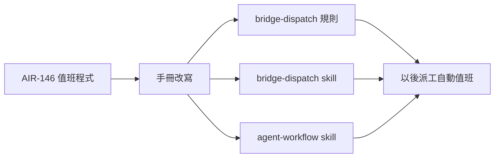

## Description

<!-- SECTION:DESCRIPTION:BEGIN -->
**一句話**：值班程式（AIR-146）做好後，把 AI 的操作手册全部改成教新做法——以後每次派工自動用值班，沒有 AI 再學舊的傻等迴圈。

**為什麼需要**：手册不改，下一個 AI 打開規則還是照舊方法傻等——值班程式等於白做。

**改哪些**：三份文件——bridge-dispatch 規則、bridge-dispatch skill、agent-workflow skill（監工那段），共四處改寫＋一輪多工測試。

**附註**：改寫點逐處對照 codex 報告 job-mu9hmdar 的 doctrine 節；本卡 AC 即四處改寫的驗收。
<!-- SECTION:DESCRIPTION:END -->

## Acceptance Criteria
<!-- AC:BEGIN -->
- [x] #1 bridge-dispatch rule＋skill 改寫落地（waiter 主路徑、裸 wait fallback 保留、124 語句行為主體更新為 watcher 內部）
- [x] #2 skill desc 觸發詞涵蓋新形態（bridge_waiter／CollectionReceipt／stalled-advisory；desc 機驗 ≤1024 chars）
- [x] #3 fan-in 消費者測試（多 job 情境）通過
- [x] #4 stalled-advisory 處置句進 doctrine（喚醒不處置；stop 恆為主 session 判斷）
<!-- AC:END -->

## Final Summary

<!-- SECTION:FINAL_SUMMARY:BEGIN -->
doctrine 接線落地——rules Dispatch⇄collection 條 watcher 主路徑（exit 124 內部消化、exit 2 fail-loud reconcile 禁 retry 重派、exit 3 stalled advisory、exit 契約單一源＝bridge_waiter.py docstring）＋裸 wait 降 fallback；skill 完整模式段重寫（派工同 step 自動 arm、重啟後恢復＝重新 arm）＋desc 觸發詞 +bridge_waiter／CollectionReceipt／stalled-advisory（timebox 刻意不收——屬 in-harness 域，agent-workflow D5 標注承接）；agent-workflow bridge 域同構防禦句。11 rg 錨點測試＋全套 1204 綠。落地 ab4ae0cc＋95c4621d（b039db2c 帶同主題訊息但實際誤掃 canonical WT 無關檔、doctrine 四檔漏網——ab4ae0cc 補正）；Muse 36KiB gate 撞線→精煉收斂（下沉細節遷 skill「下沉細節」節）；deploy 三端同步＋check_single_source critical 0
<!-- SECTION:FINAL_SUMMARY:END -->
