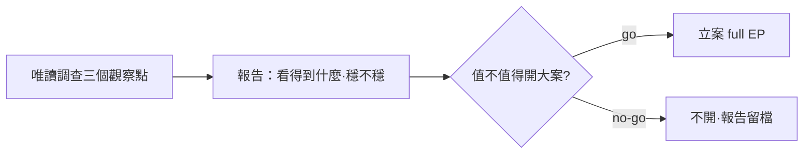

## Description

<!-- SECTION:DESCRIPTION:BEGIN -->
**一句話**：先做個不用錢的小調查——搞清楚系統裡哪裡能可靠看到「AI 開的子 agent 還活著嗎」，看完再決定要不要開大案。

**為什麼**：背景 worker 卡住的偵測由 AIR-146 解決；但另一種工作——AI 自己開的子 agent——卡住了目前只能靠人工驗屍（翻 DB、看檔案時間戳），沒有穩定的查詢介面。直接開大案太重（要動跨系統契約），先偵察再說。

**做法**：唯讀調查，什麼都不改；查完交一份報告——三個觀察點（任務登記表／對話記錄檔／行程存活）各說「看得到什麼、穩不穩定」，附「卡住的子 agent 該怎麼判定換血」草案和「要不要開大案」建議。調查檔案用完即清。

**附註**：「大案」＝跨 harness 的子 agent 觀察契約（codex 卡拆建議升 full tier）；probe 結論是立案材料、不是實作。
<!-- SECTION:DESCRIPTION:END -->

## Acceptance Criteria
<!-- AC:BEGIN -->
- [ ] #1 ZCode 觀察源清單（task registry／transcript／process 三面各附 file:line 或路徑錨點與穩定性評級）
- [ ] #2 reconcile 觸發語義草案（generation 變化偵測面）落盤
- [ ] #3 full EP 立案建議（go/no-go＋材料指針）交付
<!-- AC:END -->
