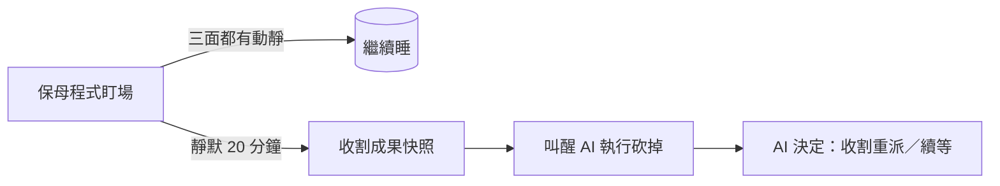
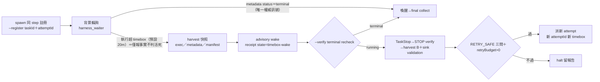

## Description

<!-- SECTION:DESCRIPTION:BEGIN -->
**一句話**：寫一個「保母程式」盯著 AI 開的子 agent——20 分鐘完全沒動靜，就先幫它留遺言（收割已完成的工作）、再叫醒 AI 來砍掉重來。

**為什麼**：子 agent 偶爾卡死（zcode 載體的 bug，系統裡已抓到 39 具殭屍殘留），目前只能靠人工驗屍。這張卡把「發現卡死→救回成果→砍掉」自動化——發現和收屍是程式的事，砍掉和重來仍由 AI／你決定。

**附註**：EP＝`ai-analysis/_tasks/2026-09/09-20-harness-liveness-watcher/ep.md`（baseline 308f9a71）；設計全文與裁決史見同目錄 references/research.md。三面靜默判準、exec lease 豁免、bounded 收割等實作細節全在 EP。

**結案修訂（K1 pivot）**：三面靜默判準經 kill criteria 實測 INVALIDATED（執行中子代理四觀察面全靜默）→ pivot timebox 模型（frozen spec v2）；終態見 Final Summary＋EP Settle 節。
<!-- SECTION:DESCRIPTION:END -->

## Final Summary

<!-- SECTION:FINAL_SUMMARY:BEGIN -->
harness liveness watcher 落地（`scripts/harness_waiter.py`）——K1 kill criteria 實測觸發（TC-4 round 2：執行中子代理 rollout 不存在＋exec fd 持有零寫入＋metadata 凍結＋無 artifacts）→ 凍結偵測 INVALIDATED → timebox 模型：watcher 不判活死，terminal transition（metadata status）＝唯一權威訊號，超 timebox 僅報事實（harvest→wake），stop／重派恆歸主 session。frozen spec v2 T1-T9 落碼與 EP byte-identical；--register／--verify（STOP fencing oracle）／--harvest-delta；interventionPolicy interactive|autonomous_once（預設 fail-safe interactive）、AUTO_RETRY_BUDGET=1、watcher 零 stop／重派路徑（AST 驗證）。TC-3 timebox 矩陣 17 測試＋TC-2 殭屍 corpus＋全套 1204 綠；TC-4 round 3 乾淨輪真機端到端（receipt state=timebox-wake）。落地 28f34e93；已知缺口：TaskStop 後 metadata 失 createdAt（harness 怪癖，verifier 寬鬆處理，歸檔 references）

**終態圖（as-built——timebox 模型；desc 圖＝pivot 前 intent baseline，兩圖 diff＝K1 pivot 架構 delta）**：

<!-- SECTION:FINAL_SUMMARY:END -->
