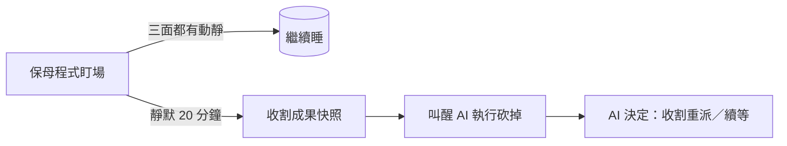

## Description

<!-- SECTION:DESCRIPTION:BEGIN -->
**一句話**：寫一個「保母程式」盯著 AI 開的子 agent——20 分鐘完全沒動靜，就先幫它留遺言（收割已完成的工作）、再叫醒 AI 來砍掉重來。

**為什麼**：子 agent 偶爾卡死（zcode 載體的 bug，系統裡已抓到 39 具殭屍殘留），目前只能靠人工驗屍。這張卡把「發現卡死→救回成果→砍掉」自動化——發現和收屍是程式的事，砍掉和重來仍由 AI／你決定。

**附註**：EP＝`ai-analysis/_tasks/2026-09/09-20-harness-liveness-watcher/ep.md`（baseline 308f9a71）；設計全文與裁決史見同目錄 references/research.md。三面靜默判準、exec lease 豁免、bounded 收割等實作細節全在 EP。
<!-- SECTION:DESCRIPTION:END -->
