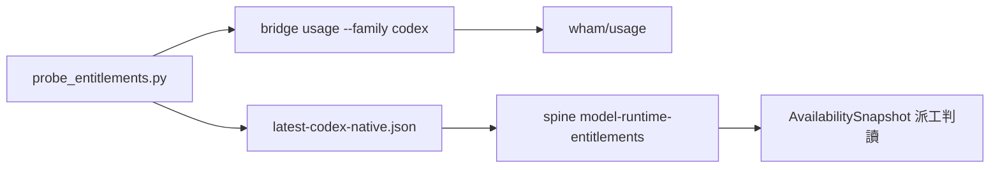

## Description

<!-- SECTION:DESCRIPTION:BEGIN -->
統一 codex native 額度探測。錨點（0921 盤點＋arch-thinking 裁定）：bridge `usage --family codex`（wham/usage direct，凍結 JSON 契約）＋ai-guide `scripts/probe_entitlements.py`（adapter→latest-*.json＋spine 候寫行）；SC codexLane（app-server rateLimits）不納入統一（綁 VSCode ext 進程生命週期，不適作跨 harness 單一源）。

範圍：
① F1 drift 修正——`probe_entitlements.py:530` `failure_class="usage_limit_web"`＋docstring（:498）＋tests（test_probe_entitlements.py:633,675）殘留舊歸因，與 model-routing webgpt 失敗態表第 6 類新歸因（native 訂閱池）矛盾；0921 三審查腿（muse/primed/fresh）獨立收斂同一點。docstring/指針修正零風險先行；enum rename 需查 spine 歷史消費端。
② codex native auth 面查證——bridge usage 實跑報 not logged in（`~/.codex/auth.json` tokens.access_token 缺/空 vs ChatGPT 載體 launcher 的 token 面）；查清後 native 探測才算通。
③ muse 池探測缺口評估（bridge 凍結 unsupported；muse 僅 TUI /usage，AIR-98 項）。

產出：native 探測可用＋spine 探測源行對帳。

<!-- SECTION:DESCRIPTION:END -->
