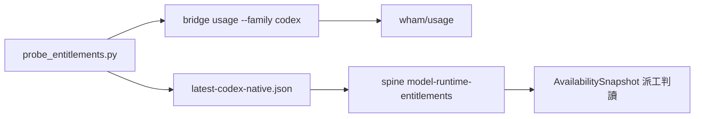

## Description

<!-- SECTION:DESCRIPTION:BEGIN -->
統一 codex native 額度探測。錨點（0921 盤點＋arch-thinking 裁定）：bridge `usage --family codex`（wham/usage direct，凍結 JSON 契約）＋ai-guide `scripts/probe_entitlements.py`（adapter→latest-*.json＋spine 候寫行）；SC codexLane（app-server rateLimits）不納入統一（綁 VSCode ext 進程生命週期，不適作跨 harness 單一源）。

範圍：
① F1 drift 修正——`probe_entitlements.py:530` `failure_class="usage_limit_web"`＋docstring（:498）＋tests（test_probe_entitlements.py:633,675）殘留舊歸因，與 model-routing webgpt 失敗態表第 6 類新歸因（native 訂閱池）矛盾；0921 三審查腿（muse/primed/fresh）獨立收斂同一點。docstring/指針修正零風險先行；enum rename 需查 spine 歷史消費端。
② codex native auth 面查證——bridge usage 實跑報 not logged in（`~/.codex/auth.json` tokens.access_token 缺/空 vs ChatGPT 載體 launcher 的 token 面）；查清後 native 探測才算通。
③ muse 池探測缺口評估（bridge 凍結 unsupported；muse 僅 TUI /usage，AIR-98 項）。

產出：native 探測可用＋spine 探測源行對帳。

<!-- SECTION:DESCRIPTION:END -->

## Final Summary

<!-- SECTION:FINAL_SUMMARY:BEGIN -->
probe 側交付完成（0921，worktree ephemeral/air-150-probe）。①root cause 證偽——範圍②假設「`~/.codex/auth.json` tokens.access_token 缺/空」不成立：`auth_mode=chatgpt`、access_token 非空（1754 chars）、09-15 後檔案穩定不變，128 份失敗記錄橫跨其上；真因＝bridge bug（delegate-bridge `rust/crates/bridge-families/src/codex.rs:566-570` default branch 讀 `$HOME/auth.json`、缺 `.join(".codex")`→auth 檔恆不存在→codex 腿恆 "codex not logged in"；docstring 宣稱 `~/.codex` 與實碼 drift、default branch 無 unit test 故逸出；`CODEX_HOME` 注入下 live 實跑 ok＝planType plus＋rate_limit windows＋credits(balance=0)）。②probe 即時解：`run_bridge_usage` 呼叫環境未設 `CODEX_HOME` 時注入 `<home>/.codex`（附註解指明 bridge bug 錨點；bridge 2.0.24 修復後可移除）——bridge 側正解歸對端 repo 工單（handoff：`.agent-tmp/air-150/bridge-handoff-prompt.md`）。③F1 rename：failure_class `usage_limit_web`→`usage_limit_native`（歸因＝native 訂閱池訊號、非 web edge，對齊 model-routing webgpt 失敗態表第 6 類；消費端全掃僅 probe:530＋tests:633,675、spine 歷史零命中——rename 零風險已證）；docstring、簽名常數（`_SIG_NATIVE_USAGE`）、測試符號同步。④muse 池 no-go：bridge 凍結 unsupported 是 capability 事實（AIR-98 A4），逆向 TUI 成本高且脆；重啟條件＝muse runtime 暴露結構化 usage 面。⑤astra 對帳留待項：wham `model_usage.gpt-6-astra.available=true` 與 spine「astra 帳號路徑 server 拒、需 credits 載體」表面矛盾，available flag 語義未查官方，留 session 對帳、不自動寫 spine。研究報告：`.agent-tmp/air-150/架構研究.md`（含三 lens 裁定——probe 留 ai-guide 消費 bridge 凍結契約，不綁進 delegate plugin、不另開 plugin）。驗證：test_probe_entitlements 47 綠（新增 CODEX_HOME 注入/透傳 2 測試）、全套 tests 綠、ruff 綠。註：本卡 Description 的 `usage_limit_web` 字樣為歷史發現記載（引用舊值本身），非活引用——rg 全 repo 唯一殘留點。
<!-- SECTION:FINAL_SUMMARY:END -->
