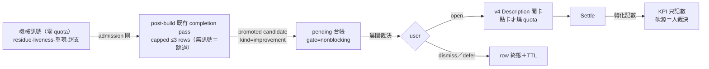

## Description

<!-- SECTION:DESCRIPTION:BEGIN -->
**這卡解什麼**：AIR-135 缺「系統自己發現摩擦」的 feedback loop——loop engineering 的 heartbeat 值得要，但其排程 LLM 掃描假設 token 便宜，quota 受限的 solo dev 不合身。本卡定義零 heartbeat 的發現鏈：機械訊號免費常駐，語義判讀搭既有 post-build 便車（**普通弧 0 新增 LLM invocation**），候選以 nonblocking row 進 pending 台帳等你晨間裁決，點頭才開卡燒 quota。

**這卡定什麼**：訊號 admission 閘（`actionable residue OR recurrence OR known reliability anomaly`——review/residue 殘留、liveness 異常、跨弧重現 failure signature、預算超支）；post-build capped 收斂（≤3 rows＋指針，無 admissible 訊號整條跳過）；pending `kind=improvement`＋`gate=nonblocking` row-type（附 evidence_ref／class／cost_bucket；重複訊號更新 recurrence 不建新 row）；source-segmented 轉化記數（reviewed→opened→settled，只記數不砍源，最小樣本閘＋high-impact escape hatch，砍源＝晨間人裁決）。

**不做什麼**：新 inbox／第二 ledger、heartbeat LLM 輪詢、raw churn／TODO aging／backlog 停滯（stretch）、自製 summarizer、無點頭自動建卡、自動修 code、接管 /compact、model finding 入 correction 迴路（135.8 邊界）。

〔已決策勿重辯〕①第一 invariant：discovery 不得阻塞 originating arc 的 Settle/Done（nonblocking 語義——現行 `decisions_pending.py` 任何 open row 擋 lint --card，本卡補 gate 維度）②schema owner 歸 135.3/135.2，本卡只增 row-type ③promotion 後原 row 凍結單向（更新只在卡上）④掛載點合流：每弧 post-build 搭便車（僅 admissible 時、capped）＋Settle 尾機械 dedupe/TTL；每弧 0 新增 LLM invocation 為硬約束 ⑤Planning Contract 帶 promotion trigger：需改 pending blocking semantics／Settle contract → 升 full ⑥探索是 filler 非 heartbeat——backlog 有承諾卡不探索；窗口尾/backlog 空才跑探索弧 ⑦與 135.8 邊界：KPI 語義 user correction 專屬，本卡轉化率另一套、名稱分開。溯源：tri 討論 job-mub6xkgs（muse GO）＋job-mub6xki6（codex GO）＋job-mub8ygxk 前身討論；findings＝`.agent-tmp/air-135-disc/findings-digest.md`。開工時依 card Planning Contract 補 AC/Plan。
<!-- SECTION:DESCRIPTION:END -->
