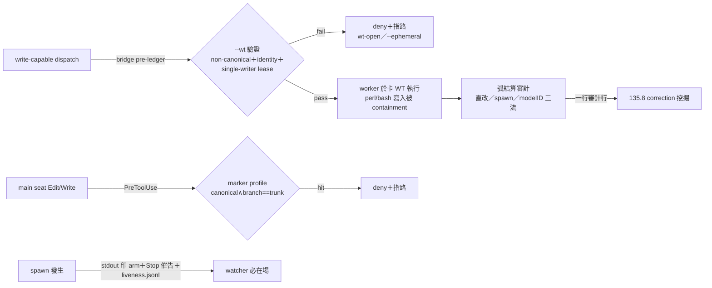

## Description

<!-- SECTION:DESCRIPTION:BEGIN -->
**這卡解什麼**：sess_48806a82（southchariot）實證 19 類流程違規——canonical main 直改源碼二犯、spawn worker 直寫共享主樹互覆、紅閘 commit 進 main、split-brain 雙樹、watcher 忘掛兩犯——而規範（user-level AGENTS.md）全 repo 部署、機械閘卻只有 ai-guide 有。本卡把 AIR-135 規範的**行動面**機械化：閘只卡「寫入座標＋分支＋身份」的封閉 predicate，意圖／授權／語義歸屬一律退 LLM 流程＋135.8 事後挖掘。

**這卡定什麼**（MVP，hook 面＋bridge 面同弧並行）：①guard 泛化——`marshal_admission_guard.py` self-gate 換 per-repo marker 判定＋branch 級 invariant（canonical∧branch==trunk 才擋；wt 級留 ai-guide 現行）＋marker profile schema ②bridge 面——`--wt` 必帶＋live git facts 驗證（non-canonical、branch/identity 一致）＋single-writer-per-WT lease＋card-match ③watcher 配對——bridge stdout 印 arm 命令＋Stop 配對催告（budget 2 fail-open 只報新增未配對）＋waiter 機器登記腿（liveness.jsonl）＋work-order `watcher:` 必填欄 ④弧結算審計——源碼直改／spawn（雙源：gate jsonl ∪ bridge ledger）／modelID 分佈三流一行審計，進 135.8 挖掘 ⑤收編指令——一命令完成 hooksPath＋marker＋profile；日頻 sweep 增列未收編 repo。

**不做什麼**（scope exclusion）：session==worktree、per-session 自動建 WT、bridge 當 WT lifecycle owner、generic Bash mutation parser（perl 前卡 NO-GO——workspace containment 結構解＋樹級 tripwire stretch）、全命令監控、intent 語義閘、從聊天內容推 commit 授權、pure docs／hotfix 全域白名單、pre-commit 當第一防線、wt-identity.json 當 credential、fs watcher 常駐。

〔已決策勿重辯〕①三分歧定案：hook＋bridge 同弧並行／marker opt-in＋零摩擦收編＋sweep 未收編可見面／perl 前卡 NO-GO ②deny 三段式（擋什麼／為什麼／可 copy-paste 恢復命令）；無 bypass env，break-glass＝human 停 registration；hotfix 走 `--ephemeral` 不白名單 ③bridge `--wt`＝翻 DW-10「不驗證 worktree」邊界決策（驗證≠建立），bridge repo 實作走其既有流程、本卡擁契約面 ④waiter frozen spec 增機器登記腿＝AIR-146 amendment ⑤rollout：新閘 warn-first 一弧量誤擋率再轉 deny；bridge grace 期一弧 ⑥ZCode hook 事實：Edit/Write 不觸發 subagent 寫入（spawn 面只 bridge 可卡）；background gate audit log 硬編碼 ai-guide 路徑為既有 bug、泛化時改分 repo ⑦Q7 誤報豁免：≤2 檔合法／卡檔 journal 不算／fallback-attach 豁免／agent-id 歸因。溯源：tri job-mub8ygl7/mub8ygml/mub8ygxk＋Q7Q8 續問 job-mub9l0kf/mub9l0lw/mub9l0wu；收斂＝`.agent-tmp/air-135-disc/enforcement-digest.md`＋違規實證 `violations-digest.md`。開工時依 card Planning Contract 補 AC/Plan；probe-first 清單（modelID 進 log？／PostToolUse Bash matcher）見 digest。
<!-- SECTION:DESCRIPTION:END -->
