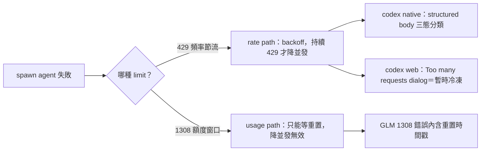

## Description

<!-- SECTION:DESCRIPTION:BEGIN -->
spawn agent 撞到限制時，有兩種性質相反的失敗：**rate limit**（請求頻率被打回——backoff／降並發就能解）和 **usage limit**（訂閱額度窗口耗盡——只能等重置）。現行 model-routing skill 的失敗態表隱含這個差異，但沒有概念層的分流條文，誤判會白等或白撞。

**做什麼**：在 model-routing skill「spawn 失敗態辨識」表格前加一條概念分流 blockquote，含三家對應（GLM 1308/429 兩碼分流、codex native 429 structured body 分類、codex web 冷凍 dialog＝retryable rate signal）；順手對齊 1302 行的 rate 用語。

**不做什麼**：不重刻窗口數字（正典＝「窗口語義」節）、不改 429 處置正典（agent-workflow）、不動 memory-audit／audit-test 的既有鬆散用語（記為後續收斂候選）。

**狀態**：bi 審查（codex＋muse）已 PASS-with-fixes、修正全數採納；spine glossary 快查投影已先行落地（記憶層，repo 外）。

<!-- SECTION:DESCRIPTION:END -->
