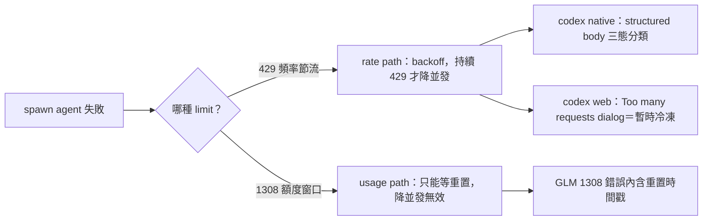

## Description

<!-- SECTION:DESCRIPTION:BEGIN -->
spawn agent 撞到限制時，有兩種性質相反的失敗：**rate limit**（請求頻率被打回——backoff／降並發就能解）和 **usage limit**（訂閱額度窗口耗盡——只能等重置）。現行 model-routing skill 的失敗態表隱含這個差異，但沒有概念層的分流條文，誤判會白等或白撞。

**做什麼**：在 model-routing skill「spawn 失敗態辨識」表格前加一條概念分流 blockquote，含三家對應（GLM 1308/429 兩碼分流、codex native 429 structured body 分類、codex web 冷凍 dialog＝retryable rate signal）；順手對齊 1302 行的 rate 用語。

**不做什麼**：不重刻窗口數字（正典＝「窗口語義」節）、不改 429 處置正典（agent-workflow）、不動 memory-audit／audit-test 的既有鬆散用語（記為後續收斂候選）。

**狀態**：bi 審查（codex＋muse）已 PASS-with-fixes、修正全數採納；spine glossary 快查投影已先行落地（記憶層，repo 外）。

<!-- SECTION:DESCRIPTION:END -->

## Acceptance Criteria
<!-- AC:BEGIN -->
- [ ] #1 AC#1：SKILL.md spawn 失敗態辨識節表格前存在概念分流 blockquote，含 rate/usage 定義、GLM 兩碼分流、codex native 三態、web dialog 訊號、窗口數字正典句（rg 可驗）
AC#2：1302 機制欄用語與新概念定義對齊，無寬鬆「rate limit」混用殘留
AC#3：rg 掃「1308|rate limit」於 rules/ skills/ 引用面，無與新條文矛盾的未處置命中
AC#4：新條文內零窗口/週期數字（數字只在窗口語義節），外部錨為 file+symbol 形態
<!-- AC:END -->

## Implementation Plan

<!-- SECTION:PLAN:BEGIN -->
〔baseline：ai-guide f9f1430c〕
〔已決策勿重辯：①bi 審查（codex job-mubue0pp-2ibiy2＋muse job-mubuefzk-pj2g0r，2026-09-22）兩腿 PASS-with-fixes，findings 收斂全採——native 429 寫三態（usage_limit_reached／quota 額度面／其餘 retryable）非二分；雙窗口降為 optional metadata 非分類 oracle；rate 定義＝request-frequency/throughput throttling（並發是 spawn 持續 429 的降級手段非定義）；GLM 429↔1308 寫法刪除改「兩碼分流禁互換」；web 池只講 dialog＝retryable rate signal，池級無 usage 硬閘宣稱歸 entitlements 實證鏈；錨用 file+symbol 不用行號；刪「數分鐘即解」②決策：不補 429 表行（429 處置正典＝agent-workflow，blockquote pointer 即可，補行＝第二真相源）③決策：agent-workflow 端本次不加指針（既有 L222 處置語義與新條文互補無衝突）④落點＝表格前 blockquote（兩腿一致）⑤glossary 快查投影已先行落地（記憶層 repo 外，隨本卡條文對齊修正）〕
範圍：skills/model-routing/SKILL.md「### spawn 失敗態辨識」節——表格前新增概念分流 blockquote＋1302 機制欄用語對齊；僅此檔此節。F9/F10（memory-audit L51、audit-test L480/487 鬆散用語）記卡 notes 為後續收斂候選，不入本卡範圍。
<!-- SECTION:PLAN:END -->

## Implementation Notes

<!-- SECTION:NOTES:BEGIN -->
〔落地記錄 2026-09-22〕bi 審查收斂（codex job-mubue0pp-2ibiy2／muse job-mubuefzk-pj2g0r 兩腿 PASS-with-fixes，findings 互證全採）→ 實作於 card WT（blockquote＋1302 用語對齊）。回執四欄：classification=boundary（instruction 條文語義——spawn 失敗處置判讀面）；review=bi external（兩腿 external second-opinion 腿）＋機驗（AC#1-4 rg 全綠；rg "1308|rate limit" rules/ skills/ 掃描零未處置矛盾——agent-workflow L222 互補、model-routing L67/127 一致）；session-freshness=fresh（user 即時澄清＋當日源碼查證，governing rules 無中途變更）；deployment-surfaces=pending（diff 在 card WT，merge main 後 symlink 面［~/.agents/skills／~/.claude/skills］即生效；非 Claude 端 skills 走同一 symlink 母鏈）。跟進候選（不入本卡範圍）：memory-audit L51「usage limit/429 合流 fallback」、audit-test L480/487/588「rate limit」寬鬆用語——後續收斂卡候選。glossary 投影已隨 findings 對齊修正（429 正典歸屬 agent-workflow、web 池級宣稱收窄歸 entitlements、三態描述、錨改 file+symbol）。
<!-- SECTION:NOTES:END -->
