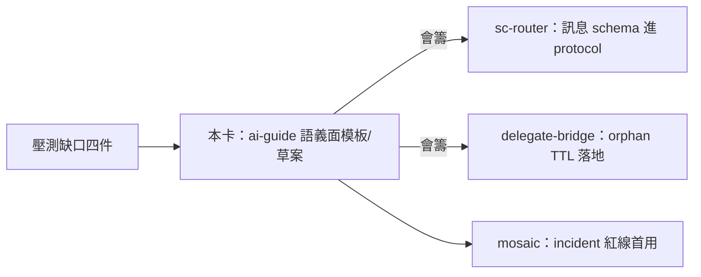
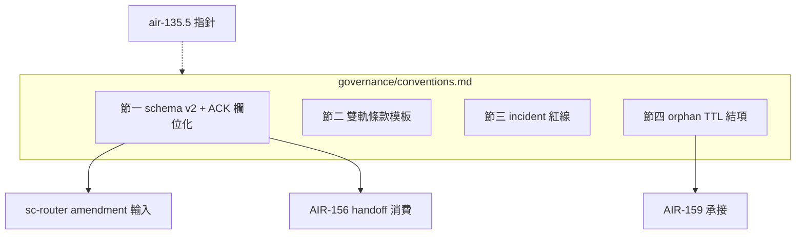

## Description

<!-- SECTION:DESCRIPTION:BEGIN -->
**這卡解什麼**：repo sovereignty（P）壓測（tri 14+13 場景）發現的機制缺口中，歸 ai-guide 語義政策面的四件慣例交付——不是新系統，是幾頁模板／欄位定義，讓跨 repo 協作的模式有標準格式。**定什麼**：①scbus 訊息欄位慣例草案（cross-repo-bug/fix-ready/verify-pass/breaking-intent 的必填欄位；semantic ACK 四態 accepted/declined/needs-info/completed——送 sc-router 會籌後進 protocol）②contract 雙軌期條款模板（並存期／migrated 回執／逾期處置）③incident 預授權紅線清單模板（可碰/禁碰/provisional 標記）④orphan WT TTL 建議值（給 bridge）。**不做什麼**：新命令、新 bus 類型、cross-repo editor、全域 dep graph。**P 總則**（同日 tri 定案，已入 guide＋135.5）：跨 repo 寫入僅限對方主權隔離面＋授權面；mutation 歸 repo 主權、acceptance 歸 consumer；無小改例外。

〔已決策勿重辯〕P 主權前提＋精煉四句＋一句話核心（0922 tri＋14 場景壓測定案，已入 guide e8e89061/997a6813＋135.5 e2adafd1）；semantic ACK 四態；不開卡清單（cross-repo editor/shared WT/全域 dep graph/dispute service/bridge courier）。溯源：sovereignty tri job-mubv2py8/mubv2pzq＋壓測 job-mubvb722/mubvb73k；brief＝.agent-tmp/air-135-disc/sovereignty-scenarios-brief.md。開工時依 card Planning Contract 補 AC/Plan。
<!-- SECTION:DESCRIPTION:END -->

## Acceptance Criteria
<!-- AC:BEGIN -->
- [ ] #1 governance/conventions.md 存在且四節齊（rg 節標題機械可查）
- [ ] #2 訊息 schema v1：每欄位標必填/選填＋語義，一欄一義；SC 三案例各有對應條款（rg 可查）；四態與 proto §5.7 對照表在場
- [ ] #3 雙軌條款模板含並存期/migrated 回執/逾期處置三段
- [ ] #4 incident 紅線模板含可碰/禁碰/provisional 三分類判準
- [ ] #5 orphan TTL ④盤點有 DB-21 消化狀態記錄（結項或待辦擇一）
- [ ] #6 SC needs-info 到後 schema 修 v2 並留 v1→v2 對照註記（SC 回覆前本項開放）
- [ ] #7 135.5 notes 有指針；uv run pytest 全套零退化
<!-- AC:END -->

## Implementation Plan

<!-- SECTION:PLAN:BEGIN -->
〔Baseline〕卡 desc 四交付物定義（訊息 schema 草案/雙軌條款模板/incident 紅線模板/orphan TTL 建議）；135.5 卡（P 總則已入 e2adafd1）＋其 notes 的 sent-record 八欄慣例（target/source/expected response type/correlation/expiry）；scbus protocol v1.4 §5.7 四態 receipt；SC 三第一手案例（要席回執 a89db751，已入卡 notes）。

〔已決策勿重辯〕①P 主權精煉四句＋一句話核心（0922 tri＋14 場景壓測定案，已入 guide＋135.5 e2adafd1）②semantic ACK 四態 accepted/declined/needs-info/completed（會籌 f99a1810 通過）③SC 三案例吸收義務（禁一欄多義/receipt 帶 evidence 指向/§5.7 對齊審）④不開卡清單：cross-repo editor/shared WT/全域 dep graph/dispute service/bridge courier⑤landing＝governance/conventions.md 單檔四節＋135.5 加指針。

〔Scope〕動——governance/conventions.md（新檔）；backlog/tasks/air-135.5 卡 notes（指針）。不動——scbus protocol 本體（草案是給 SC 的輸入）、guide/rules、AIR-159 卡、bridge repo。

〔Scenarios〕①新跨 repo 協作啟動→照 conventions 套條款模板②訊息發送→schema 欄位全填＋semantic ACK 回覆鏈③contract 雙軌期→並存期/migrated 回執/逾期處置④incident→可碰/禁碰/provisional 判準套用⑤orphan TTL→DB-21 已消化則結項（待 SC 回覆確認）。

〔Integration〕下游＝sc-router protocol amendment（SC 消費 schema）、AIR-156 handoff（envelope/consent 消費 schema）、AIR-159（TTL 值）；135.5 指針。

〔驗證式〕見 AC。
<!-- SECTION:PLAN:END -->

## Implementation Notes

<!-- SECTION:NOTES:BEGIN -->
採用 checklist 候選（0922 教訓）：其他 repo 採用 improvement-discovery 時必帶——①腳本複製或共用安裝形決策②.gitignore 同步加 KPI 檔（漏了=wt-close 撞牆重演，ai-guide 本家已犯一次）③guard 收編（enroll_repo.py）④KPI 檔 per-repo 各自累積非全域。

0922 會籌回執（sess_045d1313，scbus correlation 接 76b726bb）：P 主權包無異議通過。三備查：①訊息欄位慣例開卡時 SC 側要一席——WANT/DONE＋mosaic authority-aware 文案教訓＝semantic ACK 第一手消費案例，開卡時邀 SC 提欄位需求②zcode drain probe 併 SC-196（SC-189 drawer 穩定後執行）確認③複合鍵 identity 與 open_session 凍結形一致，無待辦。

0922 要席回執（sess_f984550b，message a89db751，semantic ACK＝accept）：開卡通知到時 SC 回覆類型預期＝needs-info（附欄位需求清單）。三個第一手消費案例供草案吸收——①WANT/DONE 欄位語義：SC kanban 欄位分工（desc 人話現況/AC 驗收/Notes append 流水）與 scbus 四態 receipt 的映射須明確，禁一欄多義②mosaic authority-aware 文案教訓：訊息文案禁斷言權威，receipt 語句帶 evidence 指向而非結論③proto §5.7 四態（queued/delivered/read/acted?）與草案 accepted/declined/needs-info/completed 對齊審——queue_next_turn 實測經驗（recv 前後語義、冪等重收）可輸入。

0922 開工：開卡通知已送 SC（command_id f29aa834）——schema v1 我側先產，SC needs-info 回覆後修 v2；orphan TTL ④若 SC 確認 DB-21 已消化即結項。
<!-- SECTION:NOTES:END -->

## Final Summary

<!-- SECTION:FINAL_SUMMARY:BEGIN -->
cross-repo 協作慣例包落地：governance/conventions.md 四節（訊息 schema v2 吸收 SC needs-info 五條＋雙軌條款模板＋incident 紅線三分類＋orphan TTL 結項指針）。settlement fresh reviewer：F1 四態用語歸屬改正／F2 ACK 附加欄位定義補齊／F4 佔位符統一——均修；F3（AIR-159 對齊）已由卡 notes 兜底。附帶產出：proto §5.7 術語漂移列為 sc-router amendment 輸入。pytest 1332 綠零退化。

<!-- SECTION:FINAL_SUMMARY:END -->
