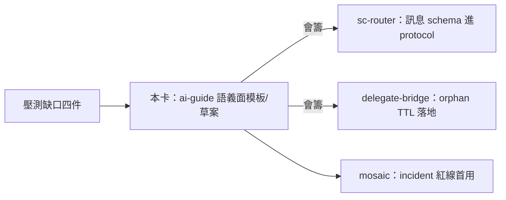

## Description

<!-- SECTION:DESCRIPTION:BEGIN -->
**這卡解什麼**：repo sovereignty（P）壓測（tri 14+13 場景）發現的機制缺口中，歸 ai-guide 語義政策面的四件慣例交付——不是新系統，是幾頁模板／欄位定義，讓跨 repo 協作的模式有標準格式。**定什麼**：①scbus 訊息欄位慣例草案（cross-repo-bug/fix-ready/verify-pass/breaking-intent 的必填欄位；semantic ACK 四態 accepted/declined/needs-info/completed——送 sc-router 會籌後進 protocol）②contract 雙軌期條款模板（並存期／migrated 回執／逾期處置）③incident 預授權紅線清單模板（可碰/禁碰/provisional 標記）④orphan WT TTL 建議值（給 bridge）。**不做什麼**：新命令、新 bus 類型、cross-repo editor、全域 dep graph。**P 總則**（同日 tri 定案，已入 guide＋135.5）：跨 repo 寫入僅限對方主權隔離面＋授權面；mutation 歸 repo 主權、acceptance 歸 consumer；無小改例外。

〔已決策勿重辯〕P 主權前提＋精煉四句＋一句話核心（0922 tri＋14 場景壓測定案，已入 guide e8e89061/997a6813＋135.5 e2adafd1）；semantic ACK 四態；不開卡清單（cross-repo editor/shared WT/全域 dep graph/dispute service/bridge courier）。溯源：sovereignty tri job-mubv2py8/mubv2pzq＋壓測 job-mubvb722/mubvb73k；brief＝.agent-tmp/air-135-disc/sovereignty-scenarios-brief.md。開工時依 card Planning Contract 補 AC/Plan。
<!-- SECTION:DESCRIPTION:END -->
