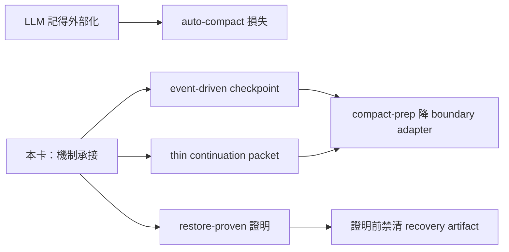

## Description

<!-- SECTION:DESCRIPTION:BEGIN -->
**這卡解什麼**：compact-prep 現況靠 LLM「記得外部化」＋compact 後靠 user 提醒 AI 讀檔——零機械觸發、零恢復證明（auto-compact 發生在外部化之前＝直接損失，實證多次）。本卡把壓縮前後的機制面交給機制：checkpoint event-driven 化、compact 時只 materialize thin continuation packet（引用 canonical state）、restore 有 restore-proven 證明、restore 證明前禁清 recovery artifact；compact-prep skill 降成 boundary adapter。

**不做什麼**：外部化內容取捨自動化（判斷面＝LLM 職權）、自製 compactor、continuation packet 成第二 workflow truth、per-turn Stop-hook 催告進正典（tri 裁決：至多有期探針）。

**開工硬 gate**：ZCode compact hook 有「0824 實測不觸發 vs 新 hooks 文檔寫支援」drift——minimal live acceptance 先行；若 compact 事件不可觀測，event-driven 的退化形態（periodic／手動／誠實 unsupported）須預寫，不能預設事件存在。

〔已決策勿重辯〕tri 五裁決點之 5：135.6 event-driven checkpoint＋thin packet＋restore-proven 為正典；Stop-hook per-turn 催告不進正典；ZCode compact hook live acceptance＝開工前硬 gate；降級形態預寫；參數（grace／閾值）開工時定死。母卡脈絡 air-135.6（其 AC#4/#8 已寫方向）。溯源：codex job-mubyzjvf-q0rb0c＋muse tri job-muc00i2l-o7uv04＋5.3 seat；合併檔 .agent-tmp/air-135-disc/session-skills-marshal-tri-merged.md。開工時依 card Planning Contract 補 AC/Plan。
<!-- SECTION:DESCRIPTION:END -->
