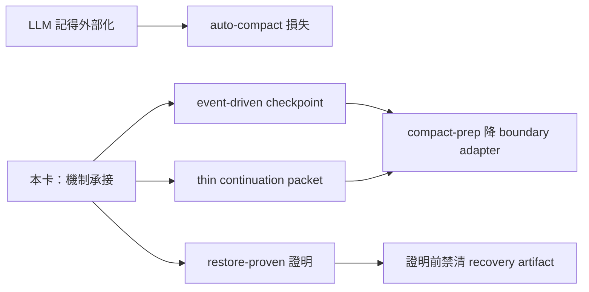

## Description

<!-- SECTION:DESCRIPTION:BEGIN -->
**這卡解什麼**：compact-prep 現況靠 LLM「記得外部化」＋compact 後靠 user 提醒 AI 讀檔——零機械觸發、零恢復證明（auto-compact 發生在外部化之前＝直接損失，實證多次）。本卡把壓縮前後的機制面交給機制：checkpoint event-driven 化、compact 時只 materialize thin continuation packet（引用 canonical state）、restore 有 restore-proven 證明、restore 證明前禁清 recovery artifact；compact-prep skill 降成 boundary adapter。

**不做什麼**：外部化內容取捨自動化（判斷面＝LLM 職權）、自製 compactor、continuation packet 成第二 workflow truth、per-turn Stop-hook 催告進正典（tri 裁決：至多有期探針）。

**開工硬 gate**：ZCode compact hook 有「0824 實測不觸發 vs 新 hooks 文檔寫支援」drift——minimal live acceptance 先行；若 compact 事件不可觀測，event-driven 的退化形態（periodic／手動／誠實 unsupported）須預寫，不能預設事件存在。

〔已決策勿重辯〕tri 五裁決點之 5：135.6 event-driven checkpoint＋thin packet＋restore-proven 為正典；Stop-hook per-turn 催告不進正典；ZCode compact hook live acceptance＝開工前硬 gate；降級形態預寫；參數（grace／閾值）開工時定死。母卡脈絡 air-135.6（其 AC#4/#8 已寫方向）。溯源：codex job-mubyzjvf-q0rb0c＋muse tri job-muc00i2l-o7uv04＋5.3 seat；合併檔 .agent-tmp/air-135-disc/session-skills-marshal-tri-merged.md。開工時依 card Planning Contract 補 AC/Plan。
<!-- SECTION:DESCRIPTION:END -->

## Acceptance Criteria
<!-- AC:BEGIN -->
- [ ] #1 ZCode compact hook live acceptance 探針落地：fixture 產生 marker log，於真實 compact 事件後 marker 檔存在（附 path＋內容行）；或 gate 否決結論（無法觸發＋原因）——兩者擇一有機械證據
- [ ] #2 checkpoint 格式驗證函式＋test：四問可答機械判準，壞檔 fail-loud 有 test
- [ ] #3 restore-proven 判準＋test：restore 驗證通過才發 proven；cleanup 於未 proven 時被擋有 test
- [ ] #4 compact-prep SKILL.md 改版：人肉提醒句（讀 context 檔續任務）移除或降 fallback 標註；rg 檢查指針指向機制面
- [ ] #5 uv run pytest 相關測試全綠＋既有測試零退化
<!-- AC:END -->

## Implementation Plan

<!-- SECTION:PLAN:BEGIN -->
〔Baseline〕skills/compact-prep/SKILL.md L15-19＝現況五步驟全靠 LLM 自律＋user 手動：步驟 1 session 自錨定 SQL、步驟 2 落檔外部化、步驟 4 請 user 手動 /compact＋「明確提醒 user：compact 後開口第一句讓 AI 讀 context 檔」、步驟 5 被提醒後才讀檔；L34 ZCode SessionStart(compact) 2026-08-24 L4 終驗實測不觸發（死路記錄）；CC 側 hooks/compact-tail-inject.py 已註冊（settings.json matcher=compact，2026-08-30 接線，僅 verbatim raw tail 注入）；機制面缺口＝無 event-driven checkpoint、無 restore-proven 證明、recovery artifact 清理無 guard。母卡 air-135.6（AC#4/#8 已寫 event-driven＋thin packet 方向）。

〔已決策勿重辯〕①tri 裁決 5：135.6 event-driven checkpoint＋thin packet＋restore-proven 為正典；per-turn Stop-hook 新鮮度催告不進正典（溯源 .agent-tmp/air-135-disc/session-skills-marshal-tri-merged.md 裁決點 5＋muse job-muc00i2l）②ZCode compact hook live acceptance＝開工硬 gate：0824 舊實測 vs 新 hooks docs（ref-docs/harness/zcode）drift，探針先行程式碼；gate 否決時降級形態（periodic／手動／誠實 unsupported）預寫＋參數定死③判斷面（外部化內容取捨）不自動化＝LLM 職權④thin packet 引用 canonical state、禁成第二 workflow truth（anchor：air-135.6 卡 AC#4/#8）⑤恢復順序單一源＝skills/_common/task-recovery.md（消費不重定義）。

〔Scope〕動——skills/compact-prep/SKILL.md（降 boundary adapter 改版）；新增 scripts/（checkpoint 格式驗證＋restore-proven 判準 helper）；tests/（新增對應測試）；探針 fixture＋註冊 JSON（機器註冊由主 session 執行，worker 產材料）。不動——task-recovery.md 定義、air-135.6 卡面、skills/handoff 與 skills/at（AIR-156/157 範圍）、hooks/compact-tail-inject.py 本體（CC 側已上線，僅必要時參照）。

〔Scenarios〕①正常：compact 前外部化由機制觸發（事件或降級形態），checkpoint 檔產生且四問可答②compact 後 restore：機制先驗 checkpoint 存在＋四問→restore-proven→cleanup 才放行③gate 否決情境：探針證實 compact 不可觀測→預寫降級形態運作（文件化）④checkpoint 檔損壞→fail-loud 禁靜默續行（數據完整性優先）⑤restore 未 proven 時 cleanup 被擋。

〔Integration〕下游＝task-recovery.md 恢復順序（checkpoint 欄位相容）；AIR-156 handoff 的 completion 四段消費 restore-proven 同形概念；觸發面＝SessionStart(compact) hook（gate 通過則 ZCode 接線）＋skill 調用（fallback）；上游客戶＝每個會 compact 的 session。

〔驗證式〕見 AC 欄（機械可判：探針 marker 或否決記錄、驗證函式 test、cleanup 擋行 test、skill 文字 rg 檢查、pytest 全綠）。
<!-- SECTION:PLAN:END -->
