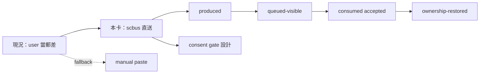

## Description

<!-- SECTION:DESCRIPTION:BEGIN -->
**這卡解什麼**：/handoff 現況＝產 prompt、user 手動貼到目標 session——無送達證明（mosaic/southchariot 收編就是人肉攜帶實證）。本卡讓 handoff 走 scbus 直送：已知 session 第一路＝scbus send（receipt＝queued-visible，不擴 ack protocol）；完成判定分四段（packet-produced→queued-visible→consumed/accepted→ownership-restored），「prompt 產完」不再冒充「對方收到」；manual paste 降為 unavailable fallback。

**要做的新設計——consent gate**：user 親手貼原本是隱式授權載體，直送後 AI 可直達另一 session mailbox——授權面必須重新設計（消費 outward-action-consent：AI 發起逐次授權；跨 ownership envelope 補 consent 欄），不能為機械化拆安全閘。

**不做什麼**：ack protocol amendment（correlated upper-layer reply 先行，多弧實證不足才准重提）、同 repo 預設路徑本輪刪除（方向納入、刪除後置——等 Marshal continuation 路徑 dogfood 後）、新 bus 類型。

〔已決策勿重辯〕tri 裁決 4：同 repo 意圖遷 Marshal 但本輪不斷路；consent gate 必設（muse 缺口 1）；receipt 語義＝queued-visible 非完成（scbus protocol 明文無 ack／user-read 第三態）。溯源同 AIR-155 合併檔。開工時依 card Planning Contract 補 AC/Plan。
<!-- SECTION:DESCRIPTION:END -->

## Acceptance Criteria
<!-- AC:BEGIN -->
- [ ] #1 handoff SKILL delivery 段改 scbus 第一路＋completion 四段（rg 檢查點）
- [ ] #2 consent gate 節對齊 outward-action-consent＋fallback 明文
- [ ] #3 端到端 dogfood：實際直送一個已知 session（scbus 送達證據）——user 授權面
- [ ] #4 全套 pytest 綠
<!-- AC:END -->

## Implementation Plan

<!-- SECTION:PLAN:BEGIN -->
〔Baseline〕①skills/handoff/SKILL.md delivery 印 code block user 手貼、無送達證明②scbus send/recv/watch/pending（proto v1.4）③governance/conventions.md v2（reply_type/in_reply_to/want/card_ref——SC 已 ack 採用）④outward-action-consent 逐次授權⑤身分遷移案例（sess_a0be42f7→sess_d4e213fc）入文件素材。

〔已決策勿重辯〕①scbus send 第一路已知 session②receipt=queued-visible 非完成③completion 四段 packet-produced→queued-visible→consumed/accepted→ownership-restored④consent gate 消費 outward-action-consent⑤manual paste 降 fallback⑥同 repo 預設本輪不斷路⑦不擴 ack protocol。

〔Scope〕動——skills/handoff/SKILL.md（delivery 段＋四段 completion＋consent gate 節）、tests/（可測邏輯）。不動——scbus/SC-router 本體、at/compact-prep、outward-action-consent rule 本體。

〔Scenarios〕①已知 session 直送＋receipt ②未知 session fallback ③跨 ownership consent gate 攔 ④四段狀態追蹤。

〔驗證式〕見 AC。
<!-- SECTION:PLAN:END -->
