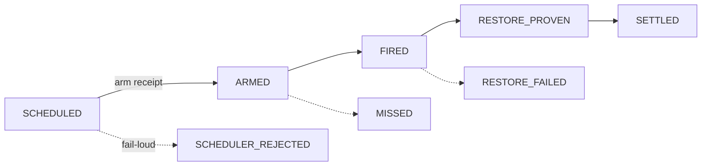

## Description

<!-- SECTION:DESCRIPTION:BEGIN -->
**這卡解什麼**：/at 排程接續現況不可靠——CronCreate 被拒後即興退到背景 sleep（綁 session 存活，session 死＝保險全滅，昨夜三連敗實證）；ticket 只有 identity/pointer 沒有生命週期；「到點了沒做完」靠新 session 讀 prose 判斷；cleanup 用 mtime>7d 會誤刪未到期 ticket。

**改成什麼**：ticket 升狀態機 SCHEDULED→ARMED→FIRED→RESTORE_PROVEN→SETTLED＋SCHEDULER_REJECTED／MISSED／RESTORE_FAILED／CANCELLED；scheduler arm 成功必有 arm receipt、失敗 fail-loud SCHEDULER_REJECTED——禁靜默降級 sleep；fire 後「做完沒」＝機械判準（ticket 狀態＋registry 組合查，非讀 prose）；cleanup 依 resume_at＋state＋grace（淘汰 mtime）；notification adapter 化（say 語音 headless 必敗，降可選）。

**開工必答**：MISSED 的 covering 觸發——overnight blind window 沒有 Marshal entry／SessionStart，誰來掃（host 啟動？launchd？）或誠實標 unsupported window。

**不做什麼**：接續優先序自動化（判斷面）、自造 scheduler primitive（只消費 harness verified adapter，沒有就標 unsupported）。

〔已決策勿重辯〕tri 裁決 2：禁 failure-class collapse（CronCreate 被拒≠session 內 sleep 苟活——兩個 failure domain 不可互為 fallback；替代 adapter 須獨立 failure domain＋經驗證雙條件）；scbus 續接登記定位＝reconcile 路徑非降級；開卡序在 B（air-155）／C（air-156）之後——scheduler capability 是真問題非文檔重寫。溯源同 AIR-155。開工時依 card Planning Contract 補 AC/Plan。
<!-- SECTION:DESCRIPTION:END -->

## Acceptance Criteria
<!-- AC:BEGIN -->
- [ ] #1 ticket state machine helper＋test（五主態四異常合法轉移表）
- [ ] #2 arm fail-loud 語義＋test（SCHEDULER_REJECTED 禁靜默降級）
- [ ] #3 cleanup 依 resume_at＋state＋grace＋test（淘汰 mtime）
- [ ] #4 at SKILL 改版（狀態機＋禁降級＋MISSED 誠實標記——rg 檢查點）
- [ ] #5 全套 pytest 綠
<!-- AC:END -->

## Implementation Plan

<!-- SECTION:PLAN:BEGIN -->
〔Baseline〕①skills/at/SKILL.md（CronCreate＋mtime>7d cleanup）②CronCreate 三連敗→背景 sleep 降級實證③zcode 無 compact 專屬事件——MISSED covering 誠實標 unsupported window＋badge（偵測研究：SessionStart 不能當 covering；zcode scheduled task 為 POC 候選另卡）。

〔已決策勿重辯〕①ticket 狀態機五主態四異常②arm 失敗 fail-loud SCHEDULER_REJECTED 禁靜默降級③cleanup 依 resume_at＋state＋grace 淘汰 mtime④notification adapter 化（say 降可選）⑤不自造 scheduler primitive⑥MISSED 誠實標 unsupported＋badge。

〔Scope〕動——skills/at/SKILL.md、scripts/（ticket state helper）、tests/。不動——bridge、compact-prep/handoff、scheduler 本體。

〔Scenarios〕①arm 成功→ARMED receipt②arm 失敗→SCHEDULER_REJECTED fail-loud③fire→RESTORE_PROVEN→SETTLED④MISSED→誠實標記＋badge⑤cleanup 依 state＋grace。

〔驗證式〕見 AC。
<!-- SECTION:PLAN:END -->
