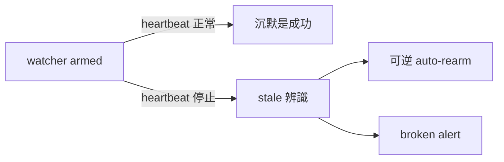

## Description

<!-- SECTION:DESCRIPTION:BEGIN -->
**這卡解什麼**：bridge_waiter（派工監督者）自己無聲死亡無人監督——昨夜實證：arm 成功後 watcher 消失（registry「No task found」），靠鬧鐘補丁才接住。AIR-152 已解「漏掛」（Stop pairing nag＋liveness 登記腿），但「已掛之後的死亡」仍不可見：機器腿只有 armed／collected 兩態，Stop hook 只查「有沒有任何 row」。

**改成什麼**：watcher heartbeat＋stale watcher 辨識＋可逆 auto-rearm／broken alert（pull-only：正常長跑主 session 不醒，死亡才醒）；job stall 與 watcher death 分態（不混一類處置）；本機部署缺口同卡修——watcher_pairing_nag 在治理模板（governance/registrations/zcode.json）有、本機 ~/.zcode/cli/config.json 沒有，即 AIR-152 Stop 催告閘於本機未生效（開工時重跑 installer 修復）。

**不做什麼**：常駐 supervisor daemon（條件式推遲：heartbeat＋event-driven reconcile dogfood 後 blind window 仍不可接受才准）；禁把 agent_liveness_sweep 擴成 AI-session liveness（它是 bridge-job reporter，只標不殺）。

〔已決策勿重辯〕tri：watcher death 與 job stall 分態；supervisor daemon＝條件式推遲非永久禁（重啟觸發＝dogfood 後 blind window 仍不可接受）；agent_liveness_sweep 邊界禁令。歸 air-135.7 脈絡（dispatch⇄collection pairing 契約的監督閉環）。溯源同 AIR-155。開工時依 card Planning Contract 補 AC/Plan。
<!-- SECTION:DESCRIPTION:END -->
