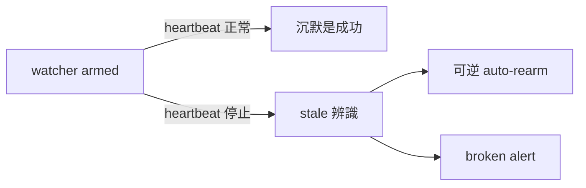

## Description

<!-- SECTION:DESCRIPTION:BEGIN -->
**這卡解什麼**：bridge_waiter（派工監督者）自己無聲死亡無人監督——昨夜實證：arm 成功後 watcher 消失（registry「No task found」），靠鬧鐘補丁才接住。AIR-152 已解「漏掛」（Stop pairing nag＋liveness 登記腿），但「已掛之後的死亡」仍不可見：機器腿只有 armed／collected 兩態，Stop hook 只查「有沒有任何 row」。

**改成什麼**：watcher heartbeat＋stale watcher 辨識＋可逆 auto-rearm／broken alert（pull-only：正常長跑主 session 不醒，死亡才醒）；job stall 與 watcher death 分態（不混一類處置）；本機部署缺口同卡修——watcher_pairing_nag 在治理模板（governance/registrations/zcode.json）有、本機 ~/.zcode/cli/config.json 沒有，即 AIR-152 Stop 催告閘於本機未生效（開工時重跑 installer 修復）。

**不做什麼**：常駐 supervisor daemon（條件式推遲：heartbeat＋event-driven reconcile dogfood 後 blind window 仍不可接受才准）；禁把 agent_liveness_sweep 擴成 AI-session liveness（它是 bridge-job reporter，只標不殺）。

〔已決策勿重辯〕tri：watcher death 與 job stall 分態；supervisor daemon＝條件式推遲非永久禁（重啟觸發＝dogfood 後 blind window 仍不可接受）；agent_liveness_sweep 邊界禁令。歸 air-135.7 脈絡（dispatch⇄collection pairing 契約的監督閉環）。溯源同 AIR-155。開工時依 card Planning Contract 補 AC/Plan。
<!-- SECTION:DESCRIPTION:END -->

## Acceptance Criteria
<!-- AC:BEGIN -->
- [ ] #1 heartbeat 腿：watcher 運行中週期 append heartbeat 事件——test 驗格式＋append＋損壞容錯
- [ ] #2 stale 判準函式＋test：heartbeat 落後閾值（常數寫死＋dogfood 複核點註記）判 stale
- [ ] #3 分態：watcher death 與 job stall（STALLED_ADVISORY）互斥可判，test 覆蓋
- [ ] #4 broken alert＋單次 auto-rearm：死亡產生可見訊號，re-arm 至多一次，test 覆蓋、無無限迴圈
- [ ] #5 frozen spec 不破壞：T1-T8 語義與 exit 契約零變——test_bridge_waiter.py＋test_bridge_dispatch_watcher_doctrine.py＋test_watcher_liveness.py 全綠
<!-- AC:END -->

## Implementation Plan

<!-- SECTION:PLAN:BEGIN -->
〔Baseline〕scripts/bridge_waiter.py L624-640 _liveness_append（AIR-152 amendment 登記腿：僅 armed／collected 兩事件，append-only 損壞容錯）；L1093 main()；docstring L17-40 frozen spec 狀態機 T1-T8（RUNNING_FRESH／STALLED_ADVISORY／TERMINAL／UNKNOWN_RECONCILE，exit 0/1/2/124/3 契約）；hooks/watcher_pairing_nag.py L76-95 _liveness_has（Stop 催告只查 row 存在與否，不查新鮮度）。缺口＝watcher 自身死亡（arm 後進程消失）靜默：liveness 台帳停在 armed 態無人察覺，0922 夜實證（registry「No task found」靠鬧鐘補丁接住）。

〔已決策勿重辯〕①watcher death 與 job stall 分態、互不誤報（tri-merged 檔裁決）②heartbeat 為 append-only 附加腿——T1-T8 狀態機 frozen spec 主體與 exit 契約零變，本卡即 liveness 腿 amendment 載體（前例：AIR-152 同形態 amendment）③禁常駐 supervisor daemon——條件式推遲（heartbeat＋event-driven reconcile dogfood 後 blind window 仍不可接受才准，重啟觸發寫明）④禁把 agent_liveness_sweep 擴成 AI-session liveness（bridge-job reporter、只標不殺）⑤auto-rearm 可逆單次、禁無限迴圈⑥stale 閾值常數寫死＋註明 dogfood 複核點。

〔Scope〕動——scripts/bridge_waiter.py（heartbeat append 腿＋stale 判準＋broken alert／單次 re-arm）；hooks/watcher_pairing_nag.py（催告語義升級：arm 後 heartbeat 停滯也觸發）；tests/（新增 heartbeat/stale/分態測試）。不動——scripts/agent_liveness_sweep.py（禁令④）、delegate-bridge repo、frozen spec 狀態機主體、liveness.jsonl 既有 armed/collected 行格式（向下相容）。

〔Scenarios〕①正常：watcher 運行中週期 heartbeat append（pull-only——主 session 沉默）②watcher 死亡：heartbeat 停滯→stale 判準命中→broken alert 可見③單次 auto-rearm：re-arm 一次後再死→只報警不再重掛④liveness.jsonl 損壞行跳過（既有容錯語義延伸）⑤job stall（既有 STALLED_ADVISORY）與 watcher death 事件分離、互不誤報。

〔Integration〕下游消費者＝hooks/watcher_pairing_nag.py（催告讀 heartbeat 新鮮度）、bridge_waiter re-arm 邏輯、AIR-135.7 dispatch⇄collection 契約；liveness.jsonl schema 延伸向下相容（舊行消費者＝nag ＋ sweep 不破壞）。

〔驗證式〕見 AC 欄（機械可判：heartbeat 格式 test、stale 判準 test、分態互斥 test、單次 re-arm test、frozen spec doctrine tests 全綠）。
<!-- SECTION:PLAN:END -->

## Implementation Notes

<!-- SECTION:NOTES:BEGIN -->
0922 部署缺口已提前修復（user 授權「跑吧」）：governance installer --surface hooks 補上 Stop/watcher_pairing_nag 註冊——本地 config grep 0→1、check drift 4→3（缺條目項消除）、mcp/plugins 區塊完整。ZCode 重開 session 生效。殘餘三筆 pre-existing drift 未動（installer 明言不自動處置）：①~/.claude/settings.json 應為 symlink 實為普通檔（user 處置）②cc＋zcode 兩面 block-memory-index-write.py 存在非模板 group 重複條目（無害雙跑；修法＝手工移除或 uninstall+reinstall）——本卡開工時併入盤點。

0922 續：三筆歷史 drift 全數清償（雙 carrier 分析收斂後 user 授權處置）——①zcode standalone 重複 group 手術移除（備份 config.json.bak-20260922-102412）②cc 同款去重③cc settings.json symlink 修復：repo settings.json（gitignored machine-local，bootstrap G1）確立為 backing store，live 去重後收斂寫回 repo、home 換回 symlink。installer check＝五面 parity 綠。scbus session-start/session-end hooks 保留（合法機器狀態）。分歧記錄：muse 主張修 manifest target_is_symlink=false，codex 以 repo settings.json 存在翻案成立——muse 前提來自工單內聯錯誤事實（fd 遵守 .gitignore 漏掃，AIR-140 盲點重犯）。**殘餘 recurrence gate：下次 CC session 實際寫 settings 後再驗 test -L；若再斷＝CC writer 與 symlink 拓撲不相容的 runtime 證據，開 full-tier migration 卡（禁重建迴圈）**——此 gate 屬本卡開工盤點項。備份：.agent-tmp/backups/＋~/.claude/、~/.zcode/cli/ 各有 .bak。
<!-- SECTION:NOTES:END -->
