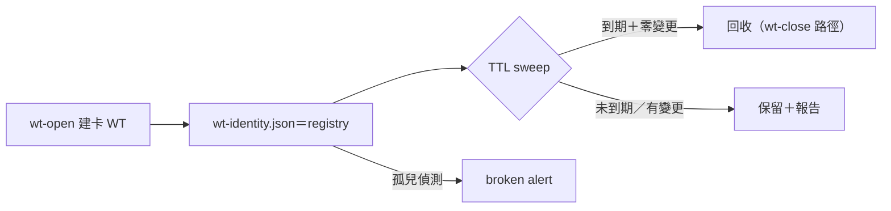
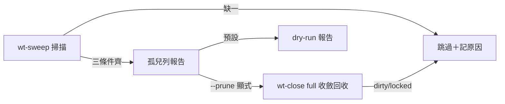

## Description

<!-- SECTION:DESCRIPTION:BEGIN -->
**這卡解什麼**：橋面線 DB-21（orphan WT 回收）owner 裁決（user 0922；sess_df8fea27 回執 message f437177d）：回收機制歸 ai-guide——WT lifecycle 本就 ai-guide 側 wt-open/wt-close 持有，bridge 端 DB-18 只做 spawn-time 驗證、不做回收。bridge 側將交付邊界評估文件＋ai-guide 機制規格提案（提案方向：wt-identity.json 即 registry、TTL sweep 掛 wt-close/Settle 或獨立 gc script；文件落 delegate-bridge repo 00-tasks/.../spawn-observability/）。本卡＝ai-guide 側承接：依提案定作法，實作 orphan WT 的 TTL sweep／回收。

**不做什麼**：bridge 端 gc 實作（對端明言不做）；改寫 wt-open/wt-close 既有 transaction 語義（只擴充回收腿）；跨 repo canonical 寫入（回收動作限本 repo WT）。

**開工前置（依賴）**：bridge 側評估文件＋規格提案送達——提案未到前本卡不派工。

〔已決策勿重辯〕owner 裁決＝user 0922（bridge 線 DB-21）；wt-identity.json 為 registry 錨點（bridge 提案方向，隨評估文件確認）；orphan TTL 建議值來源＝AIR-154 慣例包；回收走既有 wt-close 路徑擴充、禁另起爐灶。開工時依 card Planning Contract 補 AC/Plan。
<!-- SECTION:DESCRIPTION:END -->

## Acceptance Criteria
<!-- AC:BEGIN -->
- [ ] #1 孤兒偵測＋test：identity contract 存在＋dispatcher session 死＋TTL 逾三條件齊才列孤兒；缺一排除
- [ ] #2 回收安全：dry-run 預設；prune 僅限零未 commit 變更＋branch 可刪之 WT——test 覆蓋 prune 與拒 prune 兩面
- [ ] #3 wt-open/wt-close 既有行為零變（既有測試全綠）
- [ ] #4 全套 pytest 綠
- [ ] #5 bridge PASSIVE report 消費面：本輪明文 report-only 無 bridge 依賴（評估文件 §3 對齊聲明在場）
<!-- AC:END -->

## Implementation Plan

<!-- SECTION:PLAN:BEGIN -->
〔Baseline〕①scripts/wt-open.sh：identity contract 記載（enumeration by git worktree list 非 identity 檔——檔案為驗證材料）②scripts/wt-close.sh：拒無 identity contract 的 WT（manual git worktree remove 範疇）③bridge 評估文件 wt-reaper-evaluation.md（179 行，commit 859ea7b——§1 Form H vs Form B、§2 邊界、§3 建議 bridge PASSIVE gc report-only、§4 實作形狀）④DB-21 裁決：主動回收歸 ai-guide。

〔已決策勿重辯〕①主動回收＝ai-guide 側（DB-21 裁決）②bridge 側僅 PASSIVE report-only（不碰 dispatcher 建 WT；評估建議採納）③孤兒定義從嚴三條件：identity contract 存在＋dispatcher session 死＋TTL 逾——缺一非孤兒④report-first（dry-run 預設）⑤prune 限可證無損 removals（零未 commit 變更＋branch 可刪）⑥不做 daemon⑦溯源：bridge 評估文件＋DB-21＋AIR-159 卡 notes 對齊記錄。

〔Scope〕動——scripts/（新孤兒偵測＋TTL sweep：wt-sweep 或 wt-close 擴充入口）、tests/。不動——wt-open/wt-close 既有語義（擴充非重寫）、bridge repo、governance installer、liveness 台帳。

〔Scenarios〕①正常卡 WT（dispatcher 活）→掃描跳過②孤兒（contract 在＋dispatcher 死＋TTL 逾）→報告→安全回收（prune 條件滿足）③identity contract 缺→非本機制範疇（manual git worktree remove）④dry-run 預設只報告不動手。

〔驗證式〕見 AC。
<!-- SECTION:PLAN:END -->

## Implementation Notes

<!-- SECTION:NOTES:BEGIN -->
0922 對齊（154 worker 指認的殘留張力）：本卡依賴的 TTL 建議值來源＝**bridge 側評估文件＋規格提案**（開工前置，原 desc 已載）；AIR-154 慣例包節四僅記結項指針、不承載建議值——desc 中「orphan TTL 建議值來源＝AIR-154 慣例包」一句以本 note 為準修正讀法。

0922 settlement TTL 裁決（marshal judge）：預設 72h 維持——lossless 閘（dirty 樹永不回收＋prune 顯式旗標）已保護內容，72h vs bridge 評估建議 168h 的差異＝打擾面取捨非資料風險；dogfood 複核點已註記於 wt-sweep.py 常數。F5（gitdir 損壞炸整趟掃描）＝已知行為記錄（fail-loud 安全方向，降級建議留後續）。
<!-- SECTION:NOTES:END -->

## Final Summary

<!-- SECTION:FINAL_SUMMARY:BEGIN -->
orphan card WT TTL sweep 落地：scripts/wt-sweep.py（孤兒三條件：identity contract 自洽＋活動面靜默代理 session 死＋TTL 72h；dry-run 預設兩形報告；--prune 顯式走 wt-close full，可證無搘閘：dirty/unmerged/locked/self-cwd 排除；wt-close subprocess 複用不重 implement）。27 tests＋wt-open/close 零變＋全套 1523 綠＋L4 真跑（含 prune 收斂 receipt 機驗）。settlement fresh reviewer：代碼 pass；F1 交付進版控（本結案含）＋F2 卡面契約（main 已 commit，reviewer 讀到 WT 過時副本）＋F3 TTL 72h 裁決出處回寫本 notes；F5/F6/F7 nit 記錄（gitdir 損壞 fail-loud 已知行為、兩條負向測試、naive timestamp）留 polish。bridge 側 PASSIVE gc report 消費面依評估文件 §3 對齊（本輪 report-only 無 bridge 依賴）。

<!-- SECTION:FINAL_SUMMARY:END -->
