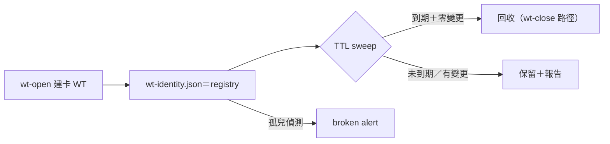

## Description

<!-- SECTION:DESCRIPTION:BEGIN -->
**這卡解什麼**：橋面線 DB-21（orphan WT 回收）owner 裁決（user 0922；sess_df8fea27 回執 message f437177d）：回收機制歸 ai-guide——WT lifecycle 本就 ai-guide 側 wt-open/wt-close 持有，bridge 端 DB-18 只做 spawn-time 驗證、不做回收。bridge 側將交付邊界評估文件＋ai-guide 機制規格提案（提案方向：wt-identity.json 即 registry、TTL sweep 掛 wt-close/Settle 或獨立 gc script；文件落 delegate-bridge repo 00-tasks/.../spawn-observability/）。本卡＝ai-guide 側承接：依提案定作法，實作 orphan WT 的 TTL sweep／回收。

**不做什麼**：bridge 端 gc 實作（對端明言不做）；改寫 wt-open/wt-close 既有 transaction 語義（只擴充回收腿）；跨 repo canonical 寫入（回收動作限本 repo WT）。

**開工前置（依賴）**：bridge 側評估文件＋規格提案送達——提案未到前本卡不派工。

〔已決策勿重辯〕owner 裁決＝user 0922（bridge 線 DB-21）；wt-identity.json 為 registry 錨點（bridge 提案方向，隨評估文件確認）；orphan TTL 建議值來源＝AIR-154 慣例包；回收走既有 wt-close 路徑擴充、禁另起爐灶。開工時依 card Planning Contract 補 AC/Plan。
<!-- SECTION:DESCRIPTION:END -->
