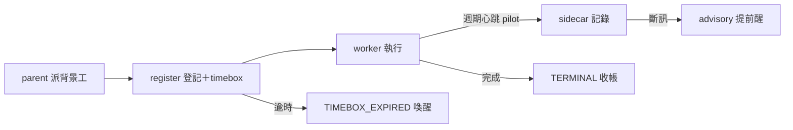

## Description

<!-- SECTION:DESCRIPTION:BEGIN -->
**這卡解什麼**：這兩天三起「派出去的 worker 無聲死亡」（bridge watcher 昨晚、SC-197 原 worker 靜默 2h10m、copy 研究員 143 分）共用同一個缺口——**派工之後沒有登記、沒有逾時、沒有人負責收帳**，全部靠人想起來才發現。本卡把監督變成派工的必要步驟：背景工派出去必須登記（誰監督、多久逾時），逾時就大聲喚醒派工者；再加一層試點性的 child 心跳（worker 主動報平安）讓長工單的 stale 偵測更靈敏。

**不做什麼**：daemon 常駐行程、把檔案修改時間當心跳、通用層接管 bridge 心跳計算、role 內嵌完整協議（9 份漂移面）、SendMessage ping（契約未凍結，留空分支）。

**pilot 邊界**：child 心跳只在 impl-lite＋cr-research 兩個長工 role 試行；forget 率<20% 且至少一次真實提前喚醒，才擴散其他 roles。

〔已決策勿重辯〕①invariant：背景＋有限工 dispatch ⇒ collection owner 建立；三出口 TERMINAL／HARD_DEATH_EVIDENCE／TIMEBOX_EXPIRED＋UNKNOWN fail-loud 升級（UNKNOWN 禁列結案態）；silence 可觀測、death 不可——禁逾時宣稱死亡②ownership 歸 parent：registration 與 collected 都 parent 專屬③刪互動短腿豁免（僅前景 <30s probe 與已登記 ownership handle 的 daemon 豁免）④hooks＝reconciliation trigger 非 detector⑤台帳分家：bridge liveness.jsonl 不動；child 寫自己的 sidecar；worker-supervision/1 投影按需⑥heartbeat 永不覆蓋 timebox／terminal；stale 恆 advisory⑦SendMessage ping contract 未凍結留空分支⑧溯源：codex job-muc59d94＋muse job-muc5k1pi＋agents-watcher 雙腿 job-muc5znvd/muc5znwb。開工時依 card Planning Contract 補 AC/Plan。
<!-- SECTION:DESCRIPTION:END -->
